# Machine Learning Zoomcamp FAQ

## General course-related question review

### Problem title

Machine Learning Zoomcamp FAQ

Machine Learning Zoomcamp FAQ

The purpose of this document is to capture frequently asked technical questions.

Editing guidelines:

When adding a new FAQ entry, make sure the question is “Heading 2”

Feel free to improve if you see something is off

Don’t change the formatting in the document or add any visual “improvements”

Don’t change the pages format (it should be “pageless”)

Add name and date at the end of your entry, if possible

Problem description

Solution description

(optional) Added by NAME on DATE

---

### How do I sign up?

In the course  there’s a link. Here it is: https://airtable.com/shryxwLd0COOEaqXo

---

### When is the next cohort? When does the next iteration start?

The course is available in the self-paced mode too, so you can go through the materials at any time. But if you want to do it as a cohort with other students, the next iterations will happen in September 2023, September 2024, September 2025 (and potentially other Septembers as well).

---

### The zoomcamps are spread out throughout the year. See article

The course videos are pre-recorded, you can start watching the course right now.

We will also occasionally have office hours we will answer your questions. The office hours sessions are recorded too. -  hours (live sessions where

You can see the office playlist with year 20xx) as well as the pre-recorded course videos in (playlist without year) in Course Channel’s Bookmarks and/or

---

### What if I miss a session?

Everything is recorded, so you won’t miss office hours or anything. You will be able to ask your questions in advance and we will cover them during the live stream. Also, you can always ask questions in Slack.

---

### How much theory will you cover?

The bare minimum. The focus is more on practice, and we'll cover the theory only on the intuitive level.:

For example, we won't derive the gradient update rule for logistic regression (there are other great courses for that), but we'll cover how to use logistic regression and make sense of the results.

---

### I don't know math. Can I take the course?

Math is not strictly a prerequisite to start learning machine learning (ML), but having a strong foundation in certain mathematical concepts can significantly improve your understanding and ability to work with ML models.

Yes! We'll cover some linear algebra in the course, but in general, there will be very few formulas, mostly code.

Here are some interesting videos covering linear algebra that you can already watch:  from Alexey Grigorev or the excellent playlist from 3Blue1Brown . Never hesitate to ask the community for help if you have any questions.

(Mélanie Fouesnard)

---

### I filled the form, but haven't received a confirmation email. Is it normal?

The process is automated now, so you should receive the email eventually. If you haven’t, check your promotions tab in Gmail as well as spam.

If you unsubscribed from our newsletter, you won't get course related updates too.

But don't worry, it’s not a problem. To make sure you don’t miss anything, join the  in Slack and . This is enough to follow the course.

---

### How long is the course?

Approximately 4 months, but may take more if you want to do some extra activities (an extra project, an article, etc)

---

### How much time do I need for this course?

Around ~10 hours per week. Timur Kamaliev did a detailed analysis of how much time students of the previous cohort needed to spend on different modules and projects.

---

### Will I get a certificate?

Yes, if you finish at least 2 out of 3 projects and review 3 peers’ Projects by the deadline, you will get a certificate. This is what it looks like: .

---

### Will I get a certificate if I missed the midterm project?

Yes, it's possible. See the previous answer.

---

### How much Python should I know?

Check . If you know everything in this article, you know enough. If you don’t, read the article and join the course  too :)

You can follow this English course from the OpenClassrooms e-learning platform, which is free and covers the python basics for data analysis:  . It is important to know some basics such as: how to run a Jupyter notebook, how to import libraries (and what libraries are), how to declare a variable (and what variables are) and some important operations regarding data analysis.

(Méwlanie Fouesnard)

---

### Any particular hardware requirements for the course or everything is mostly cloud? TIA! Couldn't really find this in the FAQ.

For the Machine Learning part, all you need is a working laptop with an internet connection. The Deep Learning part is more resource intensive, but for that you can use a cloud (we use Saturn cloud but can be anything else).

(Rileen Sinha; based on response by Alexey on Slack)

---

### I’m new to Slack and can’t find the course channel. Where is it?

Here’s how you join in Slack:

Click “All channels” at the top of your left sidebar. If you don't see this option, click “More” to find it.

Browse the list of public channels in your workspace, or use the search bar to search by channel name or description.

Select a channel from the list to view it.

Click Join Channel.

Do we need to provide the GitHub link to only our code corresponding to the homework questions?

Yes. You are required to provide the URL to your repo in order to receive a grade

---

### The course has already started. Can I still join it?

Yes, you can. Even though you missed the start date, you can register for the course. You won’t be able to submit some of the homeworks, but you can still take part in the course.

In order to get a certificate, you need to submit 2 out of 3 course projects and review 3 peers by the deadline. It means that if you join the course at the end of November and manage to work on two projects, you will still be eligible for a certificate.

---

### Can I submit the homework after the due date?

No, it’s not possible. The form is closed after the due date. But don’t worry, homework is not mandatory for finishing the course.

---

### I just joined. What should I do next? How can I access course materials?

Welcome to the course! Go to the course page (), scroll down and start going through the course materials. Then read everything in the cohort folder for your cohort’s year.

Click on the links and start watching the videos. Also watch office hours from previous cohorts. Go to the DTC youtube channel and click on Playlists and search for {course yyyy}. ML Zoomcamp was first launched in 2021.

Or you can just use this link:

---

### What are the deadlines in this course?

For the 2024 cohort, you can see the deadlines  (it’s taken from ) or in

---

### Could I partner up for the mid and final projects?

No, you need to do projects individually but it’s ok to partner up to discuss weekly lectures or exchange ideas.

---

### What’s the difference between the previous iteration of the course (2022) and this one (2023)?

There’s not much difference. There was one special module (BentoML) in the previous iteration of the course, but the rest of the modules are the same as in 2022. The homework this year is different.

---

### The course videos are from the previous iteration. Will you release new ones or we’ll use the videos from 2021?

We won’t re-record the course videos. The focus of the course and the skills we want to teach remained the same, and the videos are still up-to-date.

If you haven’t taken part in the previous iteration, you can start watching the videos. It’ll be useful for you and you will learn new things. However, we recommend using Python 3.10 now instead of Python 3.8.

---

### Submitting learning in public links

When you post about what you learned from the course on your social media pages, use the tag #mlzoomcamp. When you submit your homework, there’s a section in the form for putting the links there. Separate multiple links by any whitespace character (linebreak, space, tab, etc).

For posting the learning in public links, you get extra scores. But the number of scores is limited to 7 points: if you put more than 7 links in your homework form, you’ll get only 7 points.

The same content can be posted to 7 different social sites and still earn you 7 points if you add 7 URLs per week, see . (~ ellacharmed)

For midterms/capstones, the awarded points are doubled as the duration is longer. So for projects the points are capped at 14 for 14 URLs.

---

### Can I share my answers of the Homework with the community to compare before I submit them?

We kindly ask you not to share your answers

---

### Adding community notes

You can create your own github repository for the course with your notes, homework, projects, etc.

Then fork the original course repo and add a link under the 'Community Notes' section to the notes that are in your own repo.

After that's done, create a pull request to sync your fork with the original course repo.

(By Wesley Barreto)

---

## 1. Introduction to Machine Learning

### Computing the hash for the leaderboard and project review

Leaderboard Links:

2024 -

2023 -

2022 -

Python Code:

from hashlib import sha1

def compute_hash(email):

return sha1(email.lower().encode('utf-8')).hexdigest()

You need to call the function as follows:

print(compute_hash('YOUR_EMAIL_HERE'))

The quotes are required to denote that your email is a string.

(By Wesley Barreto)

You can also use this website directly by entering your email: . Then, you just have to copy and paste your hashed email in the “research” bar of the leaderboard to get your scores.

(Mélanie Fouesnard)

---

### wget is not recognized as an internal or external command

If you get “wget is not recognized as an internal or external command”, you need to install it.

On Ubuntu, run

sudo apt-get install wget

On Windows, the easiest way to install wget is to use :

choco install wget

Or you can download a binary  and put it to any location in your PATH (e.g. C:/tools/)

On Mac, the easiest way to install wget is to use brew.

Brew install wget

Alternatively, you can use a Python wget library, but instead of simply using “wget” you’ll need to use

python -m wget

You need to install it with pip first:

pip install wget

And then in your python code, for example in your jupyter notebook, use:

import wget

wget.download("URL")

This should download whatever is at the URL in the same directory as your code.

(Memoona Tahira)

Alternatively, you can read a CSV file from a URL directly with pandas:

url = "https://raw.githubusercontent.com/alexeygrigorev/datasets/master/housing.csv"

df = pd.read_csv(url)

Valid URL schemes include http, ftp, s3, gs, and file.

In some cases you might need to bypass https checks:

import ssl

ssl._create_default_https_context = ssl._create_unverified_context

Or you can use the built-in Python functionality for downloading the files:

import urllib.request

url = ""

urllib.request.urlretrieve(url, "housing.csv")

Urllib.request.urlretrieve() is a standard Python library function available on all devices and platforms. URL requests and URL data retrieval are done with the urllib.request module.

The urlretrieve() function allows you to download files from URLs and save them locally. Python programs use it to download files from the internet.

On any Python-enabled device or platform, you can use the urllib.request.urlretrieve() function to download the file.

(Mohammad Emad Sharifi)

---

### Retrieving csv inside notebook

You can use

!wget https://raw.githubusercontent.com/alexeygrigorev/datasets/master/housing.csv

To download the data too. The exclamation mark !, lets you execute shell commands inside your notebooks. This works generally for shell commands such as ls, cp, mkdir, mv etc . . .

For instance, if you then want to move your data into a data directory alongside your notebook-containing directory, you could execute the following:
!mkdir -p ../data/

!mv housing.csv ../data/

---

### Windows WSL and VS Code
If you have a Windows 11 device and would like to use the built in WSL to access linux you can use the Microsoft Learn link . To connect this to VS Code download the Microsoft verified VS Code extension ‘WSL’ this will allow you to remotely connect to your WSL Ubuntu instance as if it was a virtual machine.

(Tyler Simpson)

---

### Uploading the homework to Github

This is my first time using Github to upload a code. I was getting the below error message when I type

git push -u origin master:

error: src refspec master does not match any

error: failed to push some refs to ''

Solution:

The error message got fixed by running below commands:

git commit -m "initial commit"

git push origin main

If this is your first time to use Github, you will find a great & straightforward tutorial in this link

(Asia Saeed)

You can also use the “upload file” functionality from GitHub for that

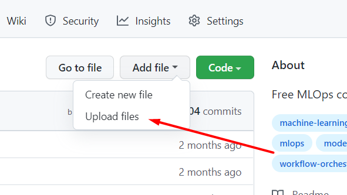

If you write your code on Google colab you can also directly share it on your Github.

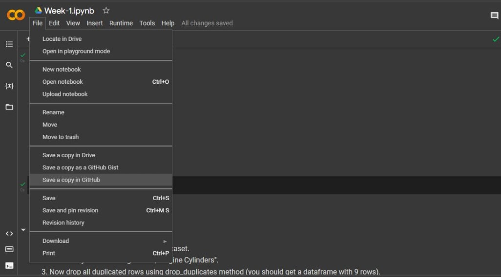

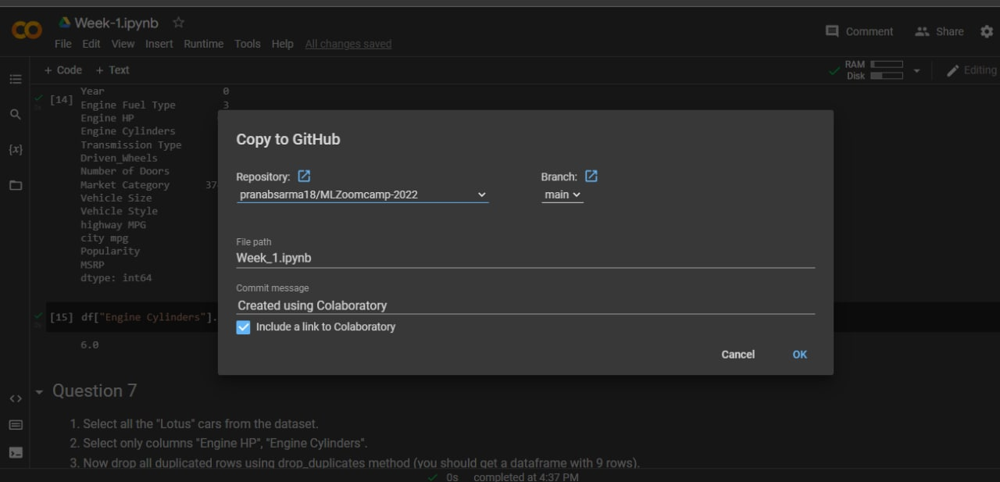

(By )

---

### Singular Matrix Error

I'm trying to invert the matrix but I got error that the matrix is singular matrix

The singular matrix error is caused by the fact that not every matrix can be inverted. In particular, in the homework it happens because you have to pay close attention when dealing with multiplication (the method .dot) since multiplication is not commutative! X.dot(Y) is not necessarily equal to Y.dot(X), so respect the order otherwise you get the wrong matrix.

---

### Conda is not an internal command

I have a problem with my terminal. Command

conda create -n ml-zoomcamp python=3.9

doesn’t work. Any of 3.8/ 3.9 / 3.10 should be all fine

If you’re on Windows and just installed Anaconda, you can use Anaconda’s own terminal called “Anaconda Prompt”.

If you don’t have Anaconda or Miniconda, you should install it first

(Tatyana Mardvilko)

---

### Read-in the File in Windows OS

How do I read the dataset with Pandas in Windows?

I used the code below but not working

df = pd.read_csv('C:\Users\username\Downloads\data.csv')

Unlike Linux/Mac OS, Windows uses the backslash (\) to navigate the files that cause the conflict with Python. The problem with using the backslash is that in Python, the '\' has a purpose known as an escape sequence. Escape sequences allow us to include special characters in strings, for example, "\n" to add a new line or "\t" to add spaces, etc. To avoid the issue we just need to add "r" before the file path and Python will treat it as a literal string (not an escape sequence).

Here’s how we should be loading the file instead:

df = pd.read_csv(r'C:\Users\username\Downloads\data.csv')

(Muhammad Awon)

---

### '403 Forbidden' error message when you try to push to a GitHub repository

Type the following command:

git config -l | grep url

The output should look like this:

remote.origin.url=

Change this to the following format and make sure the change is reflected using command in step 1:

git remote set-url origin "https://github-username@github.com/github-username/github-repository-name.git"

(Added by Dheeraj Karra)

---

### Fatal: Authentication failed for 'https://github.com/username

I had a problem when I tried to push my code from Git Bash:

remote: Support for password authentication was removed on August 13, 2021.

remote: Please see https://docs.github.com/en/get-started/getting-started-with-git/about-remote-repositories#cloning-with-https-urls for information on currently recommended modes of authentication.

fatal: Authentication failed for '

Solution:

Create a personal access token from your github account and use it when you make a push of your last changes.

Bruno Bedón

---

### wget: unable to resolve host address 'raw.githubusercontent.com'

In Kaggle, when you are trying to !wget a dataset from github (or any other public repository/location), you get the following error:

Getting  this error while trying to import data- !wget

--2022-09-17 16:55:24--

Resolving raw.githubusercontent.com (raw.githubusercontent.com)... failed: Temporary failure in name resolution.

wget: unable to resolve host address 'raw.githubusercontent.com'

Solution:

In your Kaggle notebook settings, turn on the Internet for your session. It's on the settings panel, on the right hand side of the Kaggle screen. You'll be asked to verify your phone number so Kaggle knows you are not a bot.

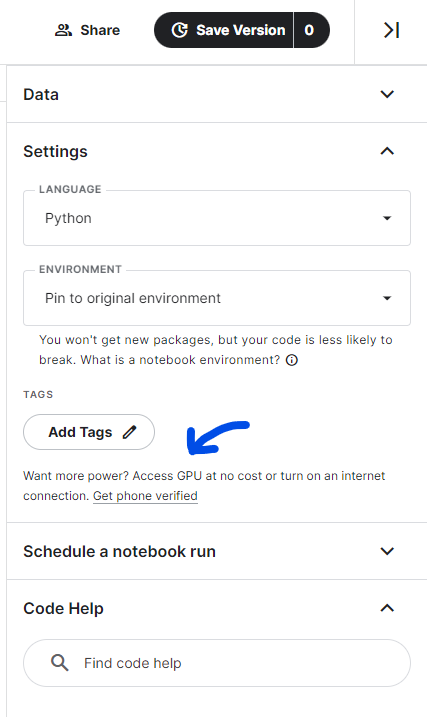

---

### Setting up an environment using VS Code

I found this video quite helpful:

[Native Jupiter Notebooks support in VS Code] In VS Code you can also have a native Jupiter Notebooks support, i.e. you do not need to open a web browser to code in a Notebook. If you have port forwarding enabled + run a ‘jupyter notebook ‘ command from a remote machine + have a remote connection configured in .ssh/config (as Alexey’s  suggests) - VS Code can execute remote Jupyter Notebooks files on a remote server from your local machine: .

[Git support from VS Code] You can work with Github from VSCode - staging and commits are easy from the VS Code’s UI:

(Added by Ivan Brigida)

---

### If you prefer the terminal to work, port forward in your config file.

Forward your ports in .ssh.
Type “nano .ssh/config”

And add “LocalForward 8888 localhost:8888” to forward your Jupyter.

(Added by Ico)

---

### Conda Environment Setup

With regards to creating an environment for the project, do we need to run the command "conda create -n ......." and "conda activate ml-zoomcamp" everytime we open vs code to work on the project?

Answer:

"conda create -n ...." is just run the first time to create the environment. Once created, you just need to run "conda activate ml-zoomcamp" whenever you want to use it.

(Added by Wesley Barreto)

conda env export > environment.yml will also allow you to reproduce your existing environment in a YAML file.  You can then recreate it with conda env create -f environment.yml

---

### Floating Point Precision

I was doing Question 7 from Week1 Homework and with step6: Invert XTX, I created the inverse. Now, an inverse when multiplied by the original matrix should return in an Identity matrix. But when I multiplied the inverse with the original matrix, it gave a matrix like this:

Inverse * Original:

[[ 1.00000000e+00 -1.38777878e-16]

[ 3.16968674e-13  1.00000000e+00]]

Solution:

It's because floating point math doesn't work well on computers as shown here:

(Added by Wesley Barreto)

---

### What does pandas.DataFrame.info() do?

Answer:

It prints the information about the dataset like:

Index datatype

No. of entries

Column information with not-null count and datatype

Memory usage by dataset

We use it as:

df.info()

(Added by Aadarsha Shrestha & Emoghena Itakpe)

---

### NameError: name 'np' is not defined

Pandas and numpy libraries are not being imported

NameError: name 'np' is not defined

NameError: name 'pd' is not defined

If you're using numpy or pandas, make sure you use the first few lines before anything else.

import pandas as pd

import numpy as np

Added by Manuel Alejandro Aponte

---

### How to select column by dtype

What if there were hundreds of columns? How do you get the columns only with numeric or object data in a more concise way?

df.select_dtypes(include=np.number).columns.tolist()

df.select_dtypes(include='object').columns.tolist()

Added by Gregory Morris

---

### How to identify the shape of dataset in Pandas

There are many ways to identify the shape of dataset, one of them is using .shape attribute!

df.shape

df.shape[0] # for identify the number of rows

df.shape[1] # for identify the number of columns

We can also use the built-in `len` function to find the total number of rows in a dataframe, just as shown below:

len(df)

Added by Radikal Lukafiardi

---

### How to avoid Value errors with array shapes in homework?

First of all use np.dot for matrix multiplication. When you compute matrix-matrix multiplication you should understand that order of multiplying is crucial and affects the result of the multiplication!

Dimension Mismatch

To perform matrix multiplication, the number of columns in the 1st matrix should match the number of rows in the 2nd matrix. You can rearrange the order to make sure that this satisfies the condition.

Added by Leah Gotladera

---

### Question 5: How and why do we replace the NaN values with average of the column?

You would first get the average of the column and save it to a variable, then replace the NaN values with the average variable.

This method is called imputing - when you have NaN/ null values in a column, but you do not want to get rid of the row because it has valuable information contributing to other columns.

Added by Anneysha Sarkar

---

### Question 5: Why is the mode returned as a Series instead of a single value in my DataFrame?

When you calculate the mode using the mode() function in pandas, the function always returns a Series. This design choice allows mode() to handle cases where there may be multiple modes (i.e., multiple values with the same highest frequency). Even when there is only one mode, the function will still return a Series with that single value.

If you are certain that your column has only one mode and you want to extract it as a single value, you can access the first element of the Series returned by mode():

(added by Karina)

---

### Question 5 (Homework small note): Do not get confused by word dell “notebook” in question

It simply means all laptops of brand “Dell”

Added by Nilesh Arte

---

### Question 7: Mathematical formula for linear regression

In Question 7 we are asked to calculate

The initial problem  can be solved by this, where a Matrix X is multiplied by some unknown weights w resulting in the target y.

Additional reading and videos:

Added by Sylvia Schmitt

with commends from Dmytro Durach

---

### Question 7: FINAL MULTIPLICATION not having 5 column

This is most likely that you interchanged the first step of the multiplication

You used  instead of

Added by Emmanuel Ikpesu

---

### Question 7: Multiplication operators.

Note, that matrix multiplication (matrix-matrix, matrix-vector multiplication) can be written as * operator in some sources, but performed as  operator or  via numpy. * operator performs element-wise multiplication ().

or  can be used, but for matrix-matrix multiplication @ or np.matmul() is preferred (as per numpy ).

If multiplying by a scalar  or * is preferred.

Added by Andrii Larkin

---

### Error launching Jupyter notebook

If you face an error kind of ImportError: cannot import name 'contextfilter' from 'jinja2' (anaconda\lib\site-packages\jinja2\__init__.py) when launching a new notebook for a brand new environment.

Switch to the main environment and run "pip install nbconvert --upgrade".

Added by George Chizhmak

---

### wget  hangs on MacOS Ventura M1

If you face this situation and see IPv6 addresses in the terminal, go to your System Settings > Network > your network connection > Details > Configure IPv6 > set to Manually > OK. Then try again

---

### In case you are using mac os and having trouble with WGET

Wget doesn't ship with macOS, so there are other alternatives to use.

No worries, we got curl:

example:

curl -o ./housing.csv https://raw.githubusercontent.com/alexeygrigorev/datasets/master/housing.csv

Explanations:

curl: a utility for retrieving information from the internet.

-o: Tell it to store the result as a file.

filename: You choose the file's name.

Links: Put the web address (URL) here, and cURL will extract data from it and save it under the name you provide.

More about it at:

Added by David Espejo

---

### How to output only a certain number of decimal places

You can use round() function or f-strings

round(number, 4)  - this will round number up to 4 decimal places

print(f'Average mark for the Homework is {avg:.3f}') - using F string

Also there is pandas.Series. round idf you need to round values in the whole Series

Please check the documentation

Added by Olga Rudakova

---

### Can’t get Juypter running locally on your machine?

If you’re struggling to get a Jupyter notebook running locally on your machine, or you have some other issue preventing you from using it (perhaps you’ve only got a cellphone to do your homework with at the moment?) then other online platforms you can consider as a stop gap measure which don’t require anything to be installed are:

JupyterLab

JupyterLite

Replit

Google Colab

Added by David Peterson

---

## 2. Machine Learning for Regression

### How to avoid accidentally pushing CSV files

To avoid accidentally pushing CSV files (or any specific file type) to a Git repository, you can use a .gitignore file.

Add a rule to ignore CSV files   *.csv

If the CSV files have already been committed,you can remove them from Git tracking but keep them locally by using command

git.rm –-cached filename.csv

Added by Olga Rudakova

---

### How do I get started with Week 2?

Here are the crucial links for this Week 2 that starts September 18, 2023

Ask questions for Live Sessions:

Calendar for weekly meetings:

Week 2 HW:

Submit HW Week 2:  (also available at the bottom of the above link)

All HWs:

GitHub for theory:

Youtube Link: 2.X ---

FAQs:

~~Nukta Bhatia~~

---

### Checking long tail of data

We can use histogram:

import pandas as pd

import matplotlib.pyplot as plt

import seaborn as sns

# Load the data

url = 'https://raw.githubusercontent.com/alexeygrigorev/datasets/master/housing.csv'

df = pd.read_csv(url)

# EDA

sns.histplot(df['median_house_value'], kde=False)

plt.show()

OR ceck skewness and describe:

print(df['median_house_value'].describe())

# Calculate the skewness of the 'median_house_value' variable

skewness = df['median_house_value'].skew()

# Print the skewness value

print("Skewness of 'median_house_value':", skewness)

(Mohammad Emad Sharifi)

---

### LinAlgError: Singular matrix

It’s possible that when you follow the videos, you’ll get a Singular Matrix error. We will explain why it happens in the Regularization video. Don’t worry, it’s normal that you have it.

You can also have an error because you did the inverse of X once in your code and you’re doing it a second time.

(Added by Cécile Guillot)

---

### California housing dataset

You can find a detailed description of the dataset ere

KS

---

### Getting NaNs after applying .mean()

I was using for loops to apply rmse to list of y_val and y_pred. But the resulting rmse is all nan.

I found out that the problem was when my data reached the mean step after squaring the error in the rmse function. Turned out there were nan in the array, then I traced the problem back to where I first started to split the data: I had only use fillna(0) on the train data, not on the validation and test data. So the problem was fixed after I applied fillna(0) to all the dataset (train, val, test). Voila, my for loops to get rmse from all the seed values work now.

Added by Sasmito Yudha Husada

---

### Target variable transformation

Why should we transform the target variable to logarithm distribution? Do we do this for all machine learning projects?

Only if you see that your target is highly skewed. The easiest way to evaluate this is by plotting the distribution of the target variable.

This can help to understand skewness and how it can be applied to the distribution of your data set.

Pastor Soto

---

### Reading the dataset directly from github

The dataset can be read directly to pandas dataframe from the github link using the technique shown below

dfh=pd.read_csv("")

Krishna Anand

---

### Loading the dataset directly through Kaggle Notebooks

For users of kaggle notebooks, the dataset can be loaded through widget using the below command. Please remember that ! before wget is essential

!wget

Once the dataset is loaded to the kaggle notebook server, it can be read through the below pandas command

df = pd.read_csv('housing.csv')

Harish Balasundaram

---

### Filter a dataset by using its values

We can filter a dataset by using its values as below.

df = df[(df["ocean_proximity"] == "<1H OCEAN") | (df["ocean_proximity"] == "INLAND")]

You can use | for ‘OR’, and & for ‘AND’

Alternative:

df = df[df['ocean_proximity'].isin(['<1H OCEAN', 'INLAND'])]

Radikal Lukafiardi

---

### Alternative way to load the data using requests

Above users showed how to load the dataset directly from github. Here is another useful way of doing this using the `requests` library:

# Get data for homework

import requests

url = 'https://raw.githubusercontent.com/alexeygrigorev/datasets/master/housing.csv'

response = requests.get(url)

if response.status_code == 200:

with open('housing.csv', 'wb') as file:

file.write(response.content)

else:

print("Download failed.")

Tyler Simpson

---

### Null column is appearing even if I applied .fillna()

When creating a duplicate of your dataframe by doing the following:

X_train = df_train

X_val = df_val

You’re still referencing the original variable, this is called a shallow copy. You can make sure that no references are attaching both variables and still keep the copy of the data do the following to create a deep copy:

X_train = df_train.copy()

X_val = df_val.copy()

Added by Ixchel García

---

### Can I use Scikit-Learn’s train_test_split for this week?

Yes, you can. Here we implement it ourselves to better understand how it works, but later we will only rely on Scikit-Learn’s functions. If you want to start using it earlier — feel free to do it

---

### Can I use LinearRegression from Scikit-Learn for this week?

Yes, you can. We will also do that next week, so don’t worry, you will learn how to do it.

---

### Corresponding Scikit-Learn functions for Linear Regression (with and without Regularization)

What are equivalents in Scikit-Learn for the linear regression with and without regularization used in week 2.

Corresponding function for model without regularization:
sklearn.linear_model.LinearRegression

Corresponding function for model with regularization:

sklearn.linear_model.Ridge

The linear model from Scikit-Learn are explained  here:

Added by Sylvia Schmitt

---

### : what is `r`, is it the same as `alpha` in ?

In the context of regression, particularly with regularization:

r typically represents the regularization parameter in some algorithms. It controls the strength of the penalty applied to the coefficients of the regression model to prevent overfitting.

In sklearn.Ridge(), the parameter alpha serves the same purpose as r. It specifies the amount of regularization applied to the model. A higher value of alpha increases the amount of regularization, which can reduce model complexity and improve generalization.

`r` is a regularization parameter.

It’s similar to `alpha` in , as both control the "strength" of regularization (increasing both will lead to stronger regularization), but mathematically not quite, here's how both are used:

||y - Xw||^2_2 + alpha * ||w||^2_2

(`train_linear_regression_reg` function)

XTX = XTX + r * np.eye(XTX.shape[0])

`r` adds “noise” to the main diagonal to prevent multicollinearity, which “breaks” finding inverse matrix.

---

### Why linear regression doesn’t provide a “perfect” fit?

linear regression often provides a good approximation of the underlying relationship but rarely achieves a "perfect" fit in real-world applications.

Q: “In lesson 2.8 why is y_pred different from y? After all, we trained X_train to get the weights that when multiplied by X_train should give exactly y, or?”

A: linear regression is a pretty simple model, it neither can nor should fit 100% (nor any other model, as this would be the sign of overfitting). This picture might illustrate some intuition behind this, imagine X is a single feature:


As our model is linear, how would you draw a line to fit all the "dots"?

You could "fit" all the "dots" on this pic using something like  (non-linear least squares) if you wanted to, but imagine how it would perform on previously unseen data.

Added by Andrii Larkin

---

### Random seed 42

One of the questions on the homework calls for using a random seed of 42. When using 42, all my missing values ended up in my training dataframe and not my validation or test dataframes, why is that?

The purpose of the seed value is to randomly generate the proportion split. Using a seed of 42 ensures that all learners are on the same page by getting the same behavior (in this case, all missing values ending up in the training dataframe). If using a different seed value (e.g. 9), missing values will then appear in all other dataframes.

---

### Shuffling the initial dataset using pandas built-in function

It is possible to do the shuffling of the dataset with the pandas built-in function .The complete dataset can be shuffled including resetting the index with the following commands:

Setting frac=1 will result in returning a shuffled version of the complete Dataset.

Setting random_state=seed will result in the same randomization as used in the course resources.

df_shuffled = df.sample(frac=1, random_state=seed)

df_shuffled.reset_index(drop=True, inplace=True)

Added by Sylvia Schmitt

---

### Shuffling data using Numpy’s Generator Feature

While the lectures have you use the shuffle function to shuffle the index of the dataframe, it no longer accepts random seed as a parameter. This is because Numpy converted this feature into its own “Class”. In order to assign the random generator a seed, you have to specify the object (rng) that you are going to utilize in your code:

#Create index from range of values in array

idx = np.arange(n)

#Create random generator object and set seed

rng = np.random.default_rng(random_seed)

#Shuffle values using Generator object

rng.shuffle(idx)

Added by Emmanuel Lopez

---

### The answer I get for one of the homework questions doesn't match any of the options. What should I do?

That’s normal. We all have different environments: our computers have different versions of OS and different versions of libraries — even different versions of Python.

If it’s the case, just select the option that’s closest to your answer

---

### Meaning of mean in homework 2, question 3

In question 3 of HW02 it is mentioned: ‘For computing the mean, use the training only’. What does that mean?

It means that you should use only the training data set for computing the mean, not validation or  test data set. This is how you can calculate the mean

df_train['column_name'].mean( )

Another option:

df_train[‘column_name’].describe()

(Bhaskar Sarma)

---

### When should we transform the target variable to logarithm distribution?

When the target variable has a long tail distribution, like in prices, with a wide range, you can transform the target variable with np.log1p() method, but be aware if your target variable has negative values, this method will not work

---

### ValueError: shapes not aligned


If we try to perform an arithmetic operation between 2 arrays of different shapes or different dimensions, it throws an error like operands could not be broadcast together with shapes. There are some scenarios when broadcasting can occur and when it fails.

If this happens sometimes we can use * operator instead of dot() method to solve the issue. So that the error is solved and also we get the dot product.

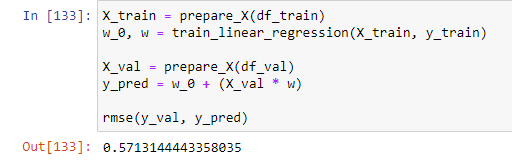

(Santhosh Kumar)

---

### How to copy a dataframe without changing the original dataframe?

Copy of a dataframe is made with X_copy = X.copy().

This is called creating a deep copy.  Otherwise it will keep changing the original dataframe if used like this: X_copy = X.

Any changes to X_copy will reflect back to X. This is not a real copy, instead it is a “view”.

(Memoona Tahira)

---

### What is standard deviation?

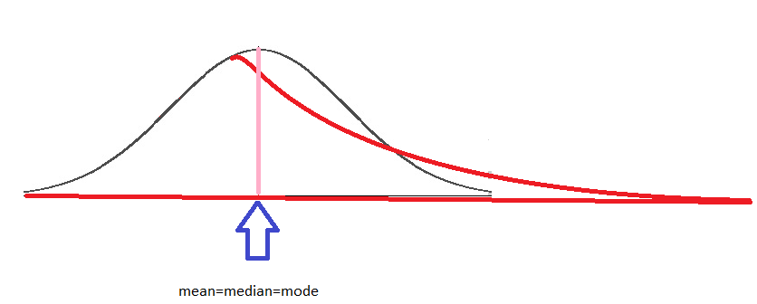

One of the most important characteristics of the normal distribution is that mean=median=mode, this means that the most popular value, the mean of the distribution and 50% of the sample are under the same value, this is equivalent to say that the area under the curve (black) is the same on the left and on the right. The long tail (red curve) is the result of having a few observations with high values, now the behaviour of the distribution changes, first of all, the area is different on each side and now the mean, median and mode are different. As a consequence, the mean is no longer representative, the range is larger than before and the probability of being on the left or on the right is not the same.

(Tatiana Dávila)

In statistics, the standard deviation is a measure of the amount of variation or dispersion of a set of values. A low standard deviation indicates that the values tend to be close to the mean (also called the expected value) of the set, while a high standard deviation indicates that the values are spread out over a wider range. [] The formula to calculate standard deviation is:

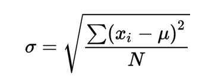

(Aadarsha Shrestha)

---

### Do we need to apply regularization techniques always? Or only in certain scenarios?

The application of regularization depends on the specific situation and problem. It is recommended to consider it when training machine learning models, especially with small datasets or complex models, to prevent overfitting. However, its necessity varies depending on the data quality and size. Evaluate each case individually to determine if it is needed.

(Daniel Muñoz Viveros)

---

### Shortcut: define functions for faster execution

As it speeds up the development:

prepare_df(initial_df, seed, fill_na_type)  - that prepared all 3 dataframes and 3 y_vectors. Fillna() can be done before the initial_df is split.

Of course, you can reuse other functions: rmse() and train_linear_regression(X,y,r) from the class notebook

(Ivan Brigida)

---

### Warning about modifying Dataframes inside functions

When applying a function to a DataFrame, it is important to consider that if you do not want to alter the original DataFrame, you should create a copy of it first. Failing to do so may result in unintended modifications to the original dataset. To preserve the integrity of your data, always use df.copy() before making any changes.

(added by Karina)

---

### How to use pandas to find standard deviation

If we have a list or series of data for example x = [1,2,3,4,5]. We can use pandas to find the standard deviation. We can pass our list into panda series and call standard deviation directly on the series pandas.Series(x).std().

(Quinn Avila)

---

### Standard Deviation Differences in Numpy and Pandas

Numpy and Pandas packages use different equations to compute the standard deviation. Numpy uses  population standard deviation, whereas pandas uses sample standard deviation by default.

Numpy

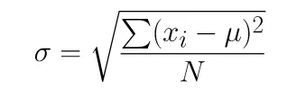

Pandas

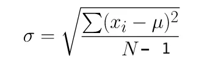

pandas default standard deviation is computed using one degree of freedom. You can change degree in of freedom in NumPy to change this to unbiased estimator by using ddof parameter:

import numpy as np

np.std(df.weight, ddof=1)

The result will be similar if we change the dof = 1 in numpy

(Harish Balasundaram)

---

### Standard deviation using Pandas built in Function

In pandas you can use built in Pandas function names std() to get standard deviation. For example

df['column_name'].std() to get standard deviation of that column.

df[['column_1', 'column_2']].std() to get standard deviation of multiple columns.

(Khurram Majeed)

---

### How to combine train and validation datasets

Use ‘pandas.concat’ function () to combine two dataframes. To combine two numpy arrays use numpy.concatenate () function. So the code would be as follows:

df_train_combined = pd.concat([df_train, df_val])

y_train = np.concatenate((y_train, y_val), axis=0)

(George Chizhmak)

---

### Understanding RMSE and how to calculate RMSE score

The Root Mean Squared Error (RMSE) is one of the primary metrics to evaluate the performance of a regression model. It calculates the average deviation between the model's predicted values and the actual observed values, offering insight into the model's ability to accurately forecast the target variable. To calculate RMSE score:

Libraries needed

import numpy as np

from sklearn.metrics import mean_squared_error

mse = mean_squared_error(actual_values, predicted_values)

rmse = np.sqrt(mse)

print("Root Mean Squared Error (RMSE):", rmse)

(Aminat Abolade)

---

### What syntax use in Pandas for multiple conditions using logical AND and OR

If you would like to use multiple conditions as an example below you will get the error. The correct syntax for OR is |, and for AND is &

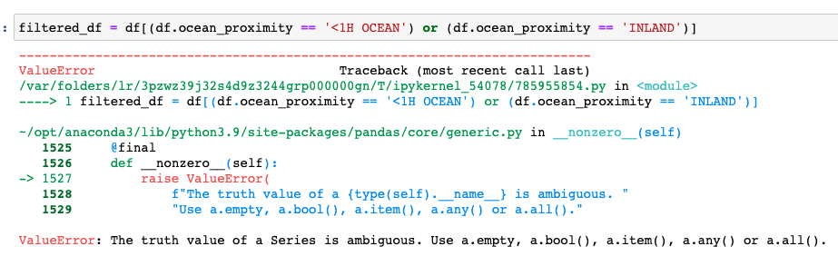

(Olga Rudakova)

–

---

### Deep dive into normal equation for regression

I found this video pretty usual for understanding how we got the normal form with linear regression

---

### Useful Resource for Missing Data Treatment

(Hrithik Kumar Advani)

---

### Caution for applying log transformation in Week-2 2023 cohort homework

The instruction for applying log transformation to the ‘median_house_value’ variable is provided before Q3 in the homework for Week-2 under the ‘Prepare and split the dataset’ heading.

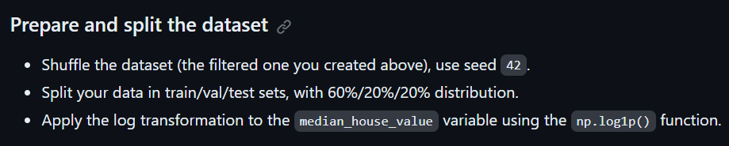

However, this instruction is absent in the subsequent questions of the homework, and I got stuck with Q5 for a long time, trying to figure out why my RMSE was so huge, when it clicked to me that I forgot to apply log transformation to the target variable. Please remember to apply log transformation to the target variable for each question.

(Added by Soham Mundhada)

---

### What sklearn version is Alexey using in the youtube videos?

Version 0.24.2 and Python 3.8.11

(Added by Diego Giraldo)

---

### For Homework #2, there’s no 2024 cohort folder?

You can find homework 2 in this folder for the 2024 cohort via this link:

(Added by Victor Emenike)

---

### Hello, for Q6 of homework 2, is the RMSE result close to the options? Mine is about 12.4 different from the closets option, but all the above questions I have pretty close answers, so I don’t know why there is such a great difference in Q6…

For questions 5 and 6, do not forget to reinitialize:

Idx = np.arange(n)

For each iteration of r in question 5 and also for question 6

(Added by Victor Emenike)

---

## 3. Machine Learning for Classification

### What is the best way to handle missing values in the dataset before training a regression model?

You can handle missing values by:

Imputing the missing values with the mean, median, or mode.

Using algorithms that support missing values inherently (e.g., some tree-based methods).

Removing rows or columns with missing data, depending on the extent of missingness. Feature engineering might also help derive new features from incomplete data​

(added by David Peterson)

---

### How do I get started with Week 3?

Week 3 HW:

Submit HW Week 3:

All HWs:

Evaluation Matrix:

GitHub for theory:

Youtube Link: 3.X ---

~~Nukta Bhatia~~

---

### Could not convert string to float:’Nissan’rt string to float: 'Nissan'

The error message “could not convert string to float: ‘Nissan’” typically occurs when a machine learning model or function is expecting numerical input, but receives a string instead. In this case, it seems like the model is trying to convert the car brand ‘Nissan’ into a numerical value, which isn’t possible.

To resolve this issue, you can encode categorical variables like car brands into numerical values. One common method is one-hot encoding, which creates new binary columns for each category/label present in the original column.

Here’s an example of how you can perform one-hot encoding using pandas:

import pandas as pd

# Assuming 'data' is your DataFrame and 'brand' is the column with car brands

data_encoded = pd.get_dummies(data, columns=['brand'])

In this code, pd.get_dummies() creates a new DataFrame where the ‘brand’ column is replaced with binary columns for each brand (e.g., ‘brand_Nissan’, ‘brand_Toyota’, etc.). Each row in the DataFrame has a 1 in the column that corresponds to its brand and 0 in all other brand columns.

-Mohammad Emad Sharifi-

---

### Why did we change the targets to binary format when calculating mutual information score in the homework?

Solution: Mutual Information score calculates the relationship between categorical variables or discrete variables. So in the homework, because the target which is median_house_value is continuous, we had to change it to binary format which in other words, makes its values discrete as either 0 or 1. If we allowed it to remain in the continuous variable format, the mutualinformation score could be calculated, but the algorithm would have to divide the continuous variables into bins and that would be highly subjective. That is why continuous variables are not used for mutual information score calculation.

—Odimegwu David—-

---

### What data should we use for correlation matrix

Q2 asks about correlation matrix and converting median_house_value from numeric to binary. Just to make sure here we are only dealing with df_train not df_train_full, right? As the question explicitly mentions the train dataset.

Yes. I think it is only on df_train. The reason behind this is that df_train_full also contains the validation dataset, so at this stage we don't want to make conclusions based on the validation data, since we want to test how we did without using that portion of the data.

Pastor Soto

---

### How do you find the correlation matrix?

First, you have to consider whether the data is numerical or categorical. If it’s numerical, you can correlate it directly - if it’s categorial you can find the correlations for the data indirectly by vectorizing the data using One-Hot encoding or other similar method.

To find if it’s numerical, check the dtypes() of the dataframe you’re looking at. Anything that’s integer, float, etc is numerical, while data types such as objects are categorical. You can correlate the numerical data by specifying which columns are numerical and using that as input to a correlation matrix.

numerical = ['tenure', 'monthlycharges', 'totalcharges']

df[numerical].corr()

Added by Michael Friske

---

### Coloring the background of the pandas.DataFrame.corr correlation matrix directly

The background of any dataframe can be colored (not only the correlation matrix) based on the numerical values the dataframe contains by using the method .

Here an example on how to color the correlation matrix. A color map of choice can get passed, here ‘viridis’ is used.

# ensure to have only numerical values in the dataframe before calling 'corr'

corr_mat = df_numerical_only.corr()

corr_mat.style.background_gradient(cmap='viridis')

Here is an example of how the coloring will look like using a dataframe containing random values and applying “background_gradient” to it.

np.random.seed = 3

df_random = pd.DataFrame(data=np.random.random(3*3).reshape(3,3))

df_random.style.background_gradient(cmap='viridis')

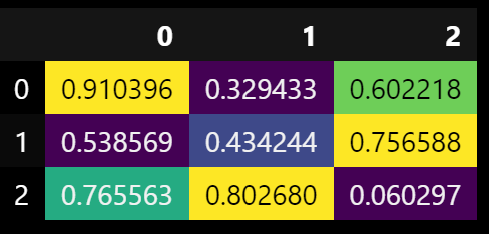

Added by Sylvia Schmitt

---

### Identifying highly correlated feature pairs easily through unstack

data_corr = pd.DataFrame(data_num.corr().round(3).abs().unstack().sort_values(ascending=False))

data_corr.head(10)

Added by Harish Balasundaram

You can also use seaborn to create a heatmap with the correlation. The code for doing that:

sns.heatmap(df[numerical_features].corr(),

annot=True,

square=True,

fmt=".2g",

cmap="crest")

Added by Cecile Guillot

You can refine your heatmap and plot only a triangle, with a blue to red color gradient, that will show every correlation between your numerical variables without redundant information with this function:

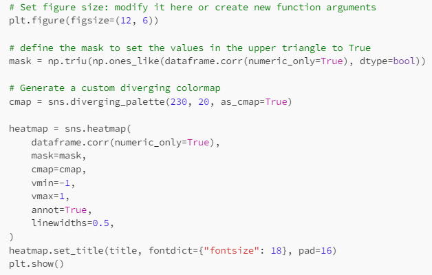

Which outputs, in the case of churn dataset:

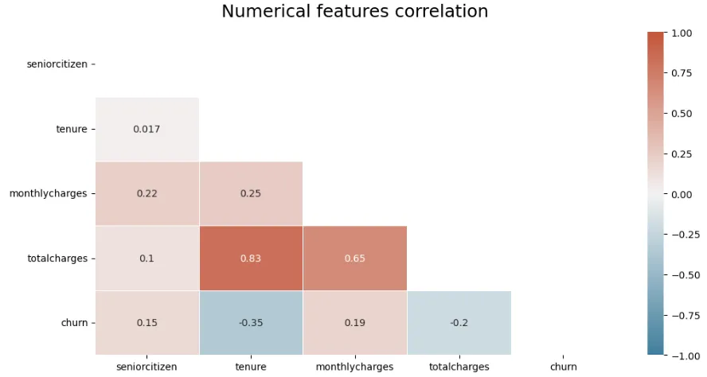

(Mélanie Fouesnard)

---

### What data should be used for EDA?

Should we perform EDA on the base of train or train+validation or train+validation+test dataset?

It's indeed good practice to only rely on the train dataset for EDA. Including validation might be okay. But we aren't supposed to touch the test dataset, even just looking at it isn't a good idea. We indeed pretend that this is the future unseen data

Alena Kniazeva

---

### Fitting DictVectorizer on validation

Validation dataset helps to validate models and prediction on unseen data. This helps get an estimate on its performance on fresh data. It helps optimize the model.

Edidiong Esu

Below is an extract of Alexey's book explaining this point. Hope is useful

When we apply the fit method, this method is looking at the content of the df_train dictionaries we are passing to the DictVectorizer instance, and fit is figuring out (training) how to map the values of these dictionaries. If categorical, applies one-hot encoding, if numerical it will leave it as it is.

With this context, if we apply the fit to the validation model, we are "giving the answers" and we are not letting the "fit" do its job for data that we haven't seen. By not applying the fit to the validation model we can know how well it was trained.

Below is an extract of Alexey's book explaining this point.

Humberto Rodriguez

There is no need to initialize another instance of dictvectorizer after fitting it on the train set as it will overwrite what it learnt from being fit on the train data.

The correct way is to fit_transform the train set, and only transform the validation and test sets.

Memoona Tahira

---

### Feature elimination

For Q5 in homework, should we calculate the smallest difference in accuracy in real values (i.e. -0.001 is less than -0.0002) or in absolute values (i.e. 0.0002 is less than 0.001)?

We should select the “smallest” difference, and not the “lowest”, meaning we should reason in absolute values.

If the difference is negative, it means that the model actually became better when we removed the feature.

---

### FutureWarning: Function get_feature_names is deprecated; get_feature_names is deprecated in 1.0 and will be removed in 1.2

In newer versions of scikit-learn, the method has been replaced by get_feature_names_out().

Instead use the method “.get_feature_names_out()” from DictVectorizer function and the warning will be resolved , but we need not worry about the waning as there won't be any warning

Santhosh Kumar

---

### Logistic regression crashing Jupyter kernel

Fitting the logistic regression takes a long time / kernel crashes when calling predict() with the fitted model.

Make sure that the target variable for the logistic regression is binary.

Konrad Muehlberg

---

### Understanding Ridge

Ridge regression is a linear regression technique used to mitigate the problem of multicollinearity (when independent variables are highly correlated) and prevent overfitting in predictive modeling. It adds a regularization term to the linear regression cost function, penalizing large coefficients.

sag Solver: The sag solver stands for "Stochastic Average Gradient." It's particularly suitable for large datasets, as it optimizes the regularization term using stochastic gradient descent (SGD). sag can be faster than some other solvers for large datasets.

Alpha: The alpha parameter  controls the strength of the regularization in Ridge regression. A higher alpha value leads to stronger regularization, which means the model will have smaller coefficient values, reducing the risk of overfitting.

from sklearn.linear_model import Ridge

ridge = Ridge(alpha=alpha, solver='sag', random_state=42)

ridge.fit(X_train, y_train)

Aminat Abolade

---

### and (sparse=False) produce the same type of one-hot encodings:


(sparse=True) produces  format, which is both more memory efficient and converges better during fit(). Basically it stores non-zero values and indices instead of adding a column for each class of each feature (models of cars produced 900+ columns alone in the current task).

Using “sparse” format like on the picture above, both via  and (sparse=False) - is slower (around 6-8min for Q6 task - Linear/Ridge Regression) for high amount of classes (like models of cars for eg) and gives a bit “worse” results in both Logistic and Linear/Ridge Regression, while also producing convergence warnings for Linear/Ridge Regression.

Larkin Andrii

---

### Convergence Problems in W3Q6

Ridge with sag solver requires feature to be of the same scale. You may get the following warning: ConvergenceWarning: The max_iter was reached which means the coef_ did not converge

Play with different scalers. See

Dmytro Durach

(Oscar Garcia)  Use a StandardScaler for the numeric fields and OneHotEncoder (sparce = False) for the categorical features.  This help with the warning. Separate the features (num/cat) without using the encoder first and see if that helps.

---

### Dealing with Convergence in Week 3 q6

When encountering convergence errors during the training of a Ridge regression model, consider the following steps:

Feature Normalization: Normalize your numerical features using techniques like MinMaxScaler or StandardScaler. This ensures that numerical features are on a 	similar scale, preventing convergence issues.

Categorical Feature Encoding: If your dataset includes categorical features, apply 	categorical encoding techniques such as OneHotEncoder (OHE) to 	convert them into a numerical format. OHE is commonly used to represent categorical variables as binary vectors, making them compatible with regression models like Ridge.

Combine Features: After 	normalizing numerical features and encoding categorical features using OneHotEncoder, combine them to form a single feature matrix (X_train). This combined dataset serves as the input for training the Ridge regression model.

By following these steps, you can address convergence errors and enhance the stability of your Ridge model training process. It's important to note that the choice of encoding method, such as OneHotEncoder, is appropriate for handling categorical features in this context.

You can find an example .
 												Osman Ali

---

### Sparse matrix compared dense matrix

A sparse matrix is more memory-efficient because it only stores the non-zero values and their positions in memory. This is particularly useful when working with large datasets with many zero or missing values.

The default DictVectorizer configuration is a sparse matrix. For week3 Q6 using the default sparse is an interesting option because of the size of the matrix. Training the model was also more performant and didn’t give an error message like dense mode.
 												Quinn Avila

---

### How  to Disable/avoid Warnings in Jupyter Notebooks

The warnings on the jupyter notebooks can be disabled/ avoided with the following comments:

Import warnings

warnings.filterwarnings(“ignore”)

Krishna Anand

---

### How to select the alpha parameter in Q6

Question: Regarding RMSE, how do we decide on the correct score to choose? In the study group discussion    about week two homework, all of us got it wrong and one person had the lowest score selected as well.

Answer: You need to find RMSE for each alpha. If RMSE scores  are equal, you will select the lowest alpha.

Asia Saeed

---

### Second variable that we need to use to calculate the mutual information score

Question: Could you please help me with HW3 Q3: "Calculate the mutual information score with the (binarized) price for the categorical variable that we have. Use the training set only." What is the second variable that we need to use to calculate the mutual information score?

Answer: You need to calculate the mutual info score between the binarized price (above_average) variable & ocean_proximity, the only original categorical variable in the dataset.

Asia Saeed

---

### Features for homework Q5

Do we need to train the model only with the features: total_rooms, total_bedrooms, population and households? or with all the available features and then pop once at a time each of the previous features and train the model to make the accuracy comparison?

You need to create a list of all features in this question and evaluate the model one time to obtain the accuracy, this will be the original accuracy, and then remove one feature each time, and in each time, train the model, find the accuracy and the difference between the original accuracy and the found accuracy. Finally, find out which feature has the smallest absolute accuracy difference.

While calculating differences between accuracy scores while training on the whole model, versus dropping one feature at a time and comparing its accuracy to the model to judge impact of the feature on the accuracy of the model, do we take the smallest difference or smallest absolute difference?

Since order of subtraction between the two accuracy scores can result in a negative number, we will take its absolute value as we are interested in the smallest value difference, not the lowest difference value. Case in point, if difference is -4 and -2, the smallest difference is abs(-2), and not abs(-4)

---

### What is the difference between OneHotEncoder and DictVectorizer?

Both work in similar ways. That is, to convert categorical features to numerical variables for use in training the model. But the difference lies in the input. OneHotEncoder uses an array as input while DictVectorizer uses a dictionary.

Both will produce the same result. But when we use OneHotEncoder, features are sorted alphabetically. When you use DictVectorizer you stack features that you want.

Tanya Mard

---

### What is the difference between pandas get_dummies and sklearn OnehotEncoder?

They are basically the same. There are some key differences with regards to their input/output types, handling of missing values, etc, but they are both techniques to one-hot-encode categorical variables with identical results. The biggest difference is get_dummies are a convenient choice when you are working with Pandas Dataframes, while if you are building a scikit-learn-based machine learning pipeline and need to handle categorical data as part of that pipeline, OneHotEncoder is a more suitable choice. [Abhirup Ghosh]

---

### Use of random seed in HW3

For the test_train_split question on week 3's homework, are we supposed to use 42 as the random_state in both splits or only the 1st one?

Answer: for both splits random_state = 42 should be used

(Bhaskar Sarma)

---

### Correlation before or after splitting the data

Should correlation be calculated after splitting or before splitting. And lastly I know how to find the correlation but how do i find the two most correlated features.

Answer: Correlation matrix of your train dataset. Thus, after splitting. Two most correlated features are the ones having the highest correlation coefficient in terms of absolute values.

---

### Features in Ridge Regression Model

Make sure that the features used in ridge regression model are only NUMERICAL ones not categorical.

Drop all categorical features first before proceeding.

(Aileah Gotladera)

While it is True that ridge regression accepts only numerical values, the categorical ones can be useful for your model. You have to transform them using one-hot encoding before training the model. To avoid the error of non convergence, put sparse=True when doing so.

(Erjon)

---

### Handling Column Information for Homework 3 Question 6

You need to use all features. and price for target. Don't include the average variable we created before.

If you use DictVectorizer then make sure to use sparce=True to avoid convergence errors

I also used StandardScalar for numerical variable you can try running with or without this

(Peter Pan)

---

### Choosing smaller C that leads to best accuracy in Homework 3 Question 6

Warning: When searching for the best value of C that yields the highest accuracy, be mindful that you should be looking for the maximum accuracy, not the minimum. Although the goal is to find the smallest C value, ensure that it corresponds to the highest accuracy achieved. Always prioritize accuracy maximization while minimizing C.

(added by Karina)

---

### Transforming Non-Numerical Columns into Numerical Columns

Use  encoders and scalers, e.g. OneHotEncoder, OrdinalEncoder, and StandardScaler.

---

### What is the better option FeatureHasher or DictVectorizer

These both methods receive the dictionary as an input. While the DictVectorizer will store the big vocabulary and takes more memory. FeatureHasher create a vectors with predefined length. They are both used for categorical features.

When you have a high cardinality for categorical features better to use FeatureHasher. If you want to preserve feature names in transformed data and have a small number of unique values is DictVectorizer. But your choice will dependence on your data.
You can read more by follow the link https://scikit-learn.org/stable/auto_examples/text/plot_hashing_vs_dict_vectorizer.html

Olga Rudakova

---

### Isn't it easier to use DictVertorizer or get dummies before splitting the data into train/val/test? Is there a reason we wouldn't do this? Or is it the same either way?

(Question by Connie S.)

The reason it's good/recommended practice to do it after splitting is to avoid data leakage - you don't want any data from the test set influencing the training stage (similarly from the validation stage in the initial training). See e.g. scikit-learn documentation on "Common pitfalls and recommended practices":

Answered/added by Rileen Sinha

---

### HW3Q4 I am getting 1.0 as accuracy. Should I use the closest option?

If you are getting 1.0 as accuracy then there is a possibility you have overfitted the model. Dropping the column msrp/price can help you solve this issue.

Added by Akshar Goyal

---

### How to calculate Root Mean Squared Error?

We can use sklearn & numpy packages to calculate Root Mean Squared Error

from sklearn.metrics import mean_squared_error

import numpy as np

Rmse = np.sqrt(mean_squared_error(y_pred, y_val/ytest)

Added by Radikal Lukafiardi

You can also refer to Alexey’s notebook for Week 2:

https://github.com/alexeygrigorev/mlbookcamp-code/blob/master/chapter-02-car-price/02-carprice.ipynb

which includes the following code:

def rmse(y, y_pred):

error = y_pred - y

mse = (error ** 2).mean()

return np.sqrt(mse)

(added by Rileen Sinha)

---

### AttributeError: 'DictVectorizer' object has no attribute 'get_feature_names'

The solution is to use “get_feature_names_out” instead. See details:

George Chizhmak

---

### Root Mean Squared Error

To use RMSE without math or numpy, ‘sklearn.metrics’ has a mean_squared_error function with a squared kwarg (defaults to True). Setting squared to False will return the RMSE.

from sklearn.metrics import mean_squared_error

rms = mean_squared_error(y_actual, y_predicted, squared=False)

See details:

Ahmed Okka

---

### Encoding Techniques

This article explains different encoding techniques used

Hrithik Kumar Advani

---

### Error in use of accuracy_score from sklearn in jupyter (sometimes)

I got this error multiple times here is the code:

“accuracy_score(y_val, y_pred >= 0.5)”

TypeError: 'numpy.float64' object is not callable

I solve it using

from sklearn import metrics

metrics.accuracy_score(y_train, y_pred>= 0.5)

OMAR Wael

---

### What is the difference between .decision_function() and .predict_proba()?

In Scikit-Learn’s LogisticRegression, a model that is trained will have raw values and the predicted probabilities.

.decision_function() returns raw values which are a linear combination of the features and weights, similar to the output of Linear Regression.

.predict_proba() goes one step further by inputting these raw values into the sigmoid function, to convert them into probabilities (between 0 and 1).

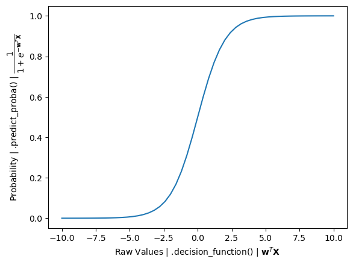

Kemal Dahha

---

### Why do I get a KeyError when dropping features after one-hot encoding?

The error occurs because some features you try to drop have been one-hot encoded into multiple columns. After encoding, the original column may no longer exist, leading to the KeyError. To resolve this, identify and drop all related one-hot encoded columns (e.g., those starting with the original feature name) instead of the original feature itself.

For example, after one-hot encoding, the column 'marital' could have been split into columns like 'marital_single', 'marital_married', etc. This means that the original column 'marital' no longer exists, leading to the KeyError.

~ David Peterson

---

### Question 6 of HW 3 asks to train a regularized logistic regression with c = 0.

This is not possible since the parameter C represents the inverse of the regularization strength, and setting C to 0 means infinite regularization and hence trying this through the scikit learn module of Logistic Regression will give ValueError

---

## 4. Evaluation Metrics for Classification

### Homework 3

Import the data using df = pd.read_csv(“bank-full.csv”, sep=';').

The data is not separated by a comma but by a semicolon.

---

### How do I get started with Week 4?

Week 4 HW 2024:

Week 4 HW 2023:

All HWs:

ML Zoomcamp project evaluation criteria:

GitHub for theory:

YouTube Link: 4.X ---

Sci-Kit Learn on Evaluation:

~~Nukta Bhatia~~

---

### Using a variable to score

Metrics can be used on a series or a dataframe

~~Ella Sahnan~~

---

### Why do we sometimes use random_state and not at other times?

Ie particularly in module-04 homework Qn2 vs Qn5.

Refer to the sklearn docs, random_state is to ensure the “randomness” that is used to shuffle dataset is reproducible, and it usually requires both random_state and shuffle params to be set accordingly.

~~Ella Sahnan~~

---

### How to get all classification metrics?

How to get classification metrics - precision, recall, f1 score, accuracy simultaneously

Use classification_report from sklearn. For more info check .

Abhishek N

---

### Multiple thresholds for Q4

I am getting multiple thresholds with the same F1 score, does this indicate I am doing something wrong or is there a method for choosing? I would assume just pick the lowest?

Choose the one closest to any of the options

Added by Azeez Enitan Edunwale

You can always use scikit-learn (or other standard libraries/packages) to verify results obtained using your own code, e.g. you can use  “classification_report” () to obtain precision, recall and F1-score.

Added by Rileen Sinha

---

### ValueError: This solver needs samples of at least 2 classes in the data, but the data contains only one class: 0

Solution description: duplicating the

df.churn = (df.churn == 'yes').astype(int)

This is causing you to have only 0's in your churn column. In fact, match with the error you are getting:  ValueError: This solver needs samples of at least 2 classes in the data, but the data contains only one class: 0.

It is telling us that it only contains 0's.

Delete one of the below cells and you will get the accuracy

Humberto Rodriguez

---

### Method to get beautiful classification report

Use Yellowbrick. Yellowbrick is a library that combines scikit-learn with matplotlib to produce visualizations for your models. It produces colorful classification reports.

Krishna Annad

---

### I’m not getting the exact result in homework

That’s fine, use the closest option

---

### Use AUC to evaluate feature importance of numerical variables

Check the solutions from the 2021 iteration of the course. You should use

---

### Help with understanding: “For each numerical value, use it as score and compute AUC”

When calculating the ROC AUC score using  the function expects two parameters “y_true” and “y_score”. So for each numerical value in the dataframe it will be passed as the “y_score” to the function and the target variable will get passed a “y_true” each time.

Sylvia Schmitt

---

### What dataset should I use to compute the metrics in Question 3

You must use the `dt_val` dataset to compute the metrics asked in Question 3 and onwards, as you did in Question 2.

Diego Giraldo

---

### What does KFold do?

KFold is a cross-validation technique that splits your dataset into k equal parts (folds). It trains the model k times, each time using a different fold as the validation set while training on the remaining folds. This process helps provide a more reliable estimate of a model's performance by ensuring every data point gets to be in both the training and validation sets. The average score across all folds offers a robust evaluation, minimizing the risk of overfitting to a specific train-test split.

What does this line do?

KFold(n_splits=n_splits, shuffle=True, random_state=1)

If I do it inside the loop [0.01, 0.1, 1, 10] or outside the loop in Q6, HW04 it doesn't make any difference to my answers. I am wondering why and what is the right way, although it doesn't make a difference!

Did you try using a different random_state? From my understanding, KFold just makes N (which is equal to n_splits) separate pairs of datasets (train+val).

In my case changing random state changed results

(Arthur Minakhmetov)

Changing the random state makes a difference in my case too, but not whether it is inside or outside the for loop. I think I have got the answer. kFold = KFold(n_splits=n_splits, shuffle = True, random_state = 1)  is just a generator object and it contains only the information n_splits, shuffle and random_state. The k-fold splitting actually happens in the next for loop for train_idx, val_idx in kFold.split(df_full_train): . So it doesn't matter where we generate the object, before or after the first loop. It will generate the same information. But from the programming point of view, it is better to do it before the loop. No point doing it again and again inside the loop

(Bhaskar Sarma)

In case of KFold(n_splits=n_splits, shuffle=True, random_state=1) and C= [0.01, 0.1, 1, 10], it is better to loop through the different values of Cs as the video explained. I had separate train() and predict() functions, which were reused after dividing the dataset via KFold. The model ran about 10 minutes and provided a good score.

(Ani Mkrtumyan)

---

### ValueError: multi_class must be in ('ovo', 'ovr')

I’m getting “ValueError: multi_class must be in ('ovo', 'ovr')” when using roc_auc_score to evaluate feature importance of numerical variables in question 1.

I was getting this error because I was passing the parameters to roc_auc_score incorrectly (df_train[col] , y_train) . The correct way is to pass the parameters in this way: roc_auc_score(y_train, df_train[col])

Asia Saeed

---

### Monitoring Wait times and progress of the code execution can be done with:

from tqdm.auto import tqdm

Tqdm - terminal progress bar

Krishna Anand

---

### What is the use of inverting or negating the variables less than the threshold?

Inverting or negating variables with ROC AUC scores less than the threshold is a valuable technique to improve feature importance and model performance when dealing with negatively correlated features. It helps ensure that the direction of the correlation aligns with the expectations of most machine learning algorithms.

Aileah Gotladera

---

### Difference between predict(X) and predict_proba(X)[:, 1]

In case of using predict(X) for this task we are getting the binary classification predictions which are 0 and 1. This may lead to incorrect evaluation values.

The solution is to use predict_proba(X)[:,1], where we get the probability that the value belongs to one of the classes.

Vladimir Yesipov

Predict_proba shows probabilities per class.

Ani Mkrtumyan

---

### Why are FPR and TPR equal to 0.0, when threshold = 1.0?

For churn/not churn predictions, I need help to interpret the following scenario please, what is happening when:

The threshold is 1.0

FPR is 0.0

And TPR is 0.0

When the threshold is 1.0, the condition for belonging to the positive class (churn class) is g(x)>=1.0 But g(x) is a sigmoid function for a binary classification problem. It has values between 0 and 1. This function  never becomes equal to outermost values, i.e. 0 and 1.

That is why there is no object, for which churn-condition could be satisfied. And that is why there is no any positive  (churn) predicted value (neither true positive, nor false positive), if threshold is equal to 1.0

Alena Kniazeva

---

### How can I annotate a graph?

Matplotlib has a cool method to  where you could provide an X,Y point and annotate with an arrow and text. For example this will show an arrow pointing to the x,y point optimal threshold.

plt.annotate(f'Optimal Threshold: {optimal_threshold:.2f}\nOptimal F1 Score: {optimal_f1_score:.2f}',

xy=(optimal_threshold, optimal_f1_score),

xytext=(0.3, 0.5),

textcoords='axes fraction',

arrowprops=dict(facecolor='black', shrink=0.05))

Quinn Avila

---

### I didn’t fully understand the ROC curve. Can I move on?

It's a complex and abstract topic and it requires some time to understand. You can move on without fully understanding the concept.

Nonetheless, it might be useful for you to rewatch the video, or even watch videos/lectures/notes by other people on this topic, as the ROC AUC is one of the most important metrics used in Binary Classification models.

---

### Why do I have different values of accuracy than the options in the homework?

One main reason behind that, is the way of splitting data. For example, we want to split data into train/validation/test with the ratios 60%/20%/20% respectively.

Although the following two options end up with the same ratio, the data itself is a bit different and not 100% matching in each case.

1)

df_train, df_temp = train_test_split(df, test_size=0.4, random_state=42)

df_val, df_test = train_test_split(df_temp, test_size=0.5, random_state=42)

2)

df_full_train, df_test = train_test_split(df, test_size=0.2, random_state=42)

df_train, df_val = train_test_split(df_full_train, test_size=0.25, random_state=42)

Therefore, I would recommend using the second method which is more consistent with the lessons and thus the homeworks.

Ibraheem Taha

---

### How to find the intercept between precision and recall curves by using numpy?

You can find the intercept between these two curves using numpy diff ( ) and sign ():

I suppose here that you have your df_scores ready with your three columns ‘threshold’, ‘precision’ and ‘recall’:

You want to know at which index (or indices) you have your intercept between precision and recall (namely: where the sign of the difference between precision and recall changes):

idx = np.argwhere(

np.diff(

np.sign(np.array(df_scores["precision"]) - np.array(df_scores["recall"]))

)

).flatten()

You can print the result to easily read it:

print(

f"The precision and recall curves intersect at a threshold equal to {df_scores.loc[idx]['threshold']}."

)

(Mélanie Fouesnard)

---

### Compute Recall, Precision, and F1 Score using scikit-learn library

In the demonstration video, we are shown how to calculate the precision and recall manually. You can use the Scikit Learn library to calculate the confusion matrix. precision, recall, f1_score without having to first define true positive, true negative, false positive, and false negative.

from sklearn.metrics import precision_score, recall_score, f1_score

precision_score(y_true, y_pred, average='binary')

recall_score(y_true, y_pred, average='binary')

f1_score(y_true, y_pred, average='binary')

Radikal Lukafiardi

---

### Why do we use cross validation?

Cross-validation evaluates the performance of a model and chooses the best hyperparameters. Cross-validation does this by splitting the dataset into multiple parts (folds), typically 5 or 10. It then trains and evaluates your model multiple times, each time using a different fold as the validation set and the remaining folds as the training set.

"C" is a hyperparameter that is typically associated with regularization in models like Support Vector Machines (SVM) and logistic regression.

Smaller "C" values: They introduce more regularization, which means the model will try to find a simpler decision boundary, potentially underfitting the data. This is because it penalizes the misclassification of training examples more severely.

Larger "C" values: They reduce the regularization effect, allowing the model to fit the training data more closely, potentially overfitting. This is because it penalizes misclassification less severely, allowing the model to prioritize getting training examples correct.

Aminat Abolade

---

### Evaluate the Model using scikit learn metrics

Model evaluation metrics can be easily computed using off the shelf calculations available in scikit learn library. This saves a lot of time and more precise compared to our own calculations from the scratch using numpy and pandas libraries.

from sklearn.metrics import (accuracy_score,

precision_score,

recall_score,

f1_score,

roc_auc_score

)

accuracy = accuracy_score(y_val, y_pred)

precision = precision_score(y_val, y_pred)

recall = recall_score(y_val, y_pred)

f1 = f1_score(y_val, y_pred)

roc_auc = roc_auc_score(y_val, y_pred)

print(f'Accuracy: {accuracy}')

print(f'Precision: {precision}')

print(f'Recall: {recall}')

print(f'F1-Score: {f1}')

print(f'ROC AUC: {roc_auc}')

(Harish Balasundaram)

---

### Are there other ways to compute Precision, Recall and F1 score?

Scikit-learn offers another way: precision_recall_fscore_support

Example:

from sklearn.metrics import precision_recall_fscore_support

precision, recall, fscore, support = precision_recall_fscore_support(y_val, y_val_pred, zero_division=0)

(Gopakumar Gopinathan)

---

### When do I use ROC vs Precision-Recall curves?

ROC curves are appropriate when the observations are balanced between each class, whereas precision-recall curves are appropriate for imbalanced datasets.

The reason for this recommendation is that ROC curves present an optimistic picture of the model on datasets with a class imbalance.

This is because of the use of true negatives in the False Positive Rate in the ROC Curve and the careful avoidance of this rate in the Precision-Recall curve.

If the proportion of positive to negative instances changes in a test set, the ROC curves will not change. Metrics such as accuracy, precision, lift and F scores use values from both columns of the confusion matrix. As a class distribution changes these measures will change as well, even if the fundamental classifier performance does not. ROC graphs are based upon TP rate and FP rate, in which each dimension is a strict columnar ratio, so cannot give an accurate picture of performance when there is class imbalance.

(Anudeep Vanjavakam)

---

### How to evaluate feature importance for numerical variables with AUC?

You can use roc_auc_score function from sklearn.metrics module and pass the vector of the target variable (‘above_average’) as the first argument and the vector of feature values as the second one. This function will return AUC score for the feature that was passed as a second argument.

(Denys Soloviov)

---

### Dependence of the F-score on class imbalance

Precision-recall curve, and thus the score, explicitly depends on the ratio  of positive to negative test cases. This means that comparison of the F-score across different problems with differing class ratios is problematic. One way to address this issue is to use a standard class ratio  when making such comparisons.

(George Chizhmak)

---

### Quick way to plot Precision-Recall Curve

We can import precision_recall_curve from scikit-learn and plot the graph as follows:

from sklearn.metrics import precision_recall_curve

precision, recall, thresholds = precision_recall_curve(y_val, y_predict)

plt.plot(thresholds, precision[:-1], label='Precision')

plt.plot(thresholds, recall[:-1], label='Recall')

plt.legend()

Hrithik Kumar Advani

---

### What is Stratified k-fold?

For multiclass classification it is important to keep class balance when you split the data set. In this case Stratified k-fold returns folds that contains approximately the sme percentage of samples of each classes.

Please check the realisation in sk-learn library:

Olga Rudakova

---

### Why is accuracy not always the best metric for evaluating a classification model?

Accuracy is the proportion of correct predictions made by the model, but it can be misleading, especially with imbalanced datasets. For example, if 95% of your data belongs to one class, a model that always predicts this majority class will have high accuracy, even though it completely fails to identify the minority class. In such cases, metrics like precision, recall, F1-score, or AUROC might be more appropriate, as they provide a clearer view of model performance on both classes.

David Peterson

---

### How to easily remember precision and recall?

Precision is TruePositive/PredictedPositive and recall means TruePositive / ActualPositive

Precision → Precise predictions (how accurate are our YES predictions?)

Recall → Remembering  (how many real YES cases did we find?)

---

### How do I interpret precision and recall?

Precision:

Memory tip: Think of Precision as "How Precise Are Our Positive Predictions?". It relates to the accuracy of the positive results. It emphasizes how many of the predicted positive instances are actually correct

Interpretation:

- High Precision:

- Most of the predicted positives are correct.

- This makes the model more reliable.

- Low Precision:

- Indicates a higher rate of false positives.

- This decreases trust in the positive predictions.

When to prioritize precision: In scenarios like email spam detection, where marking a legitimate email as spam (false positive) can lead to missed communications, high precision is preferred to ensure that most flagged emails are indeed spam.

Recall:

Memory tip: Think of Recall as "How Sensitive Are We to the Positives?". It emphasizes capturing all actual positive cases. A high recall means that the model is good at identifying most of the positives.

Interpretation:

- High Recall:

- The model captures most of the true positives.

- This is crucial in situations where missing a positive case is costly.

- Low Recall:

- Many actual positives are overlooked.

- This highlights potential issues in detection.

When to prioritize recall: In medical diagnostics for a severe or highly contagious disease, missing a true positive (an actual case of the disease) can have serious public health implications.

Balancing Precision and Recall:

- Improving one metric may lead to a decrease in the other.

- The choice between precision and recall depends on specific goals and acceptable trade-offs in a given application.

(added by Karina)

---

### How to address UndefinedMetricWarning: F-score is ill-defined and being set to 0.0 in labels with no predicted samples?

This warning occurs when your model doesn't predict any samples for certain labels, which causes a zero-division error when calculating the F-score. Specifically, the warning is triggered when there are no true positives or predicted positives for certain labels, leading to undefined precision or recall.

To address this, you can use the zero_division parameter in scikit-learn's f1_score function. This parameter defines what should happen in cases of zero division:

Set zero_division=1: This will set the precision, recall, and F-score to 1 when no positive samples are predicted.

Set zero_division=0: This is the default behavior, setting the metric to 0 when there are no predicted samples for a given label.

Set zero_division=’warn’ (default behavior): This is the default behavior, acts like 0 but also raises a warning.

Just as shown below:

from sklearn.metrics import f1_score, precision_score, recall_score

# For precision score 
precision = precision_score(y_true, y_pred, average='weighted', zero_division=’warn’) 

# For recall score 
recall = recall_score(y_true, y_pred, average='weighted', zero_division=0)

# For f1-score
f1 = f1_score(y_true, y_pred, average='weighted', zero_division=0)

(added by Jon Areas)

---

## 5. Deploying Machine Learning Models

### Homework 4 , q1 is not making sense to me.  The score should be between 0 to 1. I tried computing roc_curve (df_train['age'], y] and the graph does not have the model line. Please can anyone clarify.

The idea of the question is not something presented in the lecture videos, but it is a concept that could be useful when evaluating the importance of features with respect to the prediction of the binary target variable (yes/no).

In my case, I did the following:

identified the numerical features in the dataset

For each feature in the list of numerical features, I calculated the AUC like so: roc_auc_score(y_target, feature_vector). Here, the y_target is the y_triangle and the feature_vector contains the value for each numerical vector/column in the train dataset.

Next, I then created a data frame with two columns: name of numerical feature and ROC AUC score.

Finally, I sorted the data frame by the ROC AUC score to determine the numerical feature with the highest ROC AUC.

Victor Emenike

---

### How do I get started with Week 5?

Week 5 HW 2024:

Week 5 HW 2023:

All HWs:

HW 3 Solution:

Evaluation Matrix:

GitHub for theory:

YouTube Link: 5.X ---

~~~ Nukta Bhatia ~~~

---

### Errors related to the default environment: WSL, Ubuntu, proper Python version, installing pipenv etc.

While weeks 1-4 can relatively easily be followed and the associated homework completed with just about any default environment / local setup, week 5 introduces several layers of abstraction and dependencies.

It is advised to prepare your “homework environment” with a cloud provider of your choice. A thorough step-by-step guide for doing so for an AWS EC2 instance is provided in an introductory video taken from the MLOPS course here:

Note that (only) small  instances can be run for free, and that larger ones will be billed hourly based on usage (but can and should be stopped when not in use).

Alternative ways are sketched here:

---

### How to download CSV data via Jupyter NB and the Kaggle API, for one seamless experience

You’ll need a kaggle account

Go to settings, API and click `Create New Token`. This will download a `kaggle.json` file which contains your `username` and `key` information

In the same location as your Jupyter NB, place the `kaggle.json` file

Run `!chmod 600 <ENTER YOUR FILEPATH>/kaggle.json`

Make sure to import os via `import os` and then run:

os.environ['KAGGLE_CONFIG_DIR'] = <STRING OF YOUR FILE PATH>

Finally you can run directly in your NB: `!kaggle datasets download -d kapturovalexander/bank-credit-scoring`

And then you can unzip the file and access the CSV via: `!unzip -o bank-credit-scoring.zip`

>>> Michael Fronda <<<

---

### Basic Ubuntu Commands:

Cd .. (go back)

Ls (see current folders)
Cd ‘path’/ (go to this path)

Pwd (home)

Cat “file name’ --edit txt file in ubuntu

Aileah Gotladera

---

### Installing and updating to the python version 3.10 and higher

Open terminal and type the code below to check the version on your laptop

python3 --version

For windows,

Visit the official python website at  to download the python version you need for installation

Run the installer and  ensure to check the box that says “Add Python to PATH” during installation and complete the installation by following the prompts

Or

For Python 3,

Open your command prompt or terminal and run the following command:

pip install --upgrade python

Aminat Abolade

---

### How to install WSL on Windows 10 and 11 ?

Windows 10:

Open PowerShell as Admin.

Run: wsl --install

Restart your computer.

Set up your Linux distribution (e.g., Ubuntu).

Windows 11:

Open Windows Terminal as Admin.

Run: wsl --install

Restart if prompted.

Set up your Linux distribution.

Note: To install a specific distribution, use wsl --install -d <DistributionName>.

For updates, run: wsl --update.

It is quite simple, and you can follow these instructions here:

Make sure that you have “Virtual Machine Platform” feature activated in your Windows “Features”. To do that, search “features” in the research bar and see if the checkbox is selected. You also need to make sure that your system (in the bios) is able to virtualize. This is usually the case.

In the Microsoft Store: look for ‘Ubuntu’ or ‘Debian’ (or any linux distribution you want) and install it

Once it is downloaded, open the app and choose a username and a password (secured one). When you type your password, nothing will show in the window, which is normal: the writing is invisible.

You are now inside of your linux system. You can test some commands such as “pwd”. You are not in your Windows system.

To go to your windows system: you need to go back two times with cd ../.. And then go to the “mnt” directory with cd mnt. If you list here your files, you will see your disks. You can move to the desired folder, for example here I moved to the ML_Zoomcamp folder:

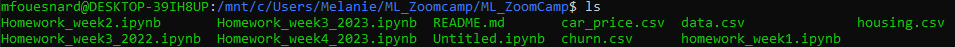

Python should be already installed but you can check it by running sudo apt install python3 command.

You can make your actual folder your default folder when you open your Ubuntu terminal with this command : echo "cd ../../mnt/your/folder/path" >> ~/.bashrc

You can disable bell sounds (when you type something that does not exist for example) by modifying the inputrc file with this command: sudo vim /etc/inputrc

You have to uncomment the set bell-style none line -> to do that, press the “i” keyboard letter (for insert) and go with your keyboard to this line. Delete the # and then press the Escape keyboard touch and finally press “:wq” to write (it saves your modifications) then quit.

You can check that your modifications are taken into account by opening a new terminal (you can pin it to your task bar so you do not have to go to the Microsoft app each time).

You will need to install pip by running this command sudo apt install python3-pip

NB: I had this error message when trying to install pipenv ():

/sbin/ldconfig.real: Can't link /usr/lib/wsl/lib/libnvoptix_loader.so.1 to libnvoptix.so.1

/sbin/ldconfig.real: /usr/lib/wsl/lib/libcuda.so.1 is not a symbolic link

So I had to create the following symbolic link:

sudo ln -s /usr/lib/wsl/lib/libcuda.so.1 /usr/lib64/libcuda.so

(Mélanie Fouesnard)

---

### Error building Docker images on Mac with M1 silicon

Do you get errors building the Docker image on the Mac M1 chipset?

The error I was getting was:

Could not open '/lib64/ld-linux-x86-64.so.2': No such file or directory

The fix (from ): vvvvvvvvvvvvvvvvvvvvvvvvvvvvvvvvvvvv

Open mlbookcamp-code/course-zoomcamp/01-intro/environment/Dockerfile

Replace line 1 with

FROM --platform=linux/amd64 ubuntu:latest

Now build the image as specified. In the end it took over 2 hours to build the image but it did complete in the end.

David Colton

---

### Method to find the version of any install python libraries in jupyter notebook

Import waitress

print(waitress.__version__)

Krishna Anand

---

### Cannot connect to the docker daemon. Is the Docker daemon running?

Ensure Docker Daemon Is Running

On Windows:

Open Docker Desktop (admin rights may be required).

Check if it’s running, and restart Docker Desktop if necessary.

On Linux:

Run sudo systemctl start docker to start the Docker daemon.

Verify it’s running with sudo systemctl status docker.

Verify Docker Group Membership (Linux Only)

Check if your user is in the Docker group:

groups $USER

If "docker" isn’t listed, add yourself with:

sudo usermod -aG docker $USER

Log out and back in to apply changes.

Restart the Docker Service (Linux)

sudo systemctl restart docker

Check Docker Socket Permissions (Linux)

Run the following command to confirm Docker socket permissions:

sudo chmod 666 /var/run/docker.sock

Try Running Docker with sudo (Linux)

Run sudo docker ps to check if permissions are causing the issue.

Test Docker Setup

Run a test Docker command to verify connection:

docker run hello-world

Working on getting Docker installed - when I try running hello-world I am getting the error.

Docker: Cannot connect to the docker daemon at unix:///var/run/docker.sock. Is the Docker daemon running ?

Solution description

If you’re getting this error on WSL, re-install your docker: remove the docker installation from WSL and install Docker Desktop on your host machine (Windows).

On Linux, start the docker daemon with either of these commands:

sudo dockerd

sudo service docker start

Added by

---

### The command '/bin/sh -c pipenv install --deploy --system &&  rm -rf /root/.cache' returned a non-zero code: 1

After using the command “docker build -t churn-prediction .” to build the Docker image, the above error is raised and the image is not created.

In your Dockerfile, change the Python version in the first line the Python version installed in your system:

FROM python:3.7.5-slim

To find your python version, use the command python --version. For example:

python --version

>> Python 3.9.7

Then, change it on your Dockerfile:

FROM python:3.9.7-slim

Added by

---

### Running “pipenv install sklearn==1.0.2” gives errors. What should I do?

When the facilitator was adding sklearn to the virtual environment in the lectures, he used sklearn==0.24.1 and it ran smoothly. But while doing the homework and you are asked to use the 1.0.2 version of sklearn, it gives errors.

The solution is to use the full name of sklearn. That is, run it as “pipenv install scikit-learn==1.0.2” and the error will go away, allowing you to install sklearn for the version in your virtual environment.

Odimegwu David

Homework asks you to install 1.3.1

Pipenv install scikit-learn==1.3.1

Use Pipenv to install Scikit-Learn version 1.3.1

Gopakumar Gopinathan

---

### Error: Failed to lock files with Pipfile.lock

When adding libraries to the virtual environment in the lesson 5.5, the trainer used the command pipenv install numpy scikit-learn==0.24.2 flask; however, some people using Python 3.11 or later, may encounter an error, failing to lock files correctly with Pipfile.lock. You may need to install `scikit-learn==1.4.2` as the error you got when running the application is a bit different from the one of the trainer. This should solve the problem.

If you are still having problems, try the following:

● Delete the Pipfile.lock via rm Pipfile; then rebuild the lock via pipenv lock from the terminal.

● If it still doesn't work, delete the pipenv environment, Pipfile and Pipfile.lock, and create a new one. The commands to delete the pipenv environment and pip files are:

`pipenv --rm`

`rm Pipfile*`

Maximilien Eyengue

---

### How do I resolve the "No module named flask" error?

I initially installed Flask with pipenv, but I received a "No module named 'flask'" error. I then reinstalled Flask using pip, and after that, I was able to import Flask successfully.

— Kuzey Edes Huyal

---

### Why do we need the --rm flag

What is the reason we don’t want to keep the docker image in our system and why do we need to run docker containers with `--rm` flag?

For best practice, you don’t want to have a lot of abandoned docker images in your system. You just update it in your folder and trigger the build one more time.

They consume extra space on your disk. Unless you don’t want to re-run the previously existing containers, it is better to use the `--rm` option.

The right way to say: “Why do we remove the docker container in our system?”. Well the docker image is still kept; it is the container that is not kept. Upon execution, images are not modified; only containers are.

The option `--rm` is for removing containers. The images remain until you remove them manually. If you don’t specify a version when building an image, it will always rebuild and replace the latest tag. `docker images` shows you all the image you have pulled or build so far.

During development and testing you usually specify `--rm` to get the containers auto removed upon exit. Otherwise they get accumulated in a stopped state, taking up space. `docker ps -a` shows you all the containers you have in your host. Each time you change Pipfile (or any file you baked into the container), you rebuild the image under the same tag or a new tag. It’s important to understand the difference between the term “docker image” and “docker container”. Image is what we build with all the resources baked in. You can move it around, maintain it in a repository, share it. Then we use the image to spin up instances of it and they are called containers.

Added by Muhammad Awon

---

### Failed to read Dockerfile

When you create the dockerfile the name should be dockerfile and needs to be without extension. One of the problems we can get at this point is to create the dockerfile as a dockerfile extension Dockerfile.dockerfile which creates an error when we build the docker image. Instead we just need to create the file without extension: Dockerfile and will run perfectly.

Added by Pastor Soto

---

### Install docker on MacOS

Refer to the page  remember to check if you have apple chip or intel chip.

---

### I cannot pull the image with docker pull command

Problem: When I am trying to pull the image with the docker pull svizor/zoomcamp-model command I am getting an error:

Using default tag: latest
Error response from daemon: manifest for svizor/zoomcamp-model:latest not found: manifest unknown: manifest unknown

Solution: The docker by default uses the latest tag to avoid this use the correct tag from image description. In our case use command:

docker pull svizor/zoomcamp-model:3.10.12-slim

Added by Vladimir Yesipov

---

### Dumping/Retrieving only the size of for a specific Docker image

Using the command docker images or docker image ls will dump all information for all local Docker images. It is possible to dump the information only for a specified image by using:

docker image ls <image name>

Or alternatively:

docker images <image name>

In action to that it is possible to only dump specific information provided using the option --format which will dump only the size for the specified image name when using the command below:

docker image ls --format "{{.Size}}" <image name>

Or alternatively:

docker images --format "{{.Size}}" <image name>

Sylvia Schmitt

---

### Where does pipenv create environments and how does it name them?

It creates them in

OSX/Linux: ~/.local/share/virtualenvs/folder-name_cyrptic-hash

Windows: C:\Users\<USERNAME>\.virtualenvs\folder-name_cyrptic-hash

Eg: C:\Users\Ella\.virtualenvs\code-qsdUdabf (for module-05 lesson)

The environment name is the name of the last folder in the folder directory where we used the pipenv install command (or any other pipenv command). E.g. If you run any pipenv command in folder path ~/home/user/Churn-Flask-app, it will create an environment named Churn-Flask-app-some_random_characters, and it's path will be like this: /home/user/.local/share/virtualenvs/churn-flask-app-i_mzGMjX.

All libraries of this environment will be installed inside this folder. To activate this environment, I will need to cd into the project folder again, and type pipenv shell. In short, the location of the project folder acts as an identifier for an environment, in place of any name.

(Memoona Tahira)

---

### How do I debug a docker container?

Launch the container image in interactive mode and overriding the entrypoint, so that it starts a bash command.

docker run -it --entrypoint bash <image>

If the container is already running, execute a command in the specific container:

docker ps (find the container-id)

docker exec -it <container-id> bash

(Marcos MJD)

---

### The input device is not a TTY when running docker in interactive mode (Running Docker on Windows in GitBash)

$ docker exec -it 1e5a1b663052 bash

the input device is not a TTY.  If you are using mintty, try prefixing the command with 'winpty'

Fix:

winpty docker exec -it 1e5a1b663052 bash

A TTY is a terminal interface that supports escape sequences, moving the cursor around, etc.

Winpty is a Windows software package providing an interface similar to a Unix pty-master for communicating with Windows console programs.

More info on terminal, shell, console applications hi and so on:

(Marcos MJD)

---

### Error: failed to compute cache key: "/model2.bin" not found: not found

Initially, I did not assume there was a model2. I copied the original model1.bin and dv.bin. Then when I tried to load using

COPY ["model2.bin", "dv.bin", "./"]

then I got the error above in MINGW64 (git bash) on Windows.

The temporary solution I found was to use

COPY ["*", "./"]

which I assume combines all the files from the original docker image and the files in your working directory.

Added by Muhammed Tan

---

### Failed to write the dependencies to pipfile and piplock file

Create a virtual environment using the Cmd command (command) and use pip freeze command to write the requirements in the text file

Krishna Anand

---

### f-strings

f-String not properly keyed in: does anyone knows why i am getting error after import pickle?

The first error showed up because your f-string is using () instead of {} around C. So, should be: f’model_C={C}.bin’

The second error as noticed by Sriniketh, your are missing one parenthesis it should be pickle.dump((dv, model), f_out)

(Humberto R.)

---

### 'pipenv' is not recognized as an internal or external command, operable program or batch file.

This error happens because pipenv is already installed but you can't access it from the path.

This error comes out if you run.

pipenv  --version

pipenv shell

Solution for Windows

Open this option

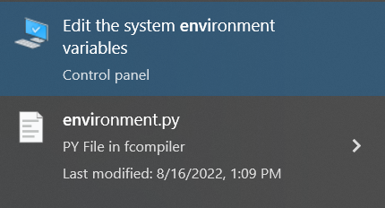

Click here

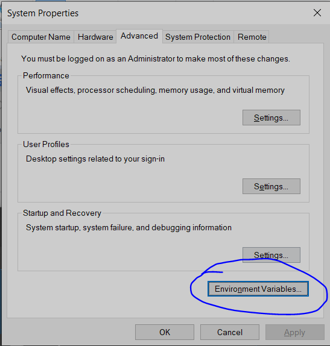

Click in Edit Button

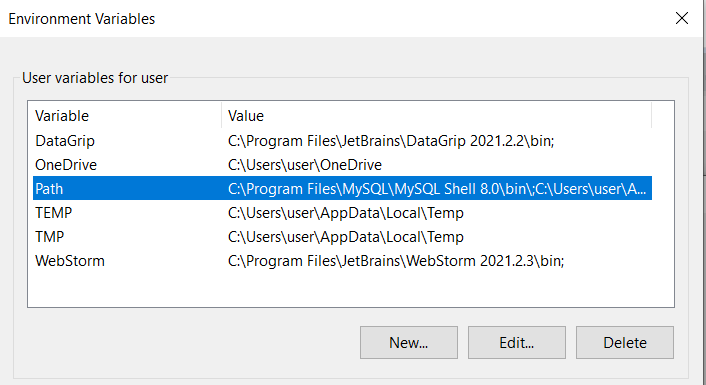

Make sure the next two locations are on the PATH, otherwise, add it.

C:\Users\AppData\....\Python\PythonXX\

C:\Users\AppData\....\Python\PythonXX\Scripts\

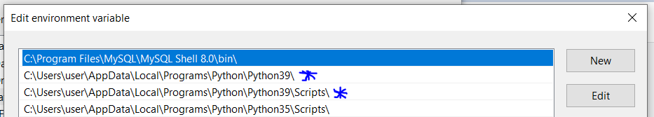

Added by Alejandro Aponte

Note: this answer assumes you don’t use Anaconda. For Windows, using Anaconda would be a better choice and less prone to errors.

---

### AttributeError: module ‘collections’ has no attribute ‘MutableMapping’

Following the instruction from video week-5.6, using pipenv to install python libraries throws below error

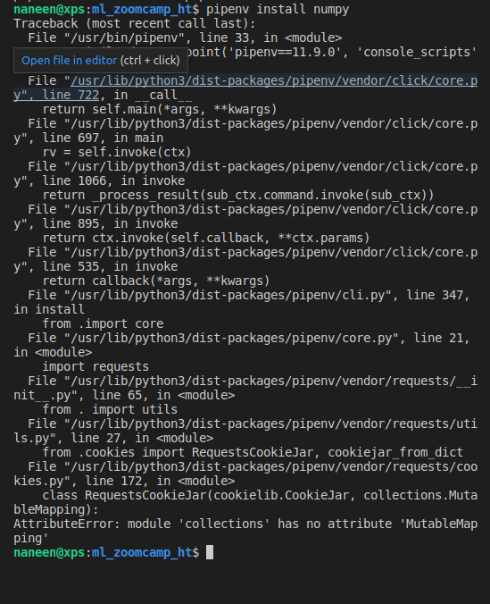

Solution to this error is to make sure that you are working with python==3.9 (as informed in the very first lesson of the zoomcamp) and not python==3.10.

Added by Hareesh Tummala

---

### Q: ValueError: Path not found or generated: WindowsPath('C:/Users/username/.virtualenvs/envname/Scripts')

After entering `pipenv shell` don’t forget to use `exit` before `pipenv --rm`, as it may cause errors when trying to install packages, it is unclear whether you are “in the shell”(using Windows) at the moment as there are no clear markers for it.

It can also mess up PATH, if that’s the case, here’s terminal commands for fixing that:

# for Windows

set VIRTUAL_ENV ""

# for Unix

export VIRTUAL_ENV=""

Also manually re-creating removed folder at `C:\Users\username\.virtualenvs\removed-envname` can help, removed-envname can be seen at the error message.

Added by Andrii Larkin

---

### ConnectionError: ('Connection aborted.', RemoteDisconnected('Remote end closed connection without response'))

Set the host to ‘0.0.0.0’ on the flask app and dockerfile then RUN the url using localhost.

(Theresa S.)

---

### docker  build ERROR [x/y] COPY …

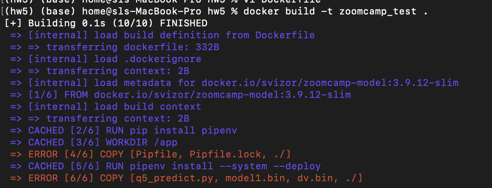

Solution:

This error occurred because I used single quotes around the filenames. Stick to double quotes

---

### Fix error during installation of Pipfile inside Docker container

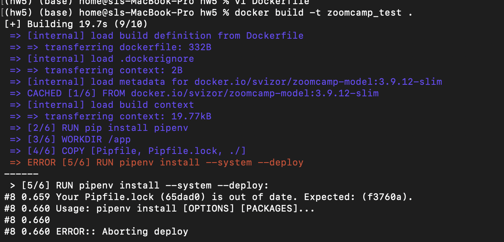

I tried the first solution on Stackoverflow which recommended running `pipenv lock` to update the Pipfile.lock. However, this didn’t resolve it. But the following switch to the pipenv installation worked

RUN pipenv install --system --deploy --ignore-pipfile

---

### How to fix error after running the Docker run command

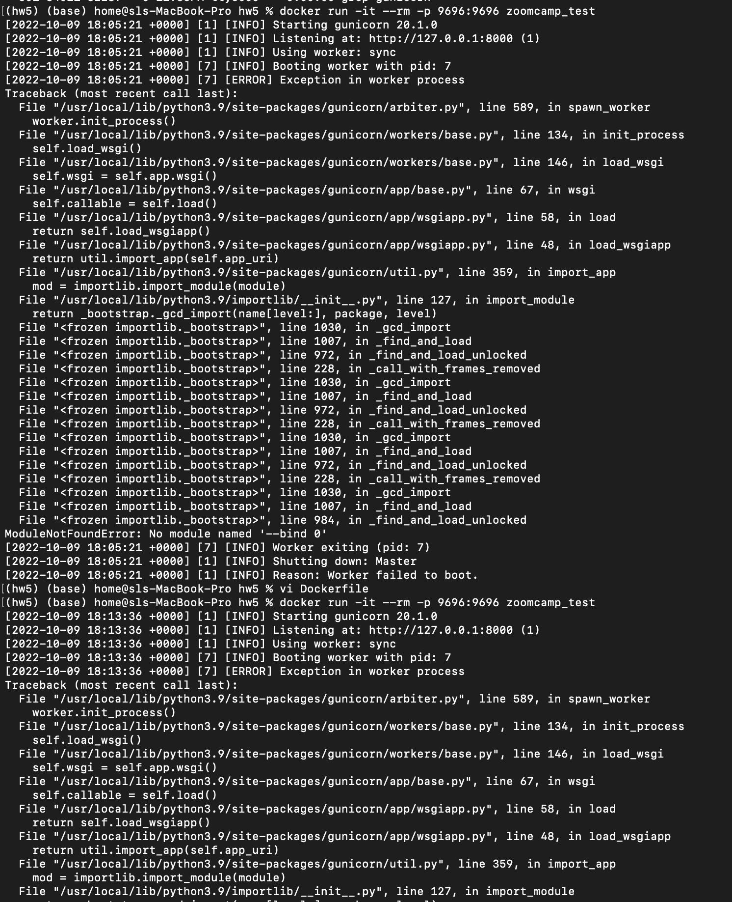

Solution

This error was because there was another instance of gunicorn running. So I thought of removing this along with the zoomcamp_test image. However, it didn’t let me remove the orphan container. So I did the following

Running the following commands

docker ps -a <to list all docker containers>

docker images <to list images>

docker stop <container ID>

docker rm <container ID>

docker rmi image

I rebuilt the Docker image, and ran it once again; this time it worked correctly and I was able to serve the test script to the endpoint.

---

### Bind for 0.0.0.0:9696 failed: port is already allocated

I was getting the below error when I rebuilt the docker image although the port was not allocated, and it was working fine.

Error message:

Error response from daemon: driver failed programming external connectivity on endpoint beautiful_tharp (875be95c7027cebb853a62fc4463d46e23df99e0175be73641269c3d180f7796): Bind for 0.0.0.0:9696 failed: port is already allocated.

Solution description

Issue has been resolved running the following command:

docker kill $(docker ps -q)

Asia Saeed

---

### Bind for 127.0.0.1:5000 showing error

I was getting the error on client side with this

Client Side:

File "C:\python\lib\site-packages\urllib3\connectionpool.py", line 703, in urlopen …………………..

raise ConnectionError(err, request=request)

requests.exceptions.ConnectionError: ('Connection aborted.', RemoteDisconnected('Remote end closed connection without response'))

Sevrer Side:

It showed error for gunicorn

The waitress  cmd was running smoothly from server side

Solution:

Use the ip-address as 0.0.0.0:8000 or 0.0.0.0:9696.They are the ones which do work max times

Aamir Wani

---

### Installing md5sum on Macos

Install it by using command

% brew install md5sha1sum

Then run command to check hash for file to check if they the same with the provided

% md5sum model1.bin dv.bin

Olga Rudakova

---

### How to run a script while a web-server is working?

Problem description:

I started a web-server in terminal (command window, powershell, etc.). How can I run another python script, which makes a request to this server?

Solution description:

Just open another terminal (command window, powershell, etc.) and run a python script.

Alena Kniazeva

---

### Version-conflict in pipenv

Problem description:

In video 5.5 when I do pipenv shell and then pipenv run gunicorn --bind 0.0.0.0:9696 predict:app, I get the following warning:

UserWarning: Trying to unpickle estimator DictVectorizer from version 1.1.1 when using version 0.24.2. This might lead to breaking code or invalid results. Use at your own risk.

Solution description:

When you create a virtual env, you should use the same version of Scikit-Learn that you used for training the model on this case it's 1.1.1. There is version conflicts so we need to make sure our model and dv files are created from the version we are using for the project.

Bhaskar Sarma

---

### Python_version and Python_full_version error after running pipenv install:

If you install packages via pipenv install, and get an error that ends like this:

pipenv.vendor.plette.models.base.ValidationError: {'python_version': '3.9', 'python_full_version': '3.9.13'}

python_full_version: 'python_version' must not be present with 'python_full_version'

python_version: 'python_full_version' must not be present with 'python_version'

Do this:

open Pipfile in nano editor, and remove either the python_version or python_full_version line, press CTRL+X, type Y and click Enter to save changed

Type pipenv lock to create the Pipfile.lock.

Done. Continue what you were doing

---

### Your Pipfile.lock (221d14) is out of date (during Docker build)

If during running the  docker build command, you get an error like this:

Your Pipfile.lock (221d14) is out of date. Expected: (939fe0).

Usage: pipenv install [OPTIONS] [PACKAGES]...

ERROR:: Aborting deploy

Option 1: Delete the pipfile.lock via rm Pipfile, and then rebuild the lock via  pipenv lock from the terminal before retrying the docker build command.

Option 2:  If it still doesn’t work, remove the pipenv environment, Pipfile and Pipfile.lock, and create a new one before building docker again. Commands to remove pipenv environment and removing pipfiles:

pipenv  --rm

rm Pipfile*

---

### You are using windows. Conda environment. You then use waitress instead of gunicorn. After a few runs, suddenly mlflow server fails to run.

Ans: Pip uninstall waitress mflow. Then reinstall just mlflow. By this time you should have successfully built your docker image so you dont need to reinstall waitress. All good. Happy learning.

Added by 🅱🅻🅰🆀

---

### Completed creating the environment locally but could not find the environment on AWS.

Ans: so you have created the env. You need to make sure you're in eu-west-1 (ireland) when you check the EB environments. Maybe you're in a different region in your console.

Added by Edidiong Esu

---

### Installing waitress on Windows via GitBash: “waitress-serve” command not found

Running 'pip install waitress' as a command on GitBash was not downloading the executable file 'waitress-serve.exe'. You need this file to be able to run commands with waitress in Git Bash. To solve this:

open a Jupyter notebook and run the same command ' pip install waitress'. This way the executable file will be downloaded. The notebook may give you this warning : 'WARNING: The script waitress-serve.exe is installed in 'c:\Users\....\anaconda3\Scripts' which is not on PATH. Consider adding this directory to PATH or, if you prefer to suppress this warning, use --no-warn-script-location.'

Add the path where 'waitress-serve.exe' is installed into gitbash's PATH as such:

enter the following command in gitbash: nano ~/.bashrc

add the path to 'waitress-serve.exe' to PATH using this command: export PATH="/path/to/waitress:$PATH"

close gitbash and open it again and you should be good to go

Added by Bachar Kabalan

---

### Warning: the environment variable LANG is not set!

Q2.1: Use Pipenv to install Scikit-Learn version 1.3.1

This is an error I got while executing the above step in the . The error is not fatal and just warns you that explicit language specifications are not set out in our bash profile. A quick-fix is here:

But one can proceed without addressing it.

Added by Abhirup Ghosh

---

### Module5 HW Question 6

The provided image FROM svizor/zoomcamp-model:3.10.12-slim has a model and dictvectorizer that should be used for question 6. "model2.bin", "dv.bin"

Added by Quinn Avila

---

### Terminal Used in Week 5 videos:

Added by Dawuta Smit

---

### waitress-serve shows Malformed application

Question:

When running

pipenv run waitress-serve --listen=localhost:9696 q4-predict:app

I get the following:

There was an exception (ValueError) importing your module.

It had these arguments:

1. Malformed application 'q4-predict:app'

Answer:

Waitress doesn’t accept a dash in the python file name.

The solution is to rename the file replacing a dash with something else for instance with an underscore eg q4_predict.py

Added by Alex Litvinov

---

### Testing HTTP POST requests from command line using curl

I wanted to have a fast and simple way to check if the HTTP POST requests are working just running a request from command line. This can be done running ‘curl’. 
(Used with WSL2 on Windows, should also work on Linux and MacOS)

curl --json '<json data>' <url>

# piping the structure to the command

cat <json file path> | curl --json @- <url>

echo '<json data>' | curl --json @- <url>

# example using piping

echo '{"job": "retired", "duration": 445, "poutcome": "success"}'\

| curl --json @- http://localhost:9696/predict

Added by Sylvia Schmitt

---

### NotSupportedError - You can use "eb local" only with preconfigured, generic and multicontainer Docker platforms.

Question:

When executing

eb local run  --port 9696

I get the following error:

ERROR: NotSupportedError - You can use "eb local" only with preconfigured, generic and multicontainer Docker platforms.

Answer:

There are two options to fix this:

Re-initialize by running eb init -i and choosing the options from a list (the first default option for docker platform should be fine).

Edit the ‘.elasticbeanstalk/config.yml’ directly changing the default_platform from Docker to default_platform: Docker running on 64bit Amazon Linux 2023

The disadvantage of the second approach is that the option might not be available the following years

Added by Alex Litvinov

An alternative solution is to re-run the init command but change the value after the -p flag from docker to a string like "Docker running on 64bit Amazon Linux". Then, re-run the first command. For example:

eb init -p "Docker running on 64bit Amazon Linux" <appname>

eb local run --port 9696

Added by Lynn Samson

Original solution from

---

### Requests Error: No connection adapters were found for 'localhost:9696/predict'.

You need to include the protocol scheme: ''.

Without the http:// part, requests has no idea how to connect to the remote server.

Note that the protocol scheme must be all lowercase; if your URL starts with HTTP:// for example, it won’t find the http:// connection adapter either.

Added by George Chizhmak

---

### Getting the same result

While running the docker image if you get the same result check which model you are using.

Remember you are using a model downloading model + python version so remember to change the model in your file when running your prediction test.

Added by Ahmed Okka

---

### Trying to run a docker image I built but it says it’s unable to start the container process

Ensure that you used pipenv to install the necessary modules including gunicorn. As pipfiles for virtual environments, you can use pipenv shell and then build+run your docker image. - Akshar Goyal

---

### How do I copy files from my local machine to docker container?

You can copy files from your local machine into a Docker container using the docker cp command. Here's how to do it:

To copy a file or directory from your local machine into a running Docker container, you can use the `docker cp command`. The basic syntax is as follows:

docker cp /path/t²o/local/file_or_directory container_id:/path/in/container

Hrithik Kumar Advani

---

### How do I copy files from a different folder into docker container’s working directory?

You can copy files from your local machine into a Docker container using the docker cp command. Here's how to do it:

In the Dockerfile, you can provide the folder containing the files that you want to copy over. The basic syntax is as follows:

COPY ["src/predict.py", "models/xgb_model.bin", "./"]											Gopakumar Gopinathan

---

### I can’t create the environment on AWS Elastic Beanstalk with the command proposed during the video

I struggled with the command :

eb init -p docker tumor-diagnosis-serving -r eu-west-1

Which resulted in an error when running : eb local run --port 9696

ERROR: NotSupportedError - You can use "eb local" only with preconfigured, generic and multicontainer Docker platforms.

I replaced it with :

eb init -p "Docker running on 64bit Amazon Linux 2" tumor-diagnosis-serving -r eu-west-1

This allowed the recognition of the Dockerfile and the build/run of the docker container.

Added by Mélanie Fouesnard

---

### Dockerfile missing when creating the AWS ElasticBean environment

I had this error when creating a AWS ElasticBean environment: eb create tumor-diagnosis-env

ERROR   Instance deployment: Both 'Dockerfile' and 'Dockerrun.aws.json' are missing in your source bundle. Include at least one of them. The deployment failed.

I did not committed the files used to build the container, particularly the Dockerfile. After a git add and git commit of the modified files, the command works.

Added by Mélanie Fouesnard

When creating and launching an AWS Elastic Bean environment with eb create why does this error show up “ERROR: CommandError - git could not find the HEAD; most likely because there are no commits present”

The error indicates that your project directory has not been initialized as a Git repository or is in a "detached HEAD" state. Elastic Beanstalk's CLI (eb) relies on Git for managing application versions, so resolving this issue is necessary. Here is how you can fix it:

Check if Git is initialized in your project directory by running: git status

If Git is not initialized, you’ll see an error or a message indicating no repository exists. Initialize it: git init

If the Git repository exists but doesn’t have any commits, create an initial commit:

o   git add .

o   git commit -m "Initial commit"

This will allow Elastic Beanstalk to track your project files

If Git reports that it is in a "detached HEAD" state, switch to a valid branch:

o   Create a new branch (if none exists): git checkout -b main

o   Or switch to an existing branch: git checkout main

If the warnings persist, reinitialize Elastic Beanstalk to ensure it’s correctly configured: eb init

Retry the Deployment by running the eb command again: eb create <env_name> --enable-spot

(added by Siddhartha Gogoi)

---

### Why doesn’t the eb create command use the latest version of my Dockerfile?

When you make local changes to Dockerfile or any other files and do not commit the changes, AWS won’t  deploy the changes. The reason is that by default, the EB CLI deploys the latest commit in the current branch. If you want to deploy to your environment without committing, you can use the –stage option to deploy changes that have been added to the staging area.

If the docker image creation fails during the “eb create” process, you can still create the image and deploy it by running eb deploy.

To deploy changes without committing

Add new and changed files to the staging area:

~/eb$ git add .

Deploy the staged changes with eb deploy:

~/eb$ eb deploy --staged

(added by Karina)

---

### Elastic Beanstalk ‘eb create’: ERROR   Creating Auto Scaling launch configuration failed Reason: Resource handler returned message: "The Launch Configuration creation operation is not available in your account. Use launch templates to create configuration templates for your Auto Scaling groups.

Create your environment using the --enable-spot flag which automatically uses Launch Templates

Example: eb create med-app-env --enable-spot

Another option is to run only eb create and follow the wizard options:

Enter Environment Name

(default is churn-serving-dev): churn-serving-dev

Enter DNS CNAME prefix

(default is churn-serving-dev): churn-serving-dev

Select a load balancer type

1) classic

2) application

3) network

(default is 2): 1

Would you like to enable Spot Fleet requests for this environment? (y/N): y

Enter a list of one or more valid EC2 instance types separated by commas (at least two instance types are recommended).

(Defaults provided on Enter): just type ‘enter’

---

### AWS Discontinues Support for Launch Configurations

Starting on October 1, 2024, the Amazon EC2 Auto Scaling service will no longer support the creation of launch configurations for new accounts. This change is due to launch configurations being phased out and replaced by launch templates by the Amazon EC2 Auto Scaling service.

For more details refer to:

This replacement of launch configurations by launch templates is what caused the error described previously (“...use launch templates to create configuration templates for your Auto Scaling groups)

(added by Karina)

---

### Default VPC Error when deploying to AWS Elastic Beanstalk:

In case of encounter this error when following the tutorial about deploying app to AWS. When you enter the command “eb create churn-prediction-env” it will prompt created successfully but later shows an error of VPC configuration, there is no default VPC for the selected region, go to AWS Console, select your region from the top bar (example: us-east-2), search for VPC and from the left menu go to “Your VPCs”. It is possible that you dont have any at this point, the action to create default VPC will be available, click on it and run the command again.

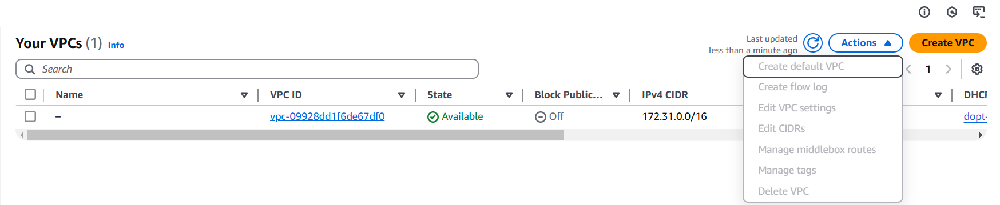

(Added by Kelly Vergara)

---

### What's the advantage of using Gunicorn with Flask in Docker?

Gunicorn is a Python WSGI HTTP server that is more suitable for production than the default Flask development server:

Performance:

Better at handling multiple simultaneous requests.

Stability:

More robust and can manage worker processes.

Usage:

Modify the CMD in your Dockerfile:
CMD ["gunicorn", "--bind", "0.0.0.0:9696", "app:app"]

(added by David Peterson)

---

### Fix warning Warning: Python 3.12 was not found on your system… Neither 'pyenv' nor 'asdf' could be found to install Python.

This is due to the fact the Pipfile is expecting Python 3.12, but the local container is probably running an older version (mainly the one shown in video , which is Python 3.8.12-slim. In order to fix this simply the `Dockerfile` to run an appropriate version, like shown below:

FROM python:3.12.7-slim

Both python versions (local version, shown in Pipfile and container version) must be congruent so as to guarantee compatibility.

(added by Jon Areas)

---

### How to use a specific python version (e.g. 3.11) from conda with pipenv?

First of all, you should avoid being in a virtual environment when using pipenv. You can point pipenv directly to the Python 3.11 interpreter from your Conda installation:

Activate conda env conda activate env_name

Get python path which python

Deactivate conda env conda deactivate

Use pipenv with the python path found in 3 pipenv --python /path/to/python

(added by Kemal Dahha)

---

### Pipenv is taking forever to lock file. I have deleted the lockfile, and restarted my pc. Please, what is a possible solution?

You could try running your homework on GitHub Codespaces instead of your local computer. In my experience, the compute resources on GitHub Codespaces are quite sufficient for Homework 5. No issues at all in terms of speed.

(added by Victor Emenike)

---

## 6. Decision Trees and Ensemble Learning

### Unable to complete HW 5 due to running Docker on M1 and not using Docker Desktop.

Solution: 
If you replaced Docker desktop with ‘lima’, you may be able to create an instance of Lima using the . Follow the instructions listed on the page and create an instance with the template supplied. You’ll have to switch your current (if any) docker context to the context associated with this new (running) image. You should be able to use ‘svizor/zoomcamp-model:3.11.5-slim’ as a base image and run your own built image without issues.

By Alex Khvatov

Simple solution:

specify the platform. try this

docker run --platform linux/amd64 -it --rm -p 9696:9696 <your-docker-image-name>

Added by Till Meineke, solution from Aaron

Q: Why do I get the error TypeError: Expecting a sequence of strings for feature names, got: <class 'numpy.ndarray'> when using xgb.DMatrix?

A: This error occurs because recent versions of xgb.DMatrix expect the feature_names parameter to be a list of strings rather than a NumPy array. If you’re following older tutorial videos, they may use feature_names=dv.get_feature_names_out() directly, which now results in this error.

Solution: To resolve this, convert dv.get_feature_names_out() to a list using .tolist(). Here’s an updated example:

# Convert feature names to a list

feature_names = dv.get_feature_names_out().tolist()

# Create DMatrix objects with the corrected feature names

dfulltrain = xgb.DMatrix(X_full_train,

label=y_full_train,

feature_names=feature_names)

dtest = xgb.DMatrix(X_test,

feature_names=feature_names)

Explanation: The dv.get_feature_names_out() method returns a NumPy array, but xgb.DMatrix now expects feature_names to be a list of strings. Using .tolist() converts the array to a compatible format, allowing the code to run without errors.

---

### How to get started with Week 6?

Week 6 HW 2024:

Till Meineke

Week 6 HW 2023:

All HWs:

HW 4 Solution:

Evaluation Matrix:

GitHub for theory:

YouTube Link: 6.X ---

FAQs:

~~~Nukta Bhatia~~~

---

### How to ensure "none" values are not interpreted as NaN when reading a CSV file in Pandas

To ensure that the string values like "None" are treated as valid strings rather than being converted to NaN when reading a CSV file, you can read the CSV file with keep_default_na set to False and specify the values you want to consider as NaN with the na_values parameter.

Here’s an example of how to do this:

import pandas as pd

df = pd.read_csv("dataset_path.csv", keep_default_na=False, na_values=['', 'NaN', 'null'])

Using keep_default_na=False prevents Pandas from applying its default set of NaN values, allowing "None" to be read as a regular string.

(added by Karina)

---

### How to fix when %%capture output is not working in Google Collab Notebook

I was using Google Collab Notebook for the 2024 cohort HW 06. For the Q6 here, the

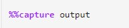

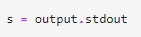

was not working in the Collab Notebook. This led me to find a solution which is as follows:

# import the required libraries

import io

import sys

# Capture output using io.StringIO

output_capture = io.StringIO()

sys.stdout = output_capture  # Redirect stdout to the StringIO buffer

# Train the model with eta=0.3

model_eta_03 = xgb.train(xgb_params, dtrain, num_boost_round=num_rounds, verbose_eval=2, evals=watchlist)

# Reset stdout

sys.stdout = sys.__stdout__

# Retrieve and print the captured output

captured_output = output_capture.getvalue()

And, we need to slightly modify the parser function for only one line:

for line in output.stdout.strip().split('\n'):    # replace this line 3 in Alexey’s parser function with

for line in output.strip().split('\n'):

And  then call the df_score_03 = parse_xgb_output(captured_output)for getting the desired dataframe.

(Added by Siddhartha Gogoi)

---

### How to get the training and validation metrics from XGBoost?

During the XGBoost lesson, we created a parser to extract the training and validation auc from the standard output. However, we can accomplish that in a more straightforward way.

We can use the evals_result  parameters, which takes an empty dictionary and updates it for each tree. Additionally, you can store the data in a dataframe and plot it in an easier manner.

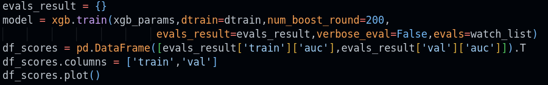

Added by Daniel Coronel

---

### How to solve regression problems with random forest in scikit-learn?

You should create sklearn.ensemble.RandomForestRegressor object. It’s rather similar to sklearn.ensemble.RandomForestClassifier for classification problems. Check  for more information.

Alena Kniazeva

---

### ValueError: feature_names must be string, and may not contain [, ] or <

In question 6, I was getting ValueError: feature_names must be string, and may not contain [, ] or < when I was creating DMatrix for train and validation

Solution description

The cause of this error is that some of the features names contain special characters like = and <, and I fixed the error by removing them as  follows:

features= [i.replace("=<", "_").replace("=","_") for i in features]

Asia Saeed

Alternative Solution:

In my case the equal sign “=” was not a problem, so in my opinion the first part of Asias solution features= [i.replace("=<", "_") should work as well.

For me this works:

features = []

for f in dv.feature_names_:

string = f.replace(“=<”, “-le”)

features.append(string)

Peter Ernicke

---

### `TypeError: Expecting a sequence of strings for feature names, got: <class 'numpy.ndarray'> ` when training xgboost model.

If you’re getting this error, It is likely because the feature names in dv.get_feature_names_out() are a np.ndarray instead of a list so you have to convert them into a list by using the to_list() method.

Ali Osman

---

### Q6: ValueError or TypeError while setting xgb.DMatrix(feature_names=)

If you’re getting TypeError:

“TypeError: Expecting a sequence of strings for feature names, got: <class 'numpy.ndarray'>”,

probably you’ve done this:

features = dv.get_feature_names_out()

It gets you np.ndarray instead of list. Converting to list list(features) will not fix this, read below.

If you’re getting ValueError:

“ValueError: feature_names must be string, and may not contain [, ] or <”,

probably you’ve either done:

features = list(dv.get_feature_names_out())

or:

features = dv.feature_names_

reason is what you get from DictVectorizer here looks like this:

['households',

'housing_median_age',

'latitude',

'longitude',

'median_income',

'ocean_proximity=<1H OCEAN',

'ocean_proximity=INLAND',

'population',

'total_bedrooms',

'total_rooms']

it has symbols XGBoost doesn’t like ([, ] or <).

What you can do, is either do not specify “feature_names=” while creating xgb.DMatrix or:

import re

features = dv.feature_names_

pattern = r'[\[\]<>]'

features = [re.sub(pattern, '  ', f) for f in features]

Added by Andrii Larkin

---

### How to Install Xgboost

To install Xgboost, use the code below directly in your jupyter notebook:

(Pip 21.3+ is required)

pip install xgboost

You can update your pip by using the code below:

pip install --upgrade pip

For more about xgbboost and installation, check here:

Aminat Abolade

---

### What is eta in XGBoost

Sometimes someone might wonder what eta means in the tunable hyperparameters of XGBoost and how it helps the model.

ETA is the learning rate of the model. XGBoost uses gradient descent to calculate and update the model. In gradient descent, we are looking for the minimum weights that help the model to learn the data very well. This minimum weights for the features is updated each time the model passes through the features and learns the features during training. Tuning the learning rate helps you tell the model what speed it would use in deriving the minimum for the weights.

---

### What is the difference between bagging and boosting?

For ensemble algorithms, during the week 6, one bagging algorithm and one boosting algorithm were presented: Random Forest and XGBoost, respectively.

Random Forest trains several models in parallel. The output can be, for example, the average value of all the outputs of each model. This is called bagging.

XGBoost trains several models sequentially: the previous model error is used to train the following model. Weights are used to ponderate the models such as the best models have higher weights and are therefore favored for the final output. This method is called boosting.

Note that boosting is not necessarily better than bagging.

Mélanie Fouesnard

Bagging stands for “Bootstrap Aggregation” - it involves taking multiple samples with replacement to derive multiple training datasets from the original training dataset (bootstrapping), training a classifier (e.g. decision trees or stumps for Random Forests) on each such training dataset, and then combining the the predictions (aggregation) to obtain the final prediction. For classification, predictions are combined via voting; for regression, via averaging. Bagging can be done in parallel, since the various classifiers are independent. Bagging decreases variance (but not bias) and is robust against overfitting.

Boosting, on the other hand, is sequential - each model learns from the mistakes of its predecessor. Observations are given different weights - observations/samples misclassified by the previous classifier are given a higher weight, and this process is continued until a stopping condition is reached (e.g. max. No. of models is reached, or error is acceptably small, etc.). Boosting reduces bias & is generally more accurate than bagging, but can be prone to overfitting.

Rileen

---

### How to save/download jupyter notebook to python script

The line of code below convert a notebook to python script which will have the same name as the notebook with a .py extension. This should be run on the terminal

jupyter nbconvert --to python notebnook.ipynb

OR on the jupyter notebook

File -> Save and Export Notebook As -> Executable Scripts. This will download the file in the download folder

Saikou Y Bah

---

### Capture stdout for each iterations of a loop separately

I wanted to directly capture the output from the xgboost training for multiple eta values to a dictionary without the need to run the same cell multiple times and manually editing the eta value in between or copy the code for a second eta value.

Using the magic cell command “%%capture output” I was only able to capture the complete output for all iterations for the loop, but. I was able to solve this using the following approach. This is just a code sample to grasp the idea.

# This would be the content of the Jupyter Notebook cell

from IPython.utils.capture import capture_output

import sys

different_outputs = {}

for i in range(3):

with capture_output(sys.stdout) as output:

print(i)

print("testing capture")

different_outputs[i] = output.stdout

# different_outputs

# {0: '0\ntesting capture\n',

#  1: '1\ntesting capture\n',

#  2: '2\ntesting capture\n'}

Added by Sylvia Schmitt

---

### ValueError: continuous format is not supported

Calling roc_auc_score() to get auc is throwing the above error.

Solution to this issue is to make sure that you pass y_actuals as 1st argument and y_pred as 2nd argument.

roc_auc_score(y_train, y_pred)

Hareesh Tummala

---

### Question 3 of homework 6 if i see that rmse goes up at a certain number of n_estimators but then goes back down lower than it was before, should the answer be the number of n_estimators after which rmse initially went up, or the number after which it was its overall lowest value?

When rmse stops improving means, when it stops to decrease or remains almost similar.

Pastor Soto

---

### One of the method to visualize the decision trees

dot_data = tree.export_graphviz(regr, out_file=None,

feature_names=boston.feature_names,

filled=True)

graphviz.Source(dot_data, format="png")

Krishna Anand

from sklearn import tree

tree.plot_tree(dt,feature_names=dv.feature_names_)

Added By Ryan Pramana

---

### ValueError: Unknown label type: 'continuous'

Solution: This problem happens because you use DecisionTreeClassifier instead of DecisionTreeRegressor. You should check if you want to use a Decision tree for classification or regression.

Alejandro Aponte

---

### Different values of auc, each time code is re-run

When I run dt = DecisionTreeClassifier() in jupyter in same laptop, each time I re-run it or do (restart kernel + run) I get different values of auc. Some of them are 0.674, 0.652, 0.642, 0.669 and so on.  Anyone knows why it could be? I am referring to 7:40-7:45 of video 6.3.

Solution: try setting the random seed e.g

dt = DecisionTreeClassifier(random_state=22)

Bhaskar Sarma

---

### Does it matter if we let the Python file create the server or if we run gunicorn directly?

They both do the same, it's just less typing from the script.

Asked by Andrew Katoch, Added by Edidiong Esu

---

### No module named ‘ping’?

When I tried to run example from the video using function ping and can not import it. I use import ping and it was unsuccessful. To fix it I use the statement:

from [file name] import ping

Olga Rudakova

---

### DictVectorizer feature names

The DictVectorizer has a function to get the feature names . This is helpful for example if you need to analyze feature importance but use the dict vectorizer for one hot encoding. Just keep in mind it does return a numpy array so you may need to convert this to a list depending on your usage for example dv.get_feature_names_out() will return a ndarray array of string objects. list(dv.get_feature_names_out()) will convert to a standard list of strings. Also keep in mind that you first need to fit the predictor and response arrays before you have access to the feature names.

Quinn Avila

---

### Does it matter if we let the Python file create the server or if we run gunicorn directly?

They both do the same, it's just less typing from the script.

---

### ValueError: feature_names must be string, and may not contain [, ] or <

This error occurs because the list of feature names contains some characters like "<" that are not supported. To fix this issue, you can replace those problematic characters with supported ones. If you want to create a consistent list of features with no special characters, you can achieve it like this:

You can address this error by replacing problematic characters in the feature names with underscores, like so:

features = [f.replace('=<', '_').replace('=', '_') for f in features]

This code will go through the list of features and replace any instances of "=<" with "", as well as any "=" with "", ensuring that the feature names only consist of supported characters.

---

### Visualize Feature Importance by using horizontal bar chart

To make it easier for us to determine which features are important, we can use a horizontal bar chart to illustrate feature importance sorted by value.

1. # extract the feature importances from the model

feature_importances = list(zip(features_names, rdr_model.feature_importances_))

importance_df = pd.DataFrame(feature_importances, columns=['feature_names', 'feature_importances'])

2. # sort descending the dataframe by using feature_importances value

importance_df = importance_df.sort_values(by='feature_importances', ascending=False)

3. # create a horizontal bar chart

plt.figure(figsize=(8, 6))

sns.barplot(x='feature_importances', y='feature_names', data=importance_df, palette='Blues_r')

plt.xlabel('Feature Importance')

plt.ylabel('Feature Names')

plt.title('Feature Importance Chart')

Radikal Lukafiardi

---

### RMSE using metrics.root_meas_square()

Instead of using np.sqrt() as the second step. You can extract it using like this way :

mean_squared_error(y_val, y_predict_val,squared=False)

Ahmed Okka

---

### Features Importance graph

I like this visual implementation of features importance in scikit-learn library:

It actually adds std.errors to features importance -> so that you can trace stability of features (important for a model’s explainability) over the different params of the model.

Ivan Brigida

---

### xgboost.core.XGBoostError: This app has encountered an error. The original error message is redacted to prevent data leaks.

Expanded error says: xgboost.core.XGBoostError: sklearn needs to be installed in order to use this module. So, sklearn in requirements solved the problem.

George Chizhmak

---

### Information Gain

Information gain  in Y due to X, or the mutual information of Y and X

Where  is the entropy of Y. 

If X is completely uninformative about Y:

If X is completely informative about Y: )

Hrithik Kumar Advani

---

### Data Leakage

Filling in missing values using an entire dataset before splitting for training/testing/validation causes

---

### Serialized Model Xgboost error

Save model by calling ‘booster.save_model’, see eg

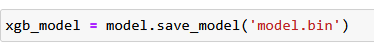

Load model:

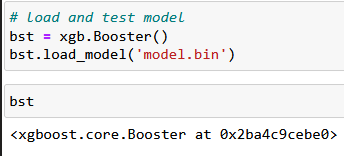

Dawuta Smit

---

### Why does DecisionTreeClassifier and DecisionTreeRegressor not throw an error when there are nan (missing) values in the feature matrix?

In lesson 6.3 around 6:00, there is an error due to missing values. Subsequently .fillna(0) is used on df_train to deal with this. However, since v1.3, support for missing values has been added for DecisionTreeClassifier and DecisionTreeRegressor. More details can be found , under sklearn.tree.

(added by Kemal Dahha)

---

### Traversing feature names and feature importance values

To pair feature names with their importance values, use dv.get_feature_names_out() to retrieve the feature names and rf.feature_importances_ for the importances. Then, combine them with zip(feature_names, importances) to view or sort by importance.

Just as shown below:

# Assuming rf is your RandomForest model and dv is your DictVectorizer

feature_names = dv.get_feature_names_out()

feature_importances = rf.feature_importances_

# Pair feature names with their importance values

feature_importance_dict = dict(zip(feature_names, feature_importances))

# Sort by importance (optional)

sorted_feature_importance = sorted(feature_importance_dict.items(), key=lambda x: x[1], reverse=True)

# Display results

for feature, importance in sorted_feature_importance:

print(f"{feature}: {importance}")

(added by Jon Areas)

---

## 8. Neural Networks and Deep Learning

### Why does XGBoost have so many parameters, and which are the most critical to start with?

XGBoost’s performance stems from its flexibility, thanks to a range of parameters. For initial tuning, focus on:

learning_rate: Controls the impact of each tree. Lower values (e.g., 0.01–0.1) typically improve performance but require more trees (n_estimators).

n_estimators: Sets the number of boosting rounds; adjust this in conjunction with learning_rate.

max_depth: Prevents overfitting by limiting the tree’s depth.

subsample: Dictates the fraction of samples used for training each tree, adding randomness to improve generalization.

Begin with these parameters before exploring others like gamma and min_child_weight for additional control over model complexity and performance.

(added by David Peterson)

This section is moved to

---

### How to get started with Week 8?

Week 8 HW 2024:

Till Meineke

---

### How to setup TensorFlow with GPU support on Ubuntu?

Here is an article that worked for me:

---

### How to use Kaggle for Deep Learning?

Create or import your notebook into Kaggle.

Click on the Three dots at the top right hand side

Click on Accelerator

Choose T4 GPU

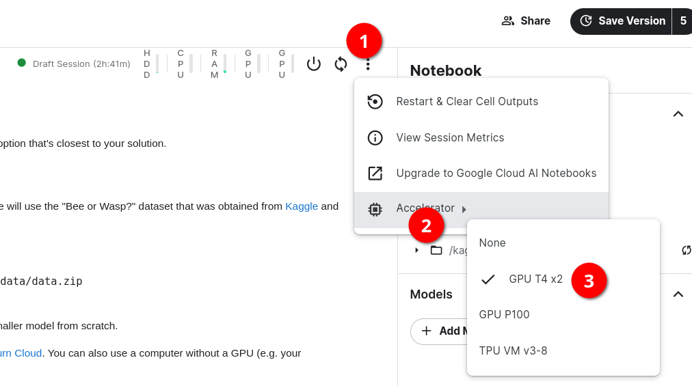

Khurram Majeed

---

### How to use Google Colab for Deep Learning?

Create or import your notebook into Google Colab.

Click on the Drop Down at the top right hand side

Click on “Change runtime type”

Choose T4 GPU

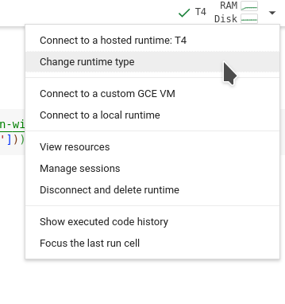

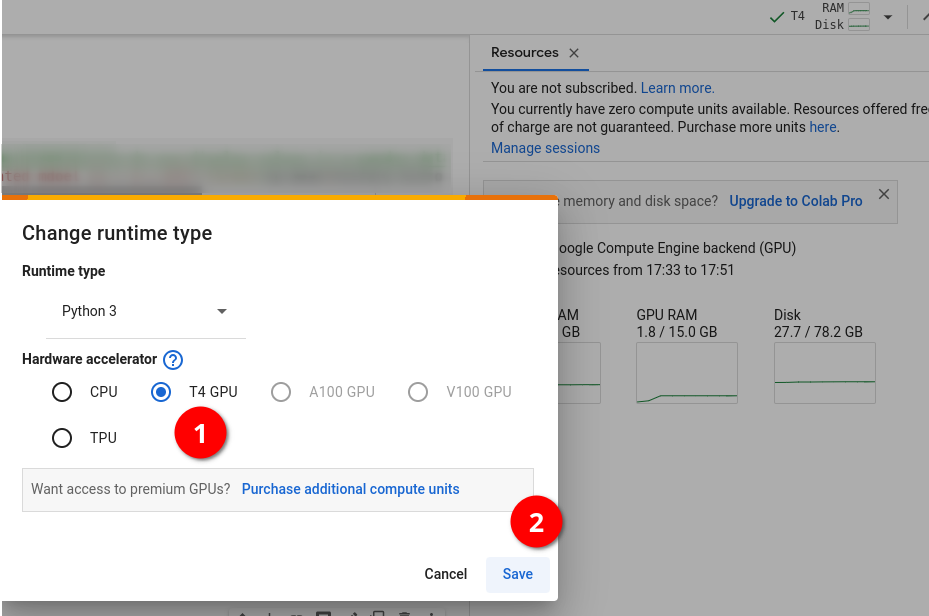

Khurram Majeed

---

### How do I push from Saturn Cloud to Github?

Connecting your GPU on Saturn Cloud to Github repository is not compulsory, since you can just download the notebook and copy it to the Github folder. But if you like technology to do things for you, then follow the solution description below:

Solution description: Follow the instructions in these github docs to create an SSH private and public key:

Then the second video on this module about saturn cloud would show you how to add the ssh keys to secrets and authenticate through a terminal.

Or alternatively, you could just use the public keys provided by Saturn Cloud by default. To do so, follow these steps:

Click on your username and on manage

Down below you will see the Git SSH keys section.

Copy the default public key provided by Saturn Cloud

Paste these key into the SSH keys section of your github repo

Open a terminal on Saturn Cloud and run this command “ssh -T ”

You will receive a successful authentication notice.

Odimegwu David

Q: What versions of TensorFlow and NumPy should I use to ensure compatibility in Saturn Cloud notebooks?

A: To avoid compatibility issues when using TensorFlow in Saturn Cloud notebooks, we recommend the following versions:

bash

Copy code

!pip install numpy==1.24 tensorflow==2.10.0 These versions are tested and work seamlessly in the Saturn Cloud environment. Once installed, you should be able to develop and run your machine learning workflows without any issues.

Added by Abdiaziz Qaladid

---

### Where is the Python TensorFlow template on Saturn Cloud?

This template is referred to in the video 8.1b

but the location shown in the video is no longer correct.

This template has been moved to “python deep learning tutorials’ which is shown on the Saturn Cloud home page.

Steven Christolis

You can follow the updated (Nov 2024) text instructions for setup SaturnCloud with tensorflow and GPU under the above given link.

Till Meineke

---

### Getting error module scipy not found during model training in Saturn Cloud tensorflow image

The above error happens since module scipy is not installed in the saturn cloud tensorflow image. While creating the Jupyter server resource, in the “Extra Packages” section under pip in the textbox write scipy. Below the textbox, the pip install scipy command will be displayed. This will ensure when the resource spins up, the scipy package will be automatically installed. This approach can also be followed for additional python packages.

Sumeet Lalla

---

### How to upload kaggle data to Saturn Cloud?

Problem description: Uploading the data to saturn cloud from kaggle can be time saving, specially if the dataset is large.

You can just download to your local machine and then upload to a folder on saturn cloud, but there is a better solution that needs to be set once and you have access to all kaggle datasets in saturn cloud.

On your notebook run:

!pip install -q kaggle

Go to Kaggle website (you need to have an account for this):

Click on your profile image -> Account

Scroll down to the API box

Click on Create New API token

It will download a json file with the name kaggle.json store on your local computer. We need to upload this file in the .kaggle folder

On the notebook click on folder icon on the left upper corner

This will take you to the root folder

Click on the .kaggle folder

Once inside of the .kaggle folder upload the kaggle.json file that you downloaded

Run this command on your notebook:

!chmod 600 /home/jovyan/.kaggle/kaggle.json

Download the data using this command:

!kaggle datasets download -d agrigorev/dino-or-dragon

Create a folder to unzip your files:

!mkdir data

Unzip your files inside that folder

!unzip dino-or-dragon.zip -d data

Pastor Soto

---

### How to install CUDA & cuDNN on Ubuntu 22.04

In order to run tensorflow with gpu on your local machine you’ll need to setup cuda and cudnn.

The process can be overwhelming. Here’s a simplified

Osman Ali

---

### Error: (ValueError: Unable to load weights saved in HDF5 format into a subclassed Model which has not created its variables yet. Call the Model first, then load the weights.) when loading model.

Problem description:

When loading saved model getting error: ValueError: Unable to load weights saved in HDF5 format into a subclassed Model which has not created its variables yet. Call the Model first, then load the weights.

Solution description:

Before loading model need to evaluate the model on input data: model.evaluate(train_ds)

Added by Vladimir Yesipov

---

### Getting error when connect git on Saturn Cloud: permission denied

Problem description:

When follow module 8.1b video to setup git in Saturn Cloud, run `ssh -T ` lead error `git@github.com: Permission denied (publickey).`

Solution description:

Alternative way, we can setup git in our Saturn Cloud env with generate SSH key in our Saturn Cloud and add it to our git account host. After it, we can access/manage our git through Saturn’s jupyter server. All steps detailed on this following tutorial:

Added by Ryan Pramana

---

### Host key verification failed.

Problem description:

Getting an error using <git clone :alexeygrigorev/clothing-dataset-small.git>

The error:

Cloning into 'clothing-dataset'...

Host key verification failed.

fatal: Could not read from remote repository.

Please make sure you have the correct access rights

and the repository exists.

Solution description:

when cloning the repo, you can also chose https - then it should work. This happens when you don't have your ssh key configured.

<git clone https://github.com/alexeygrigorev/clothing-dataset-small.git>

Added by Gregory Morris

---

### The same accuracy on epochs

Problem description

The accuracy and the loss are both still the same or nearly the same while training.

Solution description

In the homework, you should set class_mode='binary' while reading the data.

Also, problem occurs when you choose the wrong optimizer, batch size, or learning rate

Added by Ekaterina Kutovaia

---

### Model breaking after augmentation – high loss + bad accuracy

Problem:

When resuming training after augmentation, the loss skyrockets (1000+ during first epoch) and accuracy settles around 0.5 – i.e. the model becomes as good as a random coin flip.

Solution:

Check that the augmented ImageDataGenerator still includes the option “rescale” as specified in the preceding step.

Added by Konrad Mühlberg

---

### Missing channel value error while reloading model:

While doing:

import tensorflow as tf

from tensorflow import keras

model = tf.keras.models.load_model('model_saved.h5')

If you get an error message like this:

ValueError: The channel dimension of the inputs should be defined. The input_shape received is (None, None, None, None), where axis -1 (0-based) is the channel dimension, which found to be `None`.

Solution:

Saving a model (either yourself via model.save() or via checkpoint when save_weights_only = False) saves two things: The trained model weights (for example the best weights found during training) and the model architecture.  If the number of channels is not explicitly specified in the Input layer of the model, and is instead defined as a variable, the model architecture will not have the value in the variable stored. Therefore when the model is reloaded, it will complain about not knowing the number of channels. See the code below, in the first line, you need to specify number of channels explicitly:

# model architecture:

inputs = keras.Input(shape=(input_size, input_size, 3))

base = base_model(inputs, training=False)

vectors = keras.layers.GlobalAveragePooling2D()(base)

inner = keras.layers.Dense(size_inner, activation='relu')(vectors)

drop = keras.layers.Dropout(droprate)(inner)

outputs = keras.layers.Dense(10)(drop)

model = keras.Model(inputs, outputs)

(Memoona Tahira)

---

### How to unzip a folder with an image dataset and suppress output?

Problem:

A dataset for homework is in a zipped folder. If you unzip it within a jupyter notebook by means of ! unzip command, you’ll see a huge amount of output messages about unzipping of each image. So you need to suppress this output

Solution:

Execute the next cell:

%%capture

! unzip zipped_folder_name.zip -d destination_folder_name

Added by Alena Kniazeva

Inside a Jupyter Notebook:

import zipfile

local_zip = 'data.zip'

zip_ref = zipfile.ZipFile(local_zip, 'r')

zip_ref.extractall('data')

zip_ref.close()

---

### How keras flow_from_directory know the names of classes in images?

Problem:

When we run train_gen.flow_from_directory() as in video 8.5, it finds images belonging to 10 classes. Does it understand the names of classes from the names of folders? Or, there is already something going on deep behind?

Solution:

The name of class is the folder name

If you just create some random folder with the name "xyz", it will also be considered as a class!! The name itself is saying flow_from_directory

a clear explanation below:

Added by Bhaskar Sarma

Error with Tensorflow importing using saturn Cloud preconfigured template:

TypeError: Unable to convert function return value to a Python type! The signature was 	() -> handle.

Successful Dependency Reinstallation:

Just try uninstalling and re-installing tensorflow you got from saturnCloud twice or thrice.

When you uninstalled and reinstalled TensorFlow, it might have resolved underlying issues with dependencies. TensorFlow relies on several libraries (e.g., protobuf, numpy, grpcio) that can sometimes cause conflicts. By reinstalling, you ensured that all dependencies were reinstalled and aligned with the correct version, allowing TensorFlow to work as expected.

Late Recognition of the Change:

In some cases, it might take a moment for the system to recognize the changes in the Python environment after installing packages. It could be that the environment was still "stuck" in an old state before, and after several installation attempts, the correct state was finally loaded, especially after restarting the Jupyter kernel.

Added by Abdiaziz Qaladid

---

### Error with scipy missing module in SaturnCloud

Problem:

I created a new environment in SaturnCloud and chose the image corresponding to Saturn with Tensorflow, but when I tried to fit the model it showed an error about the missing module: scipy

Solution:

Install the module in a new cell: !pip install scipy

Restart the kernel and fit the model again

Added by Erick Calderin

---

### How are numeric class labels determined in flow_from_directroy using binary class mode and what is meant by the single probability predicted by a binary Keras model:

The command to read folders in the dataset in the tensorflow source code is:

for subdir in sorted(os.listdir(directory)):

…

Reference: , line 563

This means folders will be read in alphabetical order. For example, in the case of a folder named dino, and another named dragon, dino will read first and will have class label 0, whereas dragon will be read in next and will have class label 1.

When a Keras model predicts binary labels, it will only return one value, and this is the probability of class 1 in case of sigmoid activation function in the last dense layer with 2 neurons. The probability of class 0 can be found out by:

prob(class(0)) = 1- prob(class(1))

In case of using from_logits to get results, you will get two values for each of the labels.

A prediction of 0.8 is saying the probability that the image has class label 1 (in this case dragon), is 0.8, and conversely we can infer the probability that the image has class label 0 is 0.2.

(Added by Memoona Tahira)

---

### What if your accuracy and std training loss don’t match HW?

Problem:

I found running the wasp/bee model on my mac laptop had higher reported accuracy and lower std deviation than the HW answers. This may be because of the SGD optimizer. Running this on my mac printed a message about a new and legacy version that could be used.

Solution:

Try running the same code on google collab or another way. The answers were closer for me on collab. Another tip is to change the runtime to use T4 and the model run’s faster than just CPU

Added by Quinn Avila

---

### Using multi-threading for data generation in “model.fit()”

When running “model.fit(...)” an additional parameter “workers” can be specified for speeding up the data loading/generation. The default value is “1”. Try out which value between 1 and the cpu count on your system performs best.

Added by Sylvia Schmitt

---

### Reproducibility with TensorFlow using a seed point

Reproducibility for training runs can be achieved following these instructions:

seed = 1234

tf.keras.utils.set_random_seed(seed)

tf.config.experimental.enable_op_determinism()

This will work for a script, if this gets executed multiple times.

Added by Sylvia Schmitt

---

### Can we use pytorch for this lesson/homework ?

Pytorch is also a deep learning framework that allows to do equivalent tasks as keras. Here is a tutorial to create a CNN from scratch using pytorch :

The functions have similar goals. The syntax can be slightly different. For the lessons and the homework, we use keras, but one can feel free to make a pull request with the equivalent with pytorch for lessons and homework!

Mélanie Fouesnard

---

### Keras model training fails with “Failed to find data adapter”

While training a Keras model you get the error “Failed to find data adapter that can handle input: <class 'keras.src.preprocessing.image.ImageDataGenerator'>, <class 'NoneType'>” you may have unintentionally passed the image generator instead of the dataset to the model

train_gen = ImageDataGenerator(rescale=1./255)

train_ds = train_gen.flow_from_directory(…)

history_after_augmentation = model.fit(

train_gen, # this should be train_ds!!!

epochs=10,

validation_data=test_gen # this should be test_ds!!!

)

The fix is simple and probably obvious once pointed out, use the training and validation dataset (train_ds and val_ds) returned from flow_from_directory

Added by Tzvi Friedman

---

### Running ‘nvidia-smi’ in a loop without using ‘watch’

The command ‘nvidia-smi’ has a built-in function which will run it in subsequently updating it every N seconds without the need of using the command ‘watch’.

nvidia-smi -l <N seconds>

The following command will run ‘nvidia-smi’ every 2 seconds until interrupted using CTRL+C.

nvidia-smi -l 2

Added by Sylvia Schmitt

---

### Checking GPU and CPU utilization using ‘nvitop’

The Python package ‘’ is an interactive GPU process viewer similar to ‘htop’ for CPU.

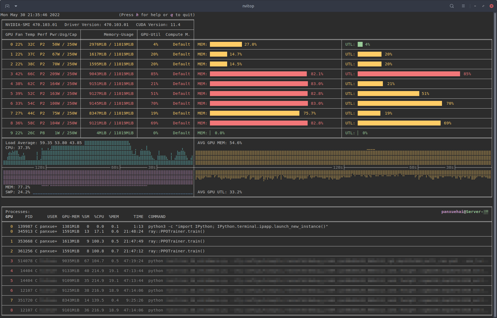

Image source:

Added by Sylvia Schmitt

---

### Q: Where does the number of Conv2d layer’s params come from? Where does the number of “features” we get after the Flatten layer come from?

Let’s say we define our Conv2d layer like this:

>> tf.keras.layers.Conv2D(32, (3,3), activation='relu', input_shape=(150, 150, 3))

It means our input image is RGB (3 channels, 150 by 150 pixels), kernel is 3x3 and number of filters (layer’s width) is 32.

If we check model.summary() we will get this:

_________________________________________________________________

Layer (type)                Output Shape              Param #

=================================================================

conv2d (Conv2D)             (None, 148, 148, 32)      896

So where does 896 params come from? It’s computed like this:

>>> (3*3*3 +1) * 32

896

# 3x3 kernel, 3 channels RGB, +1 for bias, 32 filters

What about the number of “features” we get after the Flatten layer?

For our homework model.summary() for last MaxPooling2d and Flatten layers looked like this:

_________________________________________________________________

Layer (type)                Output Shape              Param #

=================================================================

max_pooling2d_3       (None, 7, 7, 128)         0

flatten (Flatten)           (None, 6272)              0

So where do 6272 vectors come from? It’s computed like this:

>>> 7*7*128

6272

# 7x7 “image shape” after several convolutions and poolings, 128 filters

Added by Andrii Larkin

---

### Sequential vs. Functional Model Modes in Keras (TF2)

It’s quite useful to understand that all types of models in the course are a plain stack of layers where each layer has exactly one input tensor and one output tensor ( model TF page,  class).

You can simply start from an “empty” model and add more and more layers in a sequential order.

This mode is called “Sequential Model API”  (easier)

In Alexey’s videos it is implemented as chained calls of different entities (“inputs”,“base”, “vectors”,  “outputs”) in a more advanced mode “Functional Model API”.

Maybe a more complicated way makes sense when you do Transfer Learning and want to separate “Base” model vs. rest, but in the HW you need to recreate the full model from scratch ⇒ I believe it is easier to work with a sequence of “similar” layers.

You can read more about it in this TF2 .

A really useful Sequential model example is shared in the Kaggle’s “Bee or Wasp” dataset folder with code:

Added by Ivan Brigida

Fresh Run on Neural Nets

While correcting an error on neural net architecture, it is advised to do fresh run by restarting kernel, else the model learns on top of previous runs.

Added by Abhijit Chakraborty

---

### Out of memory errors when running tensorflow

I found this code snippet fixed my OOM errors, as I have an Nvidia GPU. Can't speak to OOM errors on CPU, though.

```

physical_devices = tf.configlist_physical_devices('GPU')

try:

tf.config.experimental.set_memory_growth(physical_devices[0],True)

except:

# Invalid device or cannot modify virtual devices once initialized.

pass

```

---

### How did I resolve the out of memory (OOM) issue when training my model on a GPU?

To address the out of memory (OOM) issue, I followed these steps:

1. Check GPU Memory Usage:

I ran the following command to see how much memory was being used and which processes were occupying it:

!nvidia-smi

This command provided details about memory usage and active processes on the GPU.

2. Identify Active Processes:

From the output of nvidia-smi, I noticed that a Python process (...a3/envs/tensorflow2_p310/bin/python) was consuming a significant amount of GPU memory.

3. Terminate the Python Process:

I used the process ID (PID) to kill the Python process that was consuming the excessive memory. For example, to kill a process with PID 11208, I executed:

!kill 11208

4. Kernel Restart:

After terminating the process, I noticed that the kernel automatically restarted, freeing up the GPU memory.

5. Recheck GPU Memory:

I ran nvidia-smi again to confirm that the memory usage had decreased, and there were no longer any blocking processes.

By following these steps, I was able to free up GPU memory and continue training my model successfully.

(added by Karina)

---

### Model training very slow in google colab with T4 GPU

When training the models, in the fit function, you can specify the number of workers/threads.

The number of threads apparently also works for GPUs, and came very handy in google colab for the T4 GPU, since it was very very slow, and workers default value is 1.

I changed the workers variable to 2560, following this thread in stackoverflow. I am using the free T4 GPU.  ()

Added by Ibai Irastorza

---

### Using image_dataset_from_directory instead of ImageDataGeneratorn for loading images

From the keras documentation:
Deprecated:  is not recommended for new code. Prefer loading images with  and transforming the output  with preprocessing layers. For more information, see the tutorials for  and , as well as the .

Hrithik Kumar Advani

---

### Saturn Cloud: OpenSSL version mismatch. Built against 30000020, you have 30300020

This error occurs because the OpenSSH client is built against a specific version of OpenSSL (e.g., 3.0.0), but the system tries to use a different version (e.g., 3.0.3). This mismatch prevents the SSH client from working properly.

Solution:
Set the correct OpenSSL library path by running the following line in the terminal:

export LD_LIBRARY_PATH=/usr/lib/x86_64-linux-gnu

Added by Kemal Dahha

---

## 9. Serverless Deep Learning

### How can data augmentation improve model performance?

Data augmentation artificially expands the training dataset by applying transformations like flipping, cropping, and adjusting brightness or contrast. This improves model robustness by exposing it to varied data and helps reduce overfitting.

Added by David Peterson

---

### How to get started with Week 9?

Week 9 HW 2024:

HW Submission:

Important for environment setup:  Python 3.12 vs TF Lite 2.17

Github repo:

Till Meineke

---

### Where is the model for week 9?

The week 9 uses a link to github to fetch the models.

The original link was moved to here:

https://github.com/DataTalksClub/machine-learning-zoomcamp/releases

---

### Executing the command echo ${REMOTE_URI} returns nothing.

Solution description

In the unit 9.6, Alexey ran the command echo ${REMOTE_URI} which turned the URI address in the terminal. There workaround is to set a local variable (REMOTE_URI) and assign your URI address in the terminal and use it to login the registry, for instance, REMOTE_URI=2278222782.dkr.ecr.ap-south-1.amazonaws.com/clothing-tflite-images (fake address). One caveat is that you will lose this variable once the session is terminated.

I also had the same problem on Ubuntu terminal. I executed the following two commands:

$ export REMOTE_URI=1111111111.dkr.ecr.us-west-1.amazonaws.com/clothing-tflite-images:clothing-model-xception-v4-001

$ echo $REMOTE_URI

111111111.dkr.ecr.us-west-1.amazonaws.com/clothing-tflite-images:clothing-model-xception-v4-001

Note: 1. no curly brackets (e.g. echo ${REMOTE_URI}) needed unlike in video 9.6,

2. Replace REMOTE_URI with your URI

(Bhaskar Sarma)

---

### Getting a syntax error while trying to get the password from aws-cli

The command aws ecr get-login --no-include-email returns an invalid choice error:

The solution is to use the following command instead:  aws ecr get-login-password

Could simplify the login process with, just replace the <ACCOUNT_NUMBER> and <REGION> with your values:

export PASSWORD=`aws ecr get-login-password`

docker login -u AWS -p $PASSWORD <ACCOUNT_NUMBER>.dkr.ecr.<REGION>.amazonaws.com/clothing-tflite-images

Added by Martin Uribe

---

### Pass many parameters in the model at once

We can use the keras.models.Sequential() function to pass many parameters of the cnn at once.

Krishna Anand

---

### Getting  ERROR [internal] load metadata for public.ecr.aws/lambda/python:3.8

This error is produced sometimes when building your docker image from the Amazon python base image.

Solution description: The following could solve the problem.

Update your docker desktop if you haven’t done so.

Or restart docker desktop and terminal and then build the image all over again.

Or if all else fails, first run the following command: DOCKER_BUILDKIT=0  docker build .  then build your image.

(optional) Added by Odimegwu David

Q: How can I deploy a machine learning model using AWS Lambda and API Gateway?
To deploy a machine learning model using AWS Lambda and API Gateway, follow these steps:

Prepare the Code for Lambda: Start by developing and testing your machine learning model (e.g., using TensorFlow Lite) locally. Ensure the model is optimized for serverless execution.

Use AWS Lambda: AWS Lambda is a serverless compute service that allows you to run code without provisioning or managing servers. You can upload your code, which may include the model, dependencies, and necessary libraries.

Prepare a Docker Image (Optional): If your model requires custom dependencies or environments, you can package your application in a Docker image, upload it to Amazon Elastic Container Registry (ECR), and then link it to AWS Lambda.

Create the Lambda Function: After preparing your code or Docker image, create a Lambda function that will process the requests and return results.

Expose the Lambda Function using API Gateway: Set up an API Gateway to expose the Lambda function as a RESTful endpoint. This allows you to interact with your model via HTTP requests.

By following these steps, you can deploy and expose your machine learning model in a scalable and efficient serverless architecture using AWS Lambda and API Gateway.

- Added by Abdiaziz Qaladid

---

### Problem: 'ls' is not recognized as an internal or external command, operable program or batch file.

When trying to run the command  !ls -lh in windows jupyter notebook  , I was getting an error message that says “'ls' is not recognized as an internal or external command,operable program or batch file.

Solution description :

Instead of !ls -lh , you can use this command !dir , and you will get similar output

Asia Saeed

---

### ImportError: generic_type: type "InterpreterWrapper" is already registered!

When I run   import tflite_runtime.interpreter as tflite , I get an error message says “ImportError: generic_type: type "InterpreterWrapper" is already registered!”

Solution description

This error occurs when you import both tensorflow  and tflite_runtime.interpreter  “import tensorflow as tf” and “import tflite_runtime.interpreter as tflite” in the same notebook.  To fix the issue, restart the kernel and import only tflite_runtime.interpreter " import tflite_runtime.interpreter as tflite".

Asia Saeed

---

### Windows version might not be up-to-date

Problem description:

In command line try to do $ docker build -t dino_dragon

got this Using default tag: latest

[2022-11-24T06:48:47.360149000Z][docker-credential-desktop][W] Windows version might not be up-to-date: The system cannot find the file specified.

error during connect: This error may indicate that the docker daemon is not running.: Post

.

Solution description:

You need to make sure that Docker is not stopped by a third-party program.

Andrei Ilin

---

### WARNING: You are using pip version 22.0.4; however, version 22.3.1 is available

When running docker build -t dino-dragon-model it returns the above error

The most common source of this error in this week is because Alex video shows a version of the wheel with python 8, we need to find a wheel with the version that we are working on. In this case python 9. Another common error is to copy the link, this will also produce the same error, we need to download the raw format:

https://github.com/alexeygrigorev/tflite-aws-lambda/raw/main/tflite/tflite_runtime-2.7.0-cp39-cp39-linux_x86_64.whl

Pastor Soto

---

### How to do AWS configure after installing awscli

Problem description:

In video 9.6, after installing aswcli, we should configure it with aws configure . There it asks for Access Key ID, Secret Access Key, Default Region Name and also Default output format. What we should put for Default output format? Leaving it as  None is okay?

Solution description:

Yes, in my I case I left everything as the provided defaults (except, obviously, the Access key and the secret access key)

Added by Bhaskar Sarma

---

### Object of type float32 is not JSON serializable

Problem:

While passing local testing of the lambda function without issues, trying to test the same input with a running docker instance results in an error message like

{‘errorMessage’: ‘Unable to marshal response: Object of type float32 is not JSON serializable’, ‘errorType’: ‘Runtime.MarshalError’, ‘requestId’: ‘f155492c-9af2-4d04-b5a4-639548b7c7ac’, ‘stackTrace’: []}

This happens when a model (in this case the dino vs dragon model) returns individual estimation values as numpy float32 values (arrays). They need to be converted individually to base-Python floats in order to become “serializable”.

Solution:

In my particular case, I set up the dino vs dragon model in such a way as to return a label + predicted probability for each class as follows (below is a two-line extract of function predict() in the lambda_function.py):

preds = [interpreter.get_tensor(output_index)[0][0], \

1-interpreter.get_tensor(output_index)[0][0]]

In which case the above described solution will look like this:

preds = [float(interpreter.get_tensor(output_index)[0][0]), \

float(1-interpreter.get_tensor(output_index)[0][0])]

The rest can be made work by following the chapter 9 (and/or chapter 5!) lecture videos step by step.

Added by Konrad Muehlberg

---

### Error with the line “interpreter.set_tensor(input_index, X”)

I had this error when running the command line : interpreter.set_tensor(input_index, x) that can be seen in the video 9.3 around 12 minutes.

ValueError: Cannot set tensor: Got value of type UINT8 but expected type FLOAT32 for input 0, name: serving_default_conv2d_input:0

This is because the X is an int but a float is expected.

Solution:

I found this solution from this question here  :

# Need to convert to float32 before set_tensor

X = np.float32(X)

Then, it works. I work with tensorflow 2.15.0, maybe the fact that this version is more recent involves this change ?

Added by Mélanie Fouesnard

---

### How to easily get file size in powershell terminal ?

To check your file size using the powershell terminal, you can do the following command lines:

$File = Get-Item -Path path_to_file

$FileSize = (Get-Item -Path $FilePath).Length

Now you can check the size of your file, for example in MB:

Write-host "MB":($FileSize/1MB)

Source: .

Added by Mélanie Fouesnard

---

### How do Lambda container images work?

I wanted to understand how lambda container images work in depth and how lambda functions are initialized, for this reason, I found the following documentation

https://docs.aws.amazon.com/lambda/latest/dg/runtimes-api.html

Added by Alejandro aponte

---

### How to use AWS Serverless Framework to deploy on AWS Lambda and expose it as REST API through APIGatewayService?

The docker image for aws lambda can be created and pushed to aws ecr and the same can be exposed as a REST API through APIGatewayService in a single go using AWS Serverless Framework. Refer the below article for a detailed walkthrough.

Added by Sumeet Lalla

---

### Error building docker image on M1 Mac

Problem:

While trying to build docker image in Section 9.5 with the command:

docker build -t clothing-model .

It throws a pip install error for the tflite runtime whl

ERROR: failed to solve: process "/bin/sh -c pip install " did not complete successfully: exit code: 1

Try to use this link:

If the link above does not work:

The problem is because of the arm architecture of the M1. You will need to run the code on a PC or Ubuntu OS.

Or try the code bellow.

Added by Dashel Ruiz Perez

Solution:

To build the Docker image, use the command:

docker build --platform linux/amd64 -t clothing-model .

To run the built image, use the command:

docker run -it --rm -p 8080:8080 --platform linux/amd64 clothing-model:latest

Added by Daniel Egbo

---

### Error invoking API Gateway deploy API locally

Problem: Trying to test API gateway in , running: $ python test.py

With error message:

{'message': 'Missing Authentication Token'}

Solution:

Need to get the deployed API URL for the specific path you are invoking. Example:

https://<random string>.execute-api.us-east-2.amazonaws.com/test/predict

Added by Andrew Katoch

---

### Error: Could not find a version that satisfies the requirement tflite_runtime (from versions:none)

Problem: When trying to install tflite_runtime with

!pip install --extra-index-url tflite_runtime

one gets an error message above.

Solution:

fflite_runtime is only available for the os-python version combinations that can be found here:

your combination must be missing here

you can see if any of these work for you

and install the needed one using pip

eg

pip install

as it is done in the lectures code:

Alternatively, use a virtual machine (with VM VirtualBox, for example) with a Linux system. The other way is to run a code at a virtual machine within cloud service, for example you can use Vertex AI Workbench at GCP (notebooks and terminals are provided there, so all tasks may be performed).

Added by Alena Kniazeva, modified by Alex Litvinov

---

### Error: A module that was compiled using NumPy 1.x cannot be run in NumPy 2.2.0 as it may crash

After installing tflite runtime by using the wheel suggested in the homework 9 (), I was getting a runtime error while testing the lambda handler. The error was:

“..ImportError:

A module that was compiled using NumPy 1.x cannot be run in

NumPy 2.2.0 as it may crash. To support both 1.x and 2.x

versions of NumPy, modules must be compiled with NumPy 2.0.

Some module may need to rebuild instead e.g. with 'pybind11>=2.12' ..”

The issue I was experiencing with the version of NumPy was due to it being overwritten by the installation of tflite-runtime. To prevent this from happening, you should install the wheel using the --no-deps option

RUN pip install --no-deps https://github.com/alexeygrigorev/tflite-aws-lambda/raw/main/tflite/tflite_runtime-2.14.0-cp310-cp310-linux_x86_64.whl

(added by Karina)

---

### Docker run error

docker: Error response from daemon: mkdir /var/lib/docker/overlay2/37be849565da96ac3fce34ee9eb2215bd6cd7899a63ebc0ace481fd735c4cb0e-init: read-only file system.

You need to restart the docker services to get rid of the above error

Krishna Anand

---

### Save Docker Image to local machine and view contents

The docker image can be saved/exported to tar format in local machine using the below command:

docker image save <image-name> -o <name-of-tar-file.tar>

The individual layers of the docker image for the filesystem content can be viewed by extracting the layer.tar present in the <name-of-tar-file.tar> created from above.

Sumeet Lalla

---

### Jupyter notebook not seeing package

On vscode running jupyter notebook. After I ‘pip install pillow’, my notebook did not recognize using the import for example from PIL import image. After restarting the jupyter notebook the imports worked.

Quinn Avila

---

### Running out of space for AWS instance.

Due to experimenting back and forth so much without care for storage, I just ran out of it on my 30-GB AWS instance. It turns out that deleting docker images does not actually free up any space as you might expect. After removing images, you also need to run docker system prune

---

### Using Tensorflow 2.15 for AWS deployment

Using the 2.14 version with python 3.11 works fine.

In case it doesn’t work, I tried with tensorflow 2.4.4 whl, however, make sure to run it on top of supported python versions like 3.8, else there will be issues installing tf==2.4.4

Added by Abhijit Chakraborty

---

### What IAM permission policy is needed to complete Week 9: Serverless?

Sign in to the AWS Console: Log in to the AWS Console.

Navigate to IAM: Go to the IAM service by clicking on "Services" in the top left corner and selecting "IAM" under the "Security, Identity, & Compliance" section.

Create a new policy: In the left navigation pane, select "Policies" and click on "Create policy."

Select the service and actions:

Click on "JSON" and copy and paste the JSON policy you provided earlier for the specific ECR actions.

Review and create the policy:

Click on "Review policy."

Provide a name and description for the policy.

Click on "Create policy."

JSON policy:

{

"Version": "2012-10-17",

"Statement": [

{

"Sid": "VisualEditor0",

"Effect": "Allow",

"Action": [

"ecr:CreateRepository",

"ecr:GetAuthorizationToken",

"ecr:BatchCheckLayerAvailability",

"ecr:BatchGetImage",

"ecr:InitiateLayerUpload",

"ecr:UploadLayerPart",

"ecr:CompleteLayerUpload",

"ecr:PutImage"

],

"Resource": "*"

}

]

}

Added by: Daniel Muñoz-Viveros

ERROR: failed to solve: public.ecr.aws/lambda/python:3.10: error getting credentials - err: exec: "docker-credential-desktop.exe": executable file not found in $PATH, out: ``

(WSL2 system)

Solved: Delete the file ~/.docker/config.json

Yishan Zhan

---

### Docker Temporary failure in name resolution

Add the next lines to vim /etc/docker/daemon.json

{

"dns": ["8.8.8.8", "8.8.4.4"]

}

Then, restart docker:  sudo service docker restart

Ibai Irastorza

---

### Keras model *.h5 doesn’t load. Error: weight_decay is not a valid argument, kwargs should be empty  for `optimizer_experimental.Optimizer`

Solution: add compile = False to the load_model function

keras.models.load_model('model_name.h5', compile=False)

Nadia Paz

---

### How to test AWS Lambda + Docker locally?

This deployment setup can be tested locally using  (runtime interface emulator).

Basically, if your Docker image was built upon base AWS Lambda image (FROM public.ecr.aws/lambda/python:3.10) - just use certain ports for “docker run” and a certain “localhost link” for testing:

docker run -it --rm -p 9000:8080 name

This command runs the image as a container and starts up an endpoint locally at:

localhost:9000/2015-03-31/functions/function/invocations

Post an event to the following endpoint using a curl command:

curl -XPOST "http://localhost:9000/2015-03-31/functions/function/invocations" -d '{}'

Examples of curl testing:

* windows testing:

curl -XPOST "http://localhost:9000/2015-03-31/functions/function/invocations" -d "{\"url\": \"https://habrastorage.org/webt/rt/d9/dh/rtd9dhsmhwrdezeldzoqgijdg8a.jpeg\"}"

* unix testing:

curl -XPOST "http://localhost:9000/2015-03-31/functions/function/invocations" -d '{"url": "https://habrastorage.org/webt/rt/d9/dh/rtd9dhsmhwrdezeldzoqgijdg8a.jpeg"}'

If during testing you encounter an error like this:

# {"errorMessage": "Unable to marshal response: Object of type float32 is not JSON serializable", "errorType": "Runtime.MarshalError", "requestId": "7ea5d17a-e0a2-48d5-b747-a16fc530ed10", "stackTrace": []}

just turn your response at lambda_handler() to string - str(result).

Added by Andrii Larkin

---

### "Unable to import module 'lambda_function': No module named 'tensorflow'" when run python test.py

Make sure all codes in test.py dont have any dependencies with tensorflow library. One of most common reason that lead the this error is tflite still imported from tensorflow. Change import tensorflow.lite as tflite to import tflite_runtime.interpreter as tflite

Added by Ryan Pramana

---

### Install Docker (udocker) in Google Colab

I’ve tried to do everything in Google Colab. Here is a way to work with Docker in Google Colab:

%%shell

pip install udocker

udocker --allow-root install

!udocker --allow-root run hello-world

Added by Ivan Brigida

---

### Lambda API Gateway errors:

`Authorization header requires 'Credential' parameter. Authorization header requires 'Signature' parameter. Authorization header requires 'SignedHeaders' parameter. Authorization header requires existence of either a 'X-Amz-Date' or a 'Date' header.`

`Missing Authentication Token`

import boto3

client = boto3.client('apigateway')

response = client.test_invoke_method(

restApiId='your_rest_api_id',

resourceId='your_resource_id',

httpMethod='POST',

pathWithQueryString='/test/predict', #depend how you set up the api

body='{"url": "https://habrastorage.org/webt/rt/d9/dh/rtd9dhsmhwrdezeldzoqgijdg8a.jpeg"}'

)

print(response['body'])

Yishan Zhan

---

### Unable to run pip install tflite_runtime from github wheel links?

To overcome this issue, you can download the whl file to your local project folder and in the Docker file add the following lines:

COPY <file-name> .

RUN pip install <file-name>

Abhijit Chakraborty

---

### Python 3.12 vs TF Lite 2.17

The latest versions of TF Lite don't support Python 3.12 yet. See  for 2024 cohort in main repository.

Till Meineke

---

### How can I monitor and maintain models deployed on AWS Lambda?

To monitor Lambda deployments, use AWS CloudWatch to access detailed logs, metrics, and alarms. Metrics like invocation count, duration, error rate, and memory usage can help diagnose performance issues. Use AWS X-Ray for tracing requests and analyzing latency. For model maintenance, set up an automated CI/CD pipeline to retrain models on updated data and redeploy using tools like Amazon SageMaker or custom workflows. Regularly evaluate model performance with a monitoring service to detect drift in predictions or data quality issues.

~ David Peterson

---

## 10. Kubernetes and TensorFlow Serving

### How to Use AWS SAM CLI to Create a Lambda Function as a Container Image

Set Up SAM CLI on Your Machine
Follow the installation guide for the AWS SAM CLI here:

Create a New Project
Open your command prompt and run the following command to generate boilerplate code:
sam init

Follow the SAM CLI Wizard

Select "AWS Quick Start Templates".

Choose "Machine Learning" as the application type.

Select the version of Python you will use for your runtime.

When prompted for the starter template, choose "TensorFlow Machine Learning Inference API".

After completing these steps, a new folder with the name you selected will be created. This will be your "SAM project folder" from now on. Inside this folder, you should see an "app" folder.

Add Required Files for Deployment
Move all the files you need for deployment (such as the TensorFlow Lite model and your Lambda function) into the "app" folder.

Modify the Following Files Inside the "app" Folder

requirements.txt
Replace the TensorFlow dependency with tflite-runtime, adjusting the version as necessary. You may also add any other dependencies you require, such as the requests library, and adjust the version of numpy if needed.
Example content for requirements.txt:

pillow==11.1.0

requests==2.32.3

numpy==1.26.4

tflite-runtime==2.7.0

Dockerfile
Modify the Dockerfile to copy the necessary files for your deployment after running pip install. In the default file created, it assumes that the Lambda function is in app.py and the model is inside the app/models folder. However, in this example, we assume the model is at the same level as the Lambda function.
Here's an example of an updated Dockerfile:

FROM public.ecr.aws/lambda/python:3.9

COPY requirements.txt ./

RUN python3.9 -m pip install -r requirements.txt -t .

COPY app.py ./

COPY class_indices.json ./

COPY classification_model.tflite ./

ENV MODEL_PATH ./classification_model.tflite

ENV CLASSES_PATH ./class_indices.json

CMD ["app.lambda_handler"]

Build the Lambda Function
From the SAM project directory, build the Lambda function by running:
sam build --build-dir .aws-build

After completing this step, the Docker image will be created. You can verify this by running:
docker images

Test the Lambda Function Locally
To test the image, you can run a container based on it and send a request to the service using a script, as we learned in class, or you can use SAM CLI as follows:

Modify the app/event/event.json file to include the JSON input expected by your Lambda function. For example:
{

"url": "http://bit.ly/mlbookcamp-pants"

}

From the SAM project folder, run the following command:

sam local invoke -t .aws-build/template.yaml -e events/event.json

This will start a container, send the event, and display the response. The output will also show the name of the Docker image used for the container.

Deploy the image

To deploy the image you can follow the instructions learned at classes or you can use this command and follow the prompt

sam deploy --guided

(AWS SAM takes care of creating and ECR repository)

(added by Karina)

---

### How to get started with Week 10?

TODO

---

### How to install Tensorflow in Ubuntu WSL2

Running a CNN on your CPU can take a long time and once you’ve run out of free time on some cloud providers, it’s time to pay up. Both can be tackled by installing tensorflow with CUDA support on your local machine if you have the right hardware.

I was able to get it working by using the following resources:

I included the link to PyTorch so that you can get that one installed and working too while everything is fresh on your mind. Just select your options, and for Computer Platform, I chose CUDA 11.7 and it worked for me.

Added by Martin Uribe

---

### Getting: Allocator ran out of memory errors?

If you are running tensorflow on your own machine and you start getting the following errors:

Allocator (GPU_0_bfc) ran out of memory trying to allocate 6.88GiB with freed_by_count=0. The caller indicates that this is not a failure, but this may mean that there could be performance gains if more memory were available.

Try adding this code in a cell at the beginning of your notebook:

config = tf.compat.v1.ConfigProto()

config.gpu_options.allow_growth = True

session = tf.compat.v1.Session(config=config)

After doing this most of my issues went away. I say most because there was one instance when I still got the error once more, but only during one epoch. I ran the code again, right after it finished, and I never saw the error again.

Added by Martin Uribe

Problem with downloading    file

The following old link is not valid anymore :


====>	The new link to download the file is :

Added by Sam

---

### Problem with recent version of protobuf

In session 10.3, when creating the virtual environment with pipenv and trying to run the script gateway.py, you might get this error:

TypeError: Descriptors cannot not be created directly.

If this call came from a _pb2.py file, your generated code is out of date and must be regenerated with protoc >= 3.19.0.

If you cannot immediately regenerate your protos, some other possible workarounds are:

1. Downgrade the protobuf package to 3.20.x or lower.

2. Set PROTOCOL_BUFFERS_PYTHON_IMPLEMENTATION=python (but this will use pure-Python parsing and will be much slower).

More information: https://developers.google.com/protocol-buffers/docs/news/2022-05-06#python-updates

This will happen if your version of protobuf is one of the newer ones. As a workaround, you can fix the protobuf version to an older one. In my case I got around the issue by creating the environment with:

pipenv install --python 3.9.13 requests grpcio==1.42.0 flask gunicorn \

keras-image-helper tensorflow-protobuf==2.7.0 protobuf==3.19.6

Added by Ángel de Vicente

---

### WSL Cannot Connect To Docker Daemon

Due to the uncertainties associated with machines, sometimes you can get the error message like this when you try to run a docker command:

”Cannot connect to the Docker daemon at unix:///var/run/docker.sock. Is the docker daemon running?”

Solution: The solution is simple. The Docker Desktop might no longer be connecting to the WSL Linux distro. What you need to do is go to your Docker Desktop setting and then click on resources. Under resources, click on WSL Integration. You will get a tab like the image below:

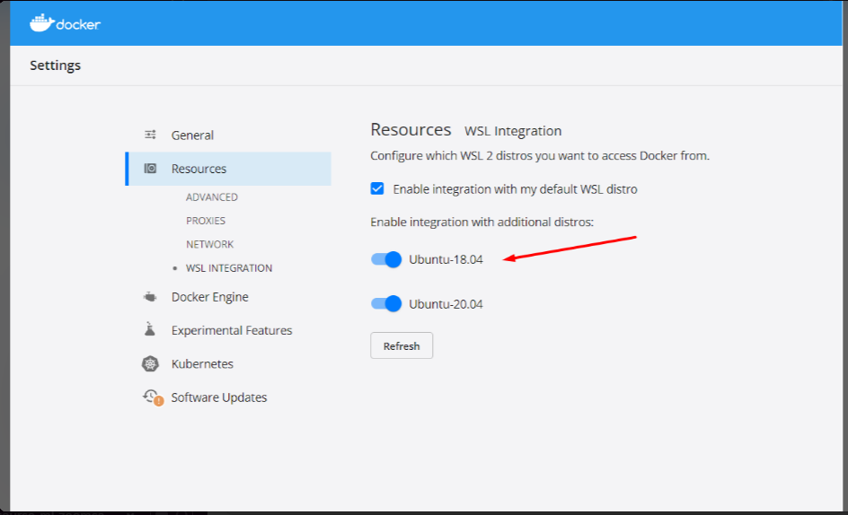

Just enable additional distros. That’s all. Even if the additional distro is the same as the default WSL distro.

Odimegwu David

---

### HPA instance doesn’t run properly

In case the HPA instance does not run correctly even after installing the latest version of Metrics Server from the components.yaml manifest with:

>>kubectl apply -f https://github.com/kubernetes-sigs/metrics-server/releases/latest/download/components.yaml

And the targets still appear as <unknown>

Run >>kubectl edit deploy -n kube-system metrics-server

And search for this line:

args:

- --kubelet-preferred-address-types=InternalIP,ExternalIP,Hostname

Add this line in the middle:  - --kubelet-insecure-tls

So that it stays like this:

args:

- --kubelet-insecure-tls

- --kubelet-preferred-address-types=InternalIP,ExternalIP,Hostname

Save and run again >>kubectl get hpa

Added by Marilina Orihuela

---

### HPA instance doesn’t run properly (easier solution)

In case the HPA instance does not run correctly even after installing the latest version of Metrics Server from the components.yaml manifest with:

>>kubectl apply -f https://github.com/kubernetes-sigs/metrics-server/releases/latest/download/components.yaml

And the targets still appear as <unknown>

Run the following command:

kubectl apply -f https://raw.githubusercontent.com/Peco602/ml-zoomcamp/main/10-kubernetes/kube-config/metrics-server-deployment.yaml

Which uses a metrics server deployment file already embedding the - --kubelet-insecure-tls option.

Added by Giovanni Pecoraro

---

### Could not install packages due to an OSError: [WinError 5] Access is denied

When I run pip install grpcio==1.42.0 tensorflow-serving-api==2.7.0 to install the libraries in windows machine,  I was getting the below error :

ERROR: Could not install packages due to an OSError: [WinError 5] Access is denied: 'C:\\Users\\Asia\\anaconda3\\Lib\\site-packages\\google\\protobuf\\internal\\_api_implementation.cp39-win_amd64.pyd'

Consider using the `--user` option or check the permissions.

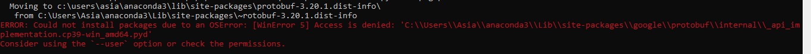

Solution description :

I was able to install the libraries using below command:

pip --user install grpcio==1.42.0 tensorflow-serving-api==2.7.0

Asia Saeed

I'm trying to deploy my machine learning model using Kubernetes, but I'm getting an error stating that my Pods are not starting. What could be the problem?

Solution:
This issue can be caused by several factors:

Resource Allocation: Ensure that your Pods have enough CPU and memory resources allocated. If resources are too low, the Kubernetes scheduler might fail to schedule your Pods.

Image Issues: Verify that the Docker image specified for your Pod is correctly built and accessible. If the image cannot be pulled from the repository, the Pod won’t start.

Added by Abdiaziz Qaladid

---

### TypeError: Descriptors cannot not be created directly.

Problem description

I was getting the below error message when I run gateway.py after modifying the code & creating virtual environment in  video 10.3 :

File "C:\Users\Asia\Data_Science_Code\Zoompcamp\Kubernetes\gat.py", line 9, in <module>

from tensorflow_serving.apis import predict_pb2

File "C:\Users\Asia\.virtualenvs\Kubernetes-Ge6Ts1D5\lib\site-packages\tensorflow_serving\apis\predict_pb2.py", line 14, in <module>

from tensorflow.core.framework import tensor_pb2 as tensorflow_dot_core_dot_framework_dot_tensor__pb2

File "C:\Users\Asia\.virtualenvs\Kubernetes-Ge6Ts1D5\lib\site-packages\tensorflow\core\framework\tensor_pb2.py", line 14, in <module>

from tensorflow.core.framework import resource_handle_pb2 as tensorflow_dot_core_dot_framework_dot_resource__handle__pb2

File "C:\Users\Asia\.virtualenvs\Kubernetes-Ge6Ts1D5\lib\site-packages\tensorflow\core\framework\resource_handle_pb2.py", line 14, in <module>

from tensorflow.core.framework import tensor_shape_pb2 as tensorflow_dot_core_dot_framework_dot_tensor__shape__pb2

File "C:\Users\Asia\.virtualenvs\Kubernetes-Ge6Ts1D5\lib\site-packages\tensorflow\core\framework\tensor_shape_pb2.py", line 36, in <module>

_descriptor.FieldDescriptor(

File "C:\Users\Asia\.virtualenvs\Kubernetes-Ge6Ts1D5\lib\site-packages\google\protobuf\descriptor.py", line 560, in __new__

_message.Message._CheckCalledFromGeneratedFile()

TypeError: Descriptors cannot not be created directly.

If this call came from a _pb2.py file, your generated code is out of date and must be regenerated with protoc >= 3.19.0.

If you cannot immediately regenerate your protos, some other possible workarounds are:

1. Downgrade the protobuf package to 3.20.x or lower.

2. Set PROTOCOL_BUFFERS_PYTHON_IMPLEMENTATION=python (but this will use pure-Python parsing and will be much slower).

Solution description:

Issue has been resolved by downgrading protobuf to version 3.20.1.

pipenv install protobuf==3.20.1

Asia Saeed

---

### How to install easily kubectl on windows ?

To install kubectl on windows using the terminal in vscode (powershell), I followed this tutorial:

I first downloaded kubectl with curl, with these command lines:

At step 3, I followed the tutorial with the copy of the exe file in a specific folder on C drive.

Then I added this folder path to PATH in my environment variables.

Kind can be installed the same way with the curl command on windows, by specifying a folder that will be added to the path environment variable.

Added by Mélanie Fouesnard

---

### Install kind through choco library

First you need to launch a powershell terminal with administrator privilege.

For this we need to install choco library first through the following syntax in powershell:

Set-ExecutionPolicy Bypass -Scope Process -Force; [System.Net.ServicePointManager]::SecurityProtocol = [System.Net.ServicePointManager]::SecurityProtocol -bor 3072; iex ((New-Object System.Net.WebClient).DownloadString('https://chocolatey.org/install.ps1'))

Krishna Anand

---

### Install Kind via Go package

If you are having challenges installing Kind through the Windows Powershell as provided on the website and Choco Library as I did, you can simply install Kind through Go.

> Download and Install Go ()

> Confirm installation by typing the following in Command Prompt -  go version

> Proceed by installing Kind by following this command - go install sigs.k8s.io/kind@v0.20.0

>Confirm Installation kind --version

It works perfectly.

---

### The connection to the server localhost:8080 was refused - did you specify the right host or port?

I ran into an issue where kubectl wasn't working.

I kept getting the following error:

kubectl get service

The connection to the server localhost:8080 was refused - did you specify the right host or port?

I searched online for a resolution, but everyone kept talking about creating an environment variable and creating some admin.config file in my home directory.

All hogwash.

The solution to my problem was to just start over.

kind delete cluster

rm -rf ~/.kube

kind create cluster

Now when I try the same command again:

kubectl get service

NAME         TYPE        CLUSTER-IP   EXTERNAL-IP   PORT(S)   AGE

kubernetes   ClusterIP   10.96.0.1    <none>        443/TCP   53s

Added by Martin Uribe

---

### Running out of storage after building many docker images

Problem description

Due to experimenting back and forth so much without care for storage, I just ran out of it on my 30-GB AWS instance.

My first reflex was to remove some zoomcamp directories, but of course those are mostly code so it didn’t help much.

Solution description

> docker images

revealed that I had over 20 GBs worth of superseded / duplicate models lying around, so I proceeded to > docker rmi

a bunch of those — but to no avail!

It turns out that deleting docker images does not actually free up any space as you might expect. After removing images, you also need to run

> docker system prune

See also:

Added by Konrad Mühlberg

---

### In HW10 Q6 what does it mean “correct value for CPU and memory”? Aren’t they arbitrary?

Yes, the question does require for you to specify values for CPU and memory in the yaml file, however the question that it is use in the form only refers to the port which do have a define correct value for this specific homework.

Pastor Soto

---

### Why cpu vals for Kubernetes deployment.yaml look like “100m” and “500m”? What does "m" mean?

In Kubernetes resource specifications, such as CPU requests and limits, the "m" stands for milliCPU, which is a unit of computing power. It represents one thousandth of a CPU core.

cpu: "100m" means the container is requesting 100 milliCPUs, which is equivalent to 0.1 CPU core.

cpu: "500m" means the container has a CPU limit of 500 milliCPUs, which is equivalent to 0.5 CPU core.

These values are specified in milliCPUs to allow fine-grained control over CPU resources. It allows you to express CPU requirements and limits in a more granular way, especially in scenarios where your application might not need a full CPU core.

Added by Andrii Larkin

---

### Kind cannot load docker image

Problem: Failing to load docker-image to cluster (when you’ved named a cluster)

kind load docker-image zoomcamp-10-model:xception-v4-001

ERROR: no nodes found for cluster "kind"

Solution: Specify cluster name with -n

kind -n clothing-model load docker-image zoomcamp-10-model:xception-v4-001

Andrew Katoch

---

### 'kind' is not recognized as an internal or external command, operable program or batch file. (In Windows)

Problem: I download kind from the next command:

curl.exe -Lo kind-windows-amd64.exe

When I try

kind --version

I get: 'kind' is not recognized as an internal or external command, operable program or batch file

Solution: The default name of executable is kind-windows-amd64.exe, so that you have to rename this file to  kind.exe. Put this file in specific folder, and add it to PATH

Alejandro Aponte

---

### Running kind on Linux with Rootless Docker or Rootless Podman

Using kind with Rootless Docker or Rootless Podman requires some changes on the system (Linux), see .

Sylvia Schmitt

---

### Kubernetes-dashboard

Luke

---

### Correct AWS CLI version for eksctl

Make sure you are on AWS CLI v2 (check with aws --version)

---

### TypeError: __init__() got an unexpected keyword argument 'unbound_message' while importing Flask

Problem Description:

In video 10.3, when I was testing a flask service, I got the above error. I ran docker run .. in one terminal. When in second terminal I run python gateway.py, I get the above error.

Solution: This error has something to do with versions of Flask and Werkzeug. I got the same error, if I just import flask with from flask import Flask.

By running pip freeze > requirements.txt,I found that their versions are Flask==2.2.2 and Werkzeug==2.2.2. This error appears while using an old version of werkzeug (2.2.2) with new version of flask (2.2.2). I solved it by pinning version of Flask into an older version with pipenv install Flask==2.1.3.

Added by Bhaskar Sarma

---

### Command aws ecr get-login --no-include-email returns “aws: error: argument operation: Invalid choice…”

As per AWS documentation:

https://docs.aws.amazon.com/AmazonECR/latest/userguide/docker-push-ecr-image.html

You need to do: (change the fields in red)

aws ecr get-login-password --region region | docker login --username AWS --password-stdin aws_account_id.dkr.ecr.region.amazonaws.com

Alternatively you can run the following command without changing anything given you have a default region configured

aws ecr get-login-password --region $(aws configure get region) | docker login --username AWS --password-stdin "$(aws sts get-caller-identity --query "Account" --output text).dkr.ecr.$(aws configure get region).amazonaws.com"

Added by Humberto Rodriguez

---

### Error downloading  tensorflow/serving:2.7.0 on Apple M1 Mac

While trying to run the docker code on M1:

docker run --platform linux/amd64 -it --rm \

-p 8500:8500 \

-v $(pwd)/clothing-model:/models/clothing-model/1 \

-e MODEL_NAME="clothing-model" \

tensorflow/serving:2.7.0

It outputs the error:

Error:

Status: Downloaded newer image for tensorflow/serving:2.7.0

[libprotobuf FATAL external/com_google_protobuf/src/google/protobuf/generated_message_reflection.cc:2345] CHECK failed: file != nullptr:

terminate called after throwing an instance of 'google::protobuf::FatalException'

what():  CHECK failed: file != nullptr:

qemu: uncaught target signal 6 (Aborted) - core dumped

/usr/bin/tf_serving_entrypoint.sh: line 3:     8 Aborted                 tensorflow_model_server --port=8500 --rest_api_port=8501 --model_name=${MODEL_NAME} --model_base_path=${MODEL_BASE_PATH}/${MODEL_NAME} "$@"

Solution

docker pull emacski/tensorflow-serving:latest

docker run -it --rm \

-p 8500:8500 \

-v $(pwd)/clothing-model:/models/clothing-model/1 \

-e MODEL_NAME="clothing-model" \

emacski/tensorflow-serving:latest-linux_arm64

See more here:

Added by Daniel Egbo

---

### Illegal instruction error when running tensorflow/serving image on Mac M2 Apple Silicon (potentially on M1 as well)

Similar to the one above but with a different solution the main reason is that emacski doesn’t seem to maintain the repo any more, the latest image is from 2 years ago at the time of writing (December 2023)

Problem:

While trying to run the docker code on Mac M2 apple silicon:

docker run --platform linux/amd64 -it --rm \

-p 8500:8500 \

-v $(pwd)/clothing-model:/models/clothing-model/1 \

-e MODEL_NAME="clothing-model" \

tensorflow/serving

You get an error:

/usr/bin/tf_serving_entrypoint.sh: line 3:     7 Illegal instruction     tensorflow_model_server --port=8500 --rest_api_port=8501 --model_name=${MODEL_NAME} --model_base_path=${MODEL_BASE_PATH}/${MODEL_NAME} "$@"

Solution:

Use bitnami/tensorflow-serving base image

Launch it either using docker run

docker run -d \

--name tf_serving \

-p 8500:8500 \

-p 8501:8501 \

-v $(pwd)/clothing-model:/bitnami/model-data/1 \

-e TENSORFLOW_SERVING_MODEL_NAME=clothing-model \

bitnami/tensorflow-serving:2

Or the following docker-compose.yaml

version: '3'

services:

tf_serving:

image: bitnami/tensorflow-serving:2

volumes:

- ${PWD}/clothing-model:/bitnami/model-data/1

ports:

- 8500:8500

- 8501:8501

environment:

- TENSORFLOW_SERVING_MODEL_NAME=clothing-model

And run it with

docker compose up

Added by Alex Litvinov

Or new since Oct 2024:

Beta release of Docker VMM - the more performant alternative to Apple Virtualization Framework on macOS (requires Apple Silicon and macOS 12.5 or later).

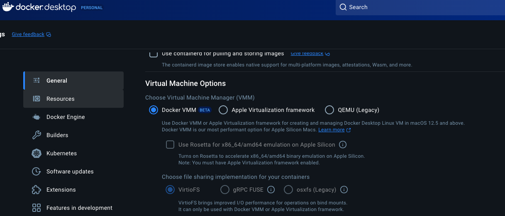

---

### HPA doesn’t show CPU metrics

Problem: CPU metrics Shows Unknown

NAME         REFERENCE           TARGETS         MINPODS   MAXPODS   REPLICAS   AGE

credit-hpa   Deployment/credit   <unknown>/20%   1         3         1          18s

FailedGetResourceMetric       2m15s (x169 over 44m)  horizontal-pod-autoscaler  failed to get cpu utilization: unable to get metrics for resource cpu: unable to fetch metrics from resource metrics API:

Solution:

-> Delete HPA (kubectl delete hpa credit-hpa)

-> kubectl apply -f

-> Create HPA

This should solve the cpu metrics report issue.

Added by Priya V

---

### HW10 Autoscaling (optional) command does not work

This command never worked:

kubectl autoscale deployment subscription --name subscription-hpa --cpu-percent=20 --min=1 --max=3

Going through the error logs, it indicated some sort of certificate validation issues because of the server's certificate not having a valid Subject Alternative Name (SAN) for the node's IP address.

chatGPT suggested to run in terminal:

kubectl patch deployment metrics-server -n kube-system --type='json' -p='[{"op": "add", "path": "/spec/template/spec/containers/0/args/-", "value": "--kubelet-insecure-tls"}]'

to skip the TLS verification and

kubectl rollout restart deployment metrics-server -n kube-system

to restart the deployment. then the metrics server started working.

Avoiding TLS certificate validation may not be a good solution for production ready systems, but it would be enough for our case.

Till Meineke, Dec 2024

---

## 11. KServe

### What tools are recommended for setting up a local Kubernetes environment for model deployment practice?

Several tools can help set up a local Kubernetes environment:

Kind: Runs Kubernetes clusters in Docker containers, suitable for testing and development.

Minikube: Runs a single-node Kubernetes cluster on your local machine.

K3s: A lightweight Kubernetes distribution ideal for local development.

MicroK8s: A minimal Kubernetes distribution for local development.

Docker Desktop: Includes a standalone Kubernetes server and client for development.

~ David Peterson

---

## Projects (Midterm and Capstone)

### Errors with istio during installation

Problem description:

Running this:

curl -s "https://raw.githubusercontent.com/kserve/kserve/release-0.9/hack/quick_install.sh" | bash

Fails with errors because of istio failing to update resources, and you are on kubectl > 1.25.0.

Check kubectl version with kubectl version

Solution description

Edit the file “quick_install.bash” by downloading it with curl without running bash. Edit the versions of Istio and Knative as per the matrix on the .

Run the bash script now.

Added by Andrew Katoch

---

### What are the project deadlines?

Answer: For 2024 cohort you can see them .

Capstone 1:

7 Jan 2025 due date for submission

14 Jan 2025 due date for evaluation

Capstone 2:

21 Jan 2025 due date for submission

28 Jan 2025 due date for evaluation

---

### Are projects solo or collaborative/group work?

Answer: All midterms and capstones are meant to be solo projects. [ @Alexey]

---

### What modules, topics, problem-sets should a midterm/capstone project cover? Can I do xyz?

Answer: Ideally midterms up to module-06, capstones include all modules in that cohort’s syllabus. But you can include anything  to feature. Just be sure to document anything not covered in class.

Also watch office hours from previous cohorts. Go to DTC youtube channel and click on Playlists and search for {course yyyy}. ML Zoomcamp was first launched in 2021.

More discussions:

[] [] []

---

### Crucial Links

These links apply to all projects, actually. Again, for some cohorts, the modules/syllabus might be different, so always check in your cohort’s folder as well for additional or different instructions, if any.

Midterm Project Sample:

MidTerm Project Deliverables:

Submit MidTerm Project:

Datasets:

and

What to do and Deliverables

Think of a problem that's interesting for you and find a dataset for that

Describe this problem and explain how a model could be used

Prepare the data and doing EDA, analyze important features

Train multiple models, tune their performance and select the best model

Export the notebook into a script

Put your model into a web service and deploy it locally with Docker

Bonus points for deploying the service to the cloud

---

### How to conduct peer reviews for projects?

Answer: Previous cohorts projects page has instructions (youtube).

Alexey and his team will compile a g-sheet with links to submitted projects with our hashed emails (just like when we check leaderboard for homework) that are ours to review within the evaluation deadline.

~~~ Added by Nukta Bhatia ~~~

---

### Learning in public links for the projects

For the learning in public for this midterm project it seems that has a total value of 14!, Does this mean that we need make 14 posts?, Or the regular seven posts for each module and each one with a value of 2?, Or just one with a total value of 14?

14 posts, one for each day, and another 2 posts for each evaluation of other participants projects

---

### My dataset is too large and I can't loaded in GitHub , do anyone knows about a solution?

You can use git-lfs () for upload large file to github repository.

Ryan Pramana

---

### What If I submitted only two projects and failed to submit the third?

If you have submitted two projects (and peer-reviewed at least 3 course-mates’ projects for each submission), you will get the certificate for the course. According to the course coordinator, Alexey Grigorev, only two projects are needed to get the course certificate.

(optional) David Odimegwu

---

### I did the first two projects and skipped the last one so I wouldn't have two peer review in second capstone right?

Yes. You only need to review peers when you submit your project.

Confirmed on Slack by Alexey Grigorev (added by Rileen Sinha)

---

### How many models should I train?

Regarding Point 4 in the midterm deliverables, which states, "Train multiple models, tune their performance, and select the best model," you might wonder, how many models should you train? The answer is simple: train as many as you can. The term "multiple" implies having more than one model, so as long as you have more than one, you're on the right track.

---

### How does the project evaluation work for you as a peer reviewer?

I am not sure how the project evaluate assignment works? Where do I find this? I have access to all the capstone 2 project, perhaps, I can randomly pick any to review.

Answer:

The link provided for example (2023/Capstone link ):  contains a list of all submitted projects to be evaluated. More specific, you are to review 3 assigned peer projects. In the spreadsheet are 3 hash values of your assigned peer projects. However, you need to derive the your hash value of your email address and find the value on the spreadsheet under the (reviewer_hash) heading.

To calculate your hash value run the python code below:

from hashlib import sha1

def compute_hash(email):

return sha1(email.lower().encode('utf-8')).hexdigest()

# Example usage **** enter your email below (Example1@gmail.com)****

email = "Example1@gmail.com"

hashed_email = compute_hash(email)

print("Original Email:", email)

print("Hashed Email (SHA-1):", hashed_email)

Edit the above code to replace  as your email address

Store and run the above python code from your terminal. See below as the Hashed Email (SHA-1) value

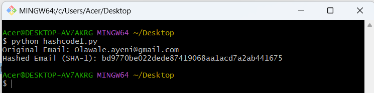

You then go to the link:

Lastly, copy the “Hashed Email (SHA-1): bd9770be022dede87419068aa1acd7a2ab441675” value and search for 3 identical entries. There you should see your peer project to be reviewed.

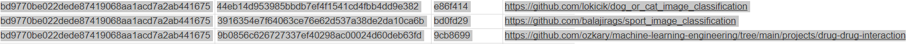

By Emmanuel Ayeni

---

### Do you pass a project based on the average of everyone else’s scores or based on the total score you earn?

Alexey Grigorev: “It’s based on all the scores to make sure most of you pass.”                                                   By Annaliese Bronz

---

## Miscellaneous

### Does your mid term project need to use a neural network to get maximum number of points?

No, even though it’s mentioned in the marking rubric, it’s not compulsory, it’s just one of the many possible methods you may use.                                                   By David Peterson

Other course-related questions that don’t fall into any of the categories above or can apply to more than one category/module

---

### Why do I need to provide a train.py file when I already have the notebook.ipynb file?

Answer: The train.py file will be used by your peers to review your midterm project. It is for them to cross-check that your training process works on someone else’s system. It should also be included in the environment in conda or with pipenv.

Odimegwu David

---

### Loading the Image with PILLOW library and converting to numpy array

Pip install pillow - install pillow library

from PIL import Image

img = Image.open('aeroplane.png')

From numpy import asarray

numdata=asarray(img)

Krishna Anand

---

### Is a train.py file necessary when you have a train.ipynb file in your midterm project directory?

Ans: train.py has to be a python file. This is because running a python script for training a model is much simpler than running a notebook and that's how training jobs usually look like in real life.

---

### Is there a way to serve up a form for users to enter data for the model to crunch on?

Yes, you can create a mobile app or interface that manages these forms and validations. But you should also perform validations on backend.

You can also check Streamlit:

Alejandro Aponte

---

### How to get feature importance for XGboost model

Using model.feature_importances_ can gives you an error:

AttributeError: 'Booster' object has no attribute 'feature_importances_'

Answer: if you train the model like this: model = xgb.train you should use get_score() instead

Ekaterina Kutovaia

---

### [Errno 12] Cannot allocate memory in AWS Elastic Container Service

In the Elastic Container Service task log, error “[Errno 12] Cannot allocate memory” showed up.

Just increase the RAM and CPU in your task definition.

Humberto Rodriguez

---

### Pickle error: can’t get attribute XXX on module __main__

When running a docker container with waitress serving the app.py for making predictions, pickle will throw an error that can't get attribute <name_of_class> on module __main__.

This does not happen when Flask is used directly, i.e. not through waitress.

The problem is that the model uses a custom column transformer class, and when the model was saved, it was saved from the __main__ module (e.g. python train.py). Pickle will reference the class in the global namespace (top-level code): __main__.<custom_class>.

When using waitress, waitress will load the predict_app module and this will call pickle.load, that will try to find __main__.<custom_class> that does not exist.

Solution:

Put the class into a separate module and import it in both the script that saves the model (e.g. train.py) and the script that loads the model (e.g. predict.py)

Note: If Flask is used (no waitress) in predict.py, and predict.py has the definition of the class, When  it is run: python predict.py, it will work because the class is in the same namespace as the one used when the model was saved (__main__).

Detailed info:

Marcos MJD

---

### How to handle outliers in a dataset?

There are different techniques, but the most common used are the next:

Dataset transformation (for example, log transformation)

Clipping high values

Dropping these observations

Alena Kniazeva

---

### Failed loading Bento from directory /home/bentoml/bento: Failed to import module "service": No module named 'sklearn'

I was getting the below error message when I was trying to create docker image using bentoml

[bentoml-cli] `serve` failed: Failed loading Bento from directory /home/bentoml/bento: Failed to import module "service": No module named 'sklearn'

Solution description

The cause was because , in bentofile.yaml, I wrote sklearn instead of scikit-learn. Issue was fixed after I modified the packages list as below.

packages: # Additional pip packages required by the service

- xgboost

- scikit-learn

- pydantic

Asia Saeed

---

### BentoML not working with –production flag at any stage: e.g. with bentoml serve and while running the bentoml container

You might see a long error message with something about sparse matrices, and in the swagger UI, you get a code 500 error with “” (empty string) as output.

Potential reason: Setting DictVectorizer or OHE to sparse while training, and then storing this in a pipeline or custom object in the benotml model saving stage in train.py. This means that when the custom object is called in service.py, it will convert each input to a different sized sparse matrix, and this can't be batched due to inconsistent length. In this case, bentoml model signatures should have batchable set to False for production during saving the bentoml mode in train.py.

(Memoona Tahira)

---

### Reproducibility

Problem description:

Do we have to run everything?

You are encouraged, if you can, to run them. As this provides another opportunity to learn from others.

Not everyone will be able to run all the files, in particular the neural networks.

Solution description:

Alternatively, can you see that everything you need to reproduce is there: the dataset is there, the instructions are there, are there any obvious errors and so on.

Related slack conversation .

(Gregory Morris)

---

### Model too big

If your model is too big for github one option is to try and compress the model using joblib. For example joblib.dump(model, model_filename, compress=('zlib', 6) will use zlib to compress the model. Just note this could take a few moments as the model is being compressed.

Quinn Avila

---

### Permissions to push docker to Google Container Registry

When you try to push the docker image to Google Container Registry and get this message “unauthorized: You don't have the needed permissions to perform this operation, and you may have invalid credentials.”, type this below on console, but first install , this is to be able to use gcloud in console:

gcloud auth configure-docker

(Jesus Acuña)

---

### Tflite_runtime unable to install

I am getting this error message when I tried to install tflite in a pipenv environment

Error:  An error occurred while installing tflite_runtime!

Error text:

ERROR: Could not find a version that satisfies the requirement tflite_runtime (from versions: none)

ERROR: No matching distribution found for tflite_runtime

This version of tflite do not run on python 3.10, the way we can make it work is by install python 3.9, after that it would install the tflite_runtime without problem.

Pastor Soto

Check all available versions here:

If you don’t find a combination matching your setup, try out the options at

which you can install as shown in the lecture, e.g.

pip install https://github.com/alexeygrigorev/tflite-aws-lambda/raw/main/tflite/tflite_runtime-2.7.0-cp38-cp38-linux_x86_64.whl

Finally, if nothing works, use the TFLite included in TensorFlow for local development, and use Docker for testing Lambda.

Rileen Sinha (based on discussions on Slack)

---

### Error when running ImageDataGenerator.flow_from_dataframe

Error: ImageDataGenerator name 'scipy' is not defined.

Check that scipy is installed in your environment.

Restart jupyter kernel and try again.

Marcos MJD

---

### How to pass BentoML content / docker container to Amazon Lambda

Tim from BentoML has prepared a dedicated video tutorial wrt this use case here:

Konrad Muehlberg

---

### Error UnidentifiedImageError: cannot identify image file

In deploying model part, I wanted to test my model locally on a test-image data and I had this silly error after the following command:

url = 'https://github.com/bhasarma/kitchenware-classification-project/blob/main/test-image.jpg'

X = preprocessor.from_url(url)

I got the error:

UnidentifiedImageError: cannot identify image file <_io.BytesIO object at 0x7f797010a590>

Solution:

Add ?raw=true after .jpg in url. E.g. as below

url = ‘https://github.com/bhasarma/kitchenware-classification-project/blob/main/test-image.jpg?raw=true’

Bhaskar Sarma

---

### [pipenv.exceptions.ResolutionFailure]: Warning: Your dependencies could not be resolved. You likely have a mismatch in your sub-dependencies

Problem: If you run pipenv install and get this message. Maybe manually change Pipfile and Pipfile.lock.

Solution: Run: ` pipenv lock` for fix this problem and dependency files

Alejandro Aponte

---

### Get_feature_names() not found

Problem: In the course this function worked to get the features from the dictVectorizer instance: dv.get_feature_names(). But in my computer did not work. I think it has to do with library versions and but apparently that function will be deprecated soon:

Old:

New:

Solution: change the line dv.get_feature_names() to list(dv.get_feature_names_out))

Ibai Irastorza

---

### Error decoding JSON response: Expecting value: line 1 column 1 (char 0)

Problem happens when contacting the server waiting to send your predict-test and your data here in the correct shape.
The problem was the format input to the model wasn’t in the right shape. Server receives the data in json format (dict) which is not suitable for the model. U should convert it to like numpy arrays.

Ahmed Okka

---

### Free cloud alternatives

Q: Hii folks, I tried deploying my docker image on Render, but it won't I get SIGTERM everytime.

I think .5GB RAM is not enough, is there any other free alternative available ?

A: aws (amazon), gcp (google), saturn.

Both aws and gcp give microinstance for free for a VERY long time, and a bunch more free stuff.

Saturn even provides free GPU instances. Recent promo link from mlzoomcamp for Saturn:

“You can sign up here:

When you sign up, write in the chat box that you're an ML Zoomcamp student and you should get extra GPU hours (something like 150)”

Added by Andrii Larkin

---

### Getting day of the year from day and month column

Problem description: I have one column day_of_the_month . It has values 1, 2, 20, 25 etc. and int . I have a second column month_of_the_year. It has values jan, feb, ..dec. and are string. I want to convert these two columns into one column day_of_the_year and I want them to be int. 2 and jan should give me 2, i.e. 2nd day of the year, 1 and feb should give me 32, i.e. 32 nd day of the year. What is the simplest pandas-way to do it?

Solution description:

convert dtype in day_of_the_month column from int to str with df['day_of_the_month'] = df['day_of_the_month'].map(str)

convert month_of_the_year column in jan, feb ...,dec into 1,2, ..,12 string using map()

convert day and month into a datetime object with:

df['date_formatted'] = pd.to_datetime(

dict(

year='2055',

month=df['month'],

day=df['day']

)

)

get day of year with: df['day_of_year']=df['date_formatted'].dt.dayofyear

(Bhaskar Sarma)

---

### Chart for classes and predictions

How to visualize the predictions per classes after training a neural net

Solution description

classes, predictions = zip(*dict(zip(classes, predictions)).items())

plt.figure(figsize=(12, 3))

plt.bar(classes, predictions)

Luke

---

### Convert dictionary values to Dataframe table

You can convert the prediction output values to a datafarme using 
df = pd.DataFrame.from_dict(dict, orient='index' , columns=["Prediction"])

Edidiong Esu

---

### Kitchenware Classification Competition Dataset Generator

The image dataset for the competition was in a different layout from what we used in the dino vs dragon lesson. Since that’s what was covered, some folks were more comfortable with that setup, so I wrote a script that would generate it for them

It can be found here:

Martin Uribe

---

### CUDA toolkit and cuDNN Install for Tensorflow

Install Nvidia drivers: .

Windows:

Install Anaconda prompt

Two options:

Install package ‘tensorflow-gpu’ in Anaconda

Install the Tensorflow way

WSL/Linux:

WSL: Use the Windows Nvida drivers, do not touch that.

Two options:

Install the Tensorflow way

Make sure to follow step 4 to install CUDA by environment

Also run:

echo ‘export XLA_FLAGS=--xla_gpu_cuda_data_dir=$CONDA_PREFIX/lib/> $CONDA_PREFIX/etc/conda/activate.d/env_vars.sh

Install CUDA toolkit 11.x.x

Install

Now you should be able to do training/inference with GPU in Tensorflow

(Learning in public links Links to social media posts where you share your progress with others (LinkedIn, Twitter, etc). Use #mlzoomcamp tag. The scores for this part will be capped at 7 points. Please make sure the posts are valid URLs starting with "https://" Does it mean that I should provide my linkedin link? or it means that I should write a post that I have completed my first assignement? (

ANS (by ezehcp7482@gmail.com): Yes, provide the linkedIN link to where you posted.

ezehcp7482@gmail.com:

PROBLEM: Since I had to put up a link to a public repository, I had to use Kaggle and uploading the dataset therein was a bit difficult; but I had to ‘google’ my way out.

ANS: See this link for a guide (https://www.kaggle.com/code/dansbecker/finding-your-files-in-kaggle-kernels/notebook)

---

### About getting the wrong result when multiplying matrices

When multiplying matrices, the order of multiplication is important.

For example:

A (m x n) * B (n x p) = C (m x p)

B (n x p) * A (m x n) = D (n x n)

C and D are matrices of different sizes and usually have different values. Therefore the order is important in matrix multiplication and changing the order changes the result.

Baran Akın

---

### None of the videos have how to install the environment in Mac, does someone have instructions for Mac with M1 chip?

Refer to

(added by Rileen Sinha)

I made a medium article describing it:

Till Meineke

---

### I may end up submitting the assignment late. Would it be evaluated?

Depends on whether the form will still be open. If you're lucky and it's open, you can submit your homework and it will be evaluated. if closed - it's too late.

(Added by Rileen Sinha, based on answer by Alexey on Slack)

---

### Does the github repository need to be public?

Yes. Whoever corrects the homework will only be able to access the link if the repository is public.

(added by Tano Bugelli)

---

### How to install Conda environment in my local machine?

You don’t install a conda environment. First you create it, then you activate it.

Step 1: how to create a conda environment?

In a terminal write the command (ml-zoomcamp is the name of the environment):

conda create -n ml-zoomcamp

Step 2: how to activate a conda environment?

conda activate ml-zoomcamp

You can verify that it worked if you see (ml-zoomcamp) prepended to your command prompt.

Note:

The answer above assumes Anaconda has already been installed on your local machine. If this is not the case, you can download it from . After installing it, you can verify it succeeded with the following command in a terminal: conda --version.

(added by Kemal Dahha)

---

### Which IDE is recommended for machine learning?

VSCode and Jupyter.

(added by Kemal Dahha)

---

### How to use wget with Google Colab?

Install w get:
!which wget

Download data:
!wget -P /content/drive/My\ Drive/Downloads/ URL

(added by Paulina Hernandez)

---

### Features in scikit-learn?

Features (X) must always be formatted as a 2-D array to be accepted by scikit-learn.

Use reshape to reshape a 1D array to a 2D.
							(-Aileah) :>

(added by Tano

filtered_df = df[df['ocean_proximity'].isin(['<1H OCEAN', 'INLAND'])]

# Select only the desired columns

selected_columns = [

'latitude',

'longitude',

'housing_median_age',

'total_rooms',

'total_bedrooms',

'population',

'households',

'median_income',

'median_house_value'

]

filtered_df = filtered_df[selected_columns]

# Display the first few rows of the filtered DataFrame

print(filtered_df.head())

---

### When I plotted using Matplot lib to check if median has a tail, I got the error below how can one bypass? FutureWarning: is_categorical_dtype is deprecated and will be removed in a future version. Use isinstance(dtype, CategoricalDtype) instead

You can probably resolve this by installing the latest version of Pandas. You can do this conveniently from a Jupyter code cell by writing:

!pip install --upgrade pandas

Alternatively, if for whatever reason you don’t want to change your Pandas version, you can suppress warnings:

import warnings

import pandas as pd

# Suppress FutureWarning messages

warnings.simplefilter(action='ignore', category=FutureWarning)

(added by Kemal Dahha)

---

### Reproducibility in different OS

When trying to rerun the docker file in Windows, as opposed to developing in WSL/Linux, I got the error of:

```

Warning: Python 3.11 was not found on your system…

Neither ‘pipenv’ nor ‘asdf’ could be found to install Python.

You can specify specific versions of Python with:

$ pipenv –python path\to\python

```

The solution was to add Python311 installation folder to the PATH and restart the system and run the docker file again. That solved the error.

(Added by Abhijit Chakraborty)

---

### Deploying to Digital Ocean

You may quickly deploy your project to DigitalOcean App Cloud. The process is relatively straightforward. The deployment costs about 5 USD/month. The container needs to be up until the end of the project evaluation.

Steps:

Register in DigitalOcean

Go to Apps -> Create App.

You will need to choose GitHub as a service provider.

Edit Source Directory (if your project is not in the repo root)

IMPORTANT: Go to settings -> App Spec and edit the Dockerfile path so it looks like ./project/Dockerfile path relative to your repo root

Remember to add model files if they are not built automatically during the container build process.

By Dmytro Durach

---

### Is it best to train your model only on the most important features?

I’m just looking back at the lessons in week 3 (churn prediction project), and lesson 3.6 talks about Feature Importance for categorical values. At , the mutual info scores show that the some features are more important than others, but then in lesson 3.10 the Logistic Regression model is trained on all of the categorical variables (see ). Once we have done feature importance, is it best to train your model only on the most important features?

Not necessarily - rather, any feature that can offer additional predictive value should be included (so, e.g. predict with & without including that feature; if excluding it drops performance, keep it, else drop it). A few individually important features might in fact be highly correlated with others, & dropping some might be fine. There are many feature selection algorithms, it might be interesting to read up on them (among the methods we've learned so far in this course, L1 regularization (Lasso) implicitly does feature selection by shrinking some weights all the way to zero).

By Rileen Sinha

---

### How can I work with very large datasets, e.g. the New York Yellow Taxi dataset, with over a million rows?

You can consider several different approaches:

Sampling: In the exploratory phase, you can use random samples of the data.

Chunking: When you do need all the data, you can read and process it in chunks that do fit in the memory.

Optimizing data types: Pandas’ automatic data type inference (when reading data in) might result in e.g. float64 precision being used to represent integers, which wastes space. You might achieve substantial memory reduction by optimizing the data types.

Using Dask, an open-source python project which parallelizes Numpy and Pandas.

(see, e.g. )

By Rileen Sinha

---

### Can I do the course in other languages, like R or Scala?

Technically, yes. Advisable? Not really. Reasons:

Some homework(s) asks for specific python library versions.

Answers may not match in MCQ options if using different languages other than Python 3.10 (the recommended version for 2023 cohort)

And as for midterms/capstones, your peer-reviewers may not know these other languages. Do you want to be penalized for others not knowing these other languages?

You can create a separate repo using course’s lessons but written in other languages for your own learnings, but not advisable for submissions.

tx[]

---

### Is use of libraries like  or huggingface allowed in the capstone and competition, or are they considered to be "too much help"?

Yes, it’s allowed (as per Alexey).

Added By Rileen Sinha

---

### Flask image was built and tested successfully, but tensorflow serving image was built and unable to test successfully. What could be the problem?

The TF and TF Serving versions have to match (as per solution from the slack channel)

Added by Chiedu Elue

For Module 10.3, if you are on apple silicon:

if you see this error when trying to run TF-Serving locally with docker:

/usr/bin/tf_serving_entrypoint.sh: line 3:     7 Illegal instruction     tensorflow_model_server --port=8500 --rest_api_port=8501 --model_name=${MODEL_NAME} --model_base_path=${MODEL_BASE_PATH}/${MODEL_NAME} "$@"

if found this

Docker release 4.35.0 (172550) for Mac introduces Docker VMM Beta, a replacement for the Apple Virtualisation Framework using Rosetta. Good news is that I can run the native TF Serving image now on.

Till Meineke (Dec 11 2024)

---

### Any advice for adding the Machine Learning Zoomcamp experience to your LinkedIn profile?

I’ve seen LinkedIn users list DataTalksClub as Experience with titles as:

Machine Learning Fellow

Machine Learning Student

Machine Learning Participant

Machine Learning Trainee

Please note it is best advised that you do not list the experience as an official “job” or “internship” experience since DataTalksClub did not hire you, nor financially compensate you.

Other ways you can incorporate the experience in the following sections:

Organizations

Projects

Skills

Featured

Original posts

Certifications

Courses

By Annaliese Bronz

Interesting question, I put the link of my project into my CV as showcase and make posts to show my progress.

By Ani Mkrtumyan

---

### How to install extras packages on Google Colab or Kaggle?

Create a cell and, for example, you can perform the next command using PIP:
!pip install tensorflow[and-cuda]==2.14

2.you can use Conda commands, for example:

!conda install pandas –yes

The option --yes is so that the installation can continue when the message "Proceed ([y]/n)?" appears

By Alexander Daniel Rios

---

### Getting Wrong RMSE that is not matching or close to answer options in HW 2(Regression) of 2024 Cohort.

The following piece of code which involves shuffling is crucial to getting RMSE which is close to the ones in the answer options in the homework.

df = orig_df.copy()

base = ['ram','storage','screen','final_price']

my_df = df[base]

idx = np.arange(n)

np.random.seed(s)

np.random.shuffle(idx)

df_shuffled = my_df.iloc[idx]

df_train = df_shuffled.iloc[idx[:n_train]].copy()

df_val = df_shuffled.iloc[idx[n_train:n_train+n_val]].copy()

df_test = df_shuffled.iloc[idx[n_train+n_val:]].copy()

df_train = df_train.reset_index(drop=True)

df_val = df_val.reset_index(drop=True)

df_test = df_test.reset_index(drop=True)

y_train = df_train.final_price.values

y_val =  df_val.final_price.values

y_test = df_test.final_price.values

del df_train['final_price']

del df_val['final_price']

del df_test['final_price']

2.	if we don't get this logic right, then all the RMSE gets messed up. Do double check in your codes.

CUDA ran out of memory in google collab

Most of the time when we are trying to run the models on collab or kaggle , we tend to face the  runtime error of CUDA out of memory.

Tips to overcome this :

Reduce the batch size .

Use lower precision

Something the memory can be allocated for things which we aren’t using it recently , so try to clear the cache

Import torch 
torch.cuda.empty_cache()  // free up the GPU memory space.

Delete unnecessary variables

Follow the links below to get a deep view of it .

(added by Nikisha)

---

### docker: Error response from daemon: failed to create task for container: failed to create shim task: OCI runtime create failed: runc create failed: unable to start container process: exec: "gunicorn": executable file not found in $PATH: unknown.

You need to add gunicorn and flask just to be safe to Pipfile with nano Pipfile.

add

[[source]]

url = "https://pypi.org/simple"

verify_ssl = true

name = "pypi"

[packages]

scikit-learn = "==1.5.2"

gunicorn = "*"

flask 	    = “*”

[dev-packages]

[requires]

python_version = "3.11"

After that run pipenv lock then do the docker build -t [name] .  and docker run [name]

(Added by Ico)

---

### If you are working in the terminal on your computer in wsl and you want to go to the directory in explorer to upload to github use type explorer.exe .

Explorer.exe calls the process and . opens in the current directory.
Or you can sync through VScode to github

(Added by Ico)

---

### Can I work with this dataset for midterm project https://www.kaggle.com/datasets/kapoorprakhar/cardio-health-risk-assessment-dataset?

Yes, you can provided it does not violate any of the plagiarism rules and it is not one of the common datasets like titanic, iris or Boston housing.set.

By Victor Emenike

---

### Where can I find other people’s projects to peer review them and where do I post mine for peer review? (cohort 2024).

The review assignments will be available on  after the first phase of the project is over -i.e. after the submission deadline. After that you will have one week to complete the review.

Saturn Cloud errors (in Jupyter Notebook):

ImportError: cannot import name 'runtime_version' from 'google.protobuf'

Can be resolved by updating protobuf:

!pip install -U protobuf

Works for tensorflow 2.17.0 and protobuf 4.25.5  (5.29.0 after updating)

Additionally, updating tensorflow to 2.18.0 (!pip install -U tensorflow at the moment) resolves the issue of the model.fit function hanging

---

