# Mlops Zoomcamp FAQ

## General course questions

### Format for questions: [Problem title]

MLOps Zoomcamp FAQ

​​MLOps Zoomcamp FAQ

The purpose of this document is to capture frequently asked technical questions.

Editing guidelines:

When adding a new FAQ entry, make sure the question is “Heading 2”

Feel free to improve if you see something is off

Don’t change the formatting in the document or add any visual “improvements”

Don’t change the pages format (it should be “pageless”)

[Problem description]

[Solution description]

(optional) Added by Name

---

### Q: I forgot if I registered, can I still join the zoomcampation of this course or that for each module?

Approximately 3 months.

Q: Can I still take this course after the cohort has started (or after the course launch date)?

You don't need to register, registration is not mandatory. It is for gauging the level of interest and collecting data for analytics.
You can also just start learning and submitting homework without registering while a cohort is “live”. It is not checked against any registered list. Registration is just to gauge interest before the start date.

---

### Is it going to be live? When?

The course videos are pre-recorded, you can start watching the course right now.

The zoomcamps are spread out throughout the year. See article

We will also occasionally have office hours - live sessions where we will answer your questions. The office hours sessions are recorded too.

You can see the office hours (playlist with year 20xx) as well as the pre-recorded course videos in (playlist without year) in Course Channel’s Bookmarks and/or

---

### Course - Can I still join the course after the start date?

Yes, even if you don't register, you're still eligible to submit the homeworks as long as the form is still open and accepting submissions.

Be aware, however, that there will be deadlines for turning in the final projects. So don't leave everything to the last minute.

---

### Course - How do I start?

No matter if you're with a 'live' cohort or follow on the self-paced mode, the way to start is similar:

see what things are where by reading  pins and  bookmarks on the course-channel


reading the repo (bookmarked in channel) and watching the video lessons (playlist bookmarked in channel)

if have questions, search the channel itself first; someone may have already asked and gotten a solution

if don't want to comb through the search results, read  for the most Frequently Asked Questions (this document)


if don't even want to read/skim/search (use ctrl+F) the questions in FAQ doc, tag the @ZoomcampQABot when you ask questions, and it will summarize it for you (if answers in its knowledge-base)

For generic, non-zoomcamp queries, you can also ask ChatGPT/BingCopilot/GoogleGemini/etc, especially for error messages

check if you're on track by checking the deadlines (in Course Management form for Homework submissions)

main difference of not being in a “live” cohort is that the responses to your questions might be delayed as not many active students come online anymore. Which is not an issue if you do your own due diligence and search for answers first or reading the documentation of the library.

If you do need to ask questions when no answers supplied in resources above have helped, follow the asking-questions.md (bookmarked in channel) guidelines, also in Pins…

---

### Course - Can I still graduate when I didn’t complete homework for week x?

Yes

---

### Certificate - Can I follow the course in a self-paced mode and get a certificate?

No, you can only get a certificate if you finish the course with a “live” cohort. We don't award certificates for the self-paced mode. The reason is you need to peer-review capstone(s) after submitting a project. You can only peer-review projects at the time the course is running.

---

### What’s the difference between the 2023 and 2022 course?

The difference is the Orchestration and Monitoring modules. Those videos will be re-recorded to use Prefect. The rest should mostly be the same.

Also all of the homeworks will be changed for the 2023 cohort.

---

### Cohort - What’s the difference between the 2024 and 2023 course?

The difference is the Orchestration and Monitoring modules. Those videos will be re-recorded to use Mage-AI. The rest should mostly be the same.

Also all of the homeworks will be changed for the 2024 cohort.

---

### Cohort - Will there be a 2024 Cohort? When will the 2024 cohort start?

Yes, it will start in May 2024

---

### Cohort - I missed the current cohort, when is the next cohort scheduled for? Will there be a 202x cohort?

Please see the summary of all zoomcamps and their respective schedule at

Although note that, there’s no guarantee that the zoomcamps would be run indefinitely or the same zoomcamps would be conducted year-after-year-after-year.

---

### Homework - What if my answer is not exactly the same as the choices presented?

Please choose the closest one to your answer. Also do not post your answer in the course slack channel.

---

### Homework - where can I find the schedule and/or deadlines of each homework assignment?

You can find the deadlines for each homework assignment in the course schedule/ timeline provided at . The time is your own local time, it has been automatically converted.

---

### Homework 1 , 2025 Cohort - Is the due date for homework 20th May? How do I check the updated playlist and homework for mlops course?

The due date differs due to the participants being in different time zones, it was the midnight of May 19th/20th in Berlin, and whatever corresponded to that in your particular time zone. You can find the deadline on the homework submission page, e.g.

You can find all cohort-specific info the 2025 cohort here:

---

### Homework 2 , 2025 Cohort - Why is the experiment in question 6 taking so long to run? Should we use yellow taxi data, or green taxi data?

You might need to use the green taxi data rather than yellow taxi data - look at other recent questions similar to yours. The preprocessing code provided with the homework expects green taxi data (even though the question specifies yellow taxi data), and answers seem to confirm that using green taxi data is the way to go. Not that there's no official confirmation of this though (as of early morning, May 27th in Berlin).

---

### Homework 2 , I am getting conflicts on server ports and cannot establish a connection to the MLflow server, why?

Your port (5000) may be in use by some other process ID, run ‘lsoft -i :5000’ to find out and either kill the process or explicitly route to a different port (than the default) with ‘mlflow ui --backend-store-uri sqlite:///mlflow.db --port 5001’

---

### Homework 3, 2025 Cohort - Do I have to use MAGE as the orchestrator? Can I use any orchestrator I want?

You do not have to use MAGE or any specific orchestrator, it is totally up to you.

---

### Q : just found this course, can I still submit homeworks?

To clarify on "Late homework submissions": we cannot submit after the homework is scored as the form is closed.

Once the form is closed (aka Scored), no further submissions are possible. So, then no "late homework submissions" allowed after the form is closed and not editable. You can check your code against the solution (check the homework.md) file.

If the due date has passed, but the form is still Open / Submitted, this is what I term "late homework submissions", the form is still editable. Don’t forget to click the Update button with your changes!

So, we're on borrowed time and we have no way of knowing when Alexey would close the form (the process is still manual at this time).

---

### Hi, is it too late to start the course, I have ML experience?

It really depends on how much time and effort you can dedicate to the project over the coming weeks. Since you're late for the homeworks and they aren't required for the certificate, it might make sense to throw yourself into the projects - even if the first attempt is a struggle, it will be the best preparation for the second attempt, should you need (or feel like) one.

---

### Project - Are we free to choose our own topics for the final project?

Please pick up a problem you want to solve yourself. Potential datasets can be found on either Kaggle, Hugging Face, Google, AWS, or the UCI Machine Learning Datasets Repository. More links documented in . Please also read

---

### Project - Is the capstone an individual or team project?

It is an individual project.

---

### Project - For the final project, is it required to be put on the cloud?

You can get a few cloud points by using kubernetes even if you deploy it only locally. Or you can use localstack too to mimic AWS. Be sure you’re clear on the.

---

### Homework and Leaderboard - what is the system for points in the course management platform?

After you submit your homework it will be graded based on the amount of questions in a particular homework. You can see how many points you have right on the page of the homework up top. Additionally in the leaderboard you will find the sum of all points you’ve earned - points for Homeworks, FAQs and Learning in Public. If homework is clear, others work as follows: if you submit something to FAQ, you get one point, for each learning in a public link you get one point. Hover over the ? for some explanations.

---

### What exactly is a learning-in-public post?

They are content that you created about what you have learned on that topic. Some DOs and DON’Ts explained by Alexey in loom video:

Anyone caught abusing and gaming the system would be publicly called out and get their points stripped so they don’t appear so high up on the Leaderboard (as of 18 June 2024).

---

### Leaderboard - I am not on the leaderboard / how do I know which one I am on the leaderboard?

When you set up your account you are automatically assigned a random name such as “Lucid Elbakyan” for example. Click on the Jump to your record on the leaderboard link to find your entry.

If you want to see what your Display name is, click on the Edit Course Profile button.


First field is your nickname/displayed-name, change it if you want to be known as your Slack username or Github username or whatever nickname if you want to remain anonymous

Unless you want “Lucid Elbakyan” on your certificate, it is mandatory that you change the second field to your official name as in your identification documents - passport, national ID card, driver’s license, etc. This is the name that is going to appear on your Certificate!

---

## Module 1: Introduction

### You can submit and update your project attempt (1 or 2) multiple times before the final deadline.

It might be a good idea not to wait till last minute and submit even partially complete project

And keep adding improvements till last date (If needed)

You can simply update git commit sha.

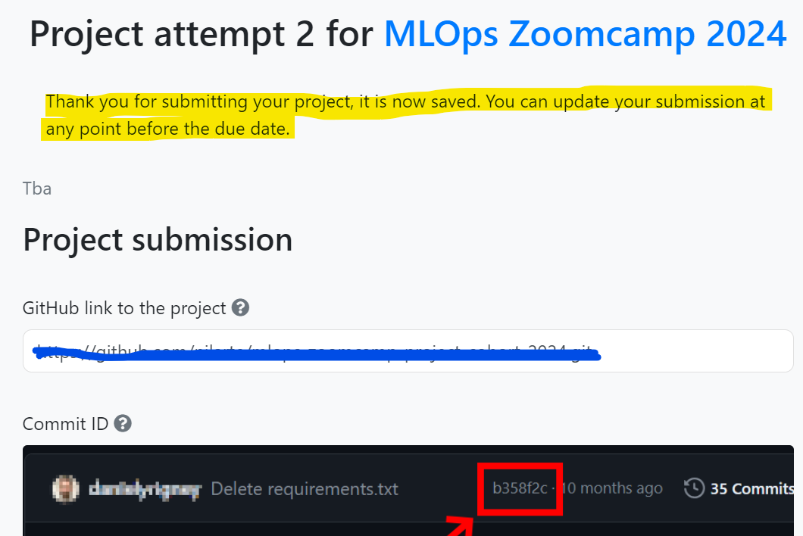

---

### Opening Jupyter in VSCode

You can install the Jupyter extension to open notebooks in VSCode.

Added by Khubaib

---

### Launching Jupyter notebook from codespace VM

When you are ready and installed Anaconda, in a new terminal, you can run a jupyter notebook with the command line “jupyter notebook”. Be careful not to make any typo, for example“jupyter-notebook” will throw an error “Jupyter command `jupyter-notebook` not found.”.

Added by Mélanie Fouesnard

---

### Configuring Github to work from the remote VM

In case one would like to set a github repository (e.g. for Homeworks), one can follow 2 great tutorials that helped a lot

Setting up github on AWS instance -

Setting up keys on AWS instance -

Then, one should be able to push to its repo

AWS selected instance

It is not covered under free subscription due to large in size or other reason..Received below reply from them.(I am referring here the Linux setup video in intro)

For free version you can check the free tier link. EC2 only has the below in free :

Resizable compute capacity in the Cloud.

750 hours per month of Linux, RHEL, or SLES t2.micro or t3.micro* instance dependent on region

750 hours per month of Windows t2.micro or t3.micro* instance dependent on region

750 hours per month of public IPv4 address regardless of instance type

*launches in Unlimited mode (may incur additional charges)

Added by Giri (glk08909@gmail.com)

Added by Daniel Hen ()

---

### Opening Jupyter in AWS

Faced issue while setting up JUPYTER NOTEBOOK on AWS. I was unable to access it from my desktop. (I am not using visual studio and hence faced problem)

Run

jupyter notebook --generate-config

Edit file /home/ubuntu/.jupyter/jupyter_notebook_config.py to add following line:

NotebookApp.ip = '*'

Added by Atul Gupta ()

---

### WSL instructions

If you wish to use WSL on your windows machine, here are the setup instructions:

Command: Sudo apt install wget

Get . wget <download address>

Command: git clone <github repository address>

Jupyter: pip3 install jupyter

Added by Gregory Morris ()

All in all softwares at one shop:

You can use anaconda which has all built in services like pycharm, jupyter

Added by Khaja Zaffer ()

Alternatively, you can download miniforge, which is a more lightweight open-source version of conda, which doesn’t rely on the proprietary Anaconda repository and allows you to use mamba, as a default package manager, which greatly improves environment solving speed.

For a clear, step-by-step guide to installing miniforge, the Texas Tech University High Performance Computing Center has an excellent comprehensive guide:

Added by Jon Areas ()

For windows “wsl --install” in Powershell

Added by Vadim Surin ()

If python is still showing as 3.10 after installing anaconda with Python 3.9, try running ‘source .bashrc’ from ${HOME} folder, for any reason if its still not working, add ‘export PATH=”<anaconda install path>/bin:$PATH”’

---

### Created repo without .gitignore

If you created a repo without .gitignore, follow this steps to add .gitignore:

Open Terminal.

Navigate to the location of your Git repository.

Create a .gitignore file for your repository.

touch .gitignore

Locate the .gitignore file: If you already have a .gitignore file, open it.

Edit the .gitignore File: Add the following lines to the .gitignore file:

# Python

*.pyc

__pycache__/

*.py[cod]

*$

Save the Changes: Save the .gitignore file.

Commit the Changes

Added by Chuks Okoli (chuks.o.okoli@gmail.com)

---

### .gitignore how-to

If you create a folder data and download datasets or raw files in your local repository. Then to push all your code to remote repository without this files or folder please use gitignore file. The simple way to create it do the following steps
1. Create empty .txt file (using text editor or command line)

2. Safe as .gitignore (. must use the dot symbol)

3. Add rules
 *.parquet - to ignore all parquet files

data/ - to ignore all files in folder data

For more pattern read GIT documentation

Added by Olga Rudakova (olgakurgan@gmail.com)

---

### AWS suggestions

Make sure when you stop an EC2 instance that it actually stops (there's a meme about it somewhere). There are green circles (running), orange (stopping), and red (stopped). Always refresh the page to make sure you see the red circle and status of stopped.

Even when an EC2 instance is stopped, there WILL be other charges that are incurred (e.g. if you uploaded data to the EC2 instance, this data has to be stored somewhere, usually an EBS volume and this storage incurs a cost).

You can set up billing alerts. (I've never done this, so no advice on how to do this).

(Question by: Akshit Miglani () and Answer by Anna Vasylytsya)

---

### IBM Cloud an alternative for AWS

You can get invitation code by coursera and use it in account to verify it it has different characteristics.

---

### AWS costs

I am worried about the cost of keeping an AWS instance running during the course.

With the instance specified during working environment setup, if you remember to Stop Instance once you finished your work for the day.  Using that strategy, in a day with about 5 hours of work you will pay around $0.40 USD which will account for $12 USD per month, which seems to be an affordable amount.

You must remember that you would have a different IP public address every time you Restart your instance, and you would need to edit your ssh Config file.  It's worth the time though.

Additionally, AWS enables you to set up an automatic email alert if a predefined budget is exceeded.

.

Also, you can estimate the cost yourself, using  (to use it you don’t even need to be logged in).
At the time of writing (20.05.2023) t3a.xlarge instance with 2 hr/day usage (which translates to 10 hr/week that should be enough to complete the course) and 30GB EBS monthly cost is 10.14 USD

Here’s

Added by Alex Litvinov ()

---

### Is the AWS free tier enough for doing this course?

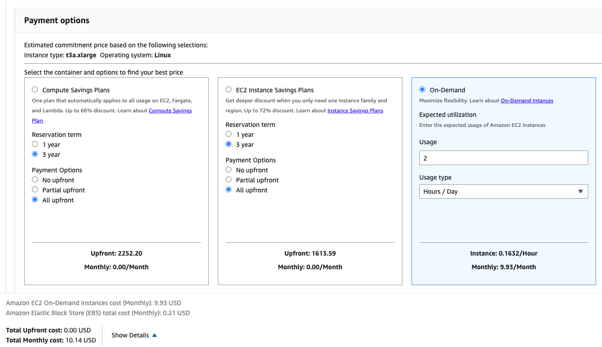

For many parts - yes. Some things like kinesis are not in AWS free tier, but you can do it locally with localstack.

---

### AWS EC2: this site can’t be reached

When I click an open IP-address in an AWS EC2 instance I get an error: “This site can’t be reached”. What should I do?

This ip-address is not required to be open in a browser. It is needed to connect to the running EC2 instance via terminal from your local machine or via terminal from a remote server with such command, for example if:

ip-address is 11.111.11.111

downloaded key name is razer.pem (the key should be moved to a hidden folder .ssh)

your user name is user_name

ssh -i /Users/user_name/.ssh/razer.pem ubuntu@11.111.11.111

---

### Unprotected private key file!

After this command `ssh -i ~/.ssh/razer.pem ubuntu@XX.XX.XX.XX` I got this error: "unprotected private key file". This page () explains how to fix this error. Basically you need to change the file permissions of the key file with this command: chmod 400 ~/.ssh/razer.pem

---

### AWS EC2 instance constantly drops SSH connection

My SSH connection to AWS cannot last more than a few minutes, whether via terminal or VS code.

My config:

# Copy Configuration in local nano editor, then Save it!

Host mlops-zoomcamp                                         # ssh connection calling name

User ubuntu                                             # username AWS EC2

HostName <instance-public-IPv4-addr>                    # Public IP, it changes when Source EC2 is turned off.

IdentityFile ~/.ssh/name-of-your-private-key-file.pem   # Private SSH key file path

LocalForward 8888 localhost:8888                        # Connecting to a service on an internal network from the outside, static forward or set port user forward via on vscode

StrictHostKeyChecking no

Added by Muhammed Çelik

The disconnection will occur whether I SSH via WSL2 or via VS Code, and usually occurs after I run some code, i.e. “import mlflow”, so not particularly intense computation.

I cannot reconnect to the instance without stopping and restarting with a new IPv4 address.

I’ve gone through steps listed on this page:

Inbound rule should allow all incoming IPs for SSH.

What I expect to happen:

SSH connection should remain while I’m actively using the instance, and if it does disconnect, I should be able to reconnect back.

Solution: sometimes the hang ups are caused by the instance running out of memory. In one instance, using EC2 feature to view screenshot of the instance as a means to troubleshoot, it was the OS out-of-memory feature which killed off some critical processes. In this case, if we can’t use a higher compute VM with more RAM, try adding a swap file, which uses the disk as RAM substitute and prevents the OOM error. Follow Ubuntu’s documentation here: .

Alternatively follow AWS’s own doc, which mirrors Ubuntu’s:

Added by Claudia van Dijk: In addition, if your connection happens to be dropping because of timeouts, you can add this line to your local .ssh/config file, which makes it ping the connection every 50 seconds in case timeout is set to 60 seconds:

ServerAliveInterval 50

---

### AWS EC2 IP Update

Everytime I restart my EC2 instance I keep getting different IP and need to update the config file manually.

Solution: You can create a script like this to automatically update the IP address of your EC2 instance.

---

### VS Code crashes when connecting to Jupyter

Make sure to use an instance with enough compute capabilities such as a t2.xlarge. You can check the monitoring tab in the EC2 dashboard to monitor your instance.

---

### My connection to my GCP VM instance keeps timing out when I try to connect

If you switched off the VM instance completely in GCP then when it switches back on the IP address changes. You need to update the ssh_config file with the new external IP address. This can be done in VS Code if you have the Remote-SSH extension installed. Open the command palette and type `Remote-SSH Open SSH Configuration File…` then select the appropriate ssh_config file. And edit the HostName to the correct IP address.

---

### X has 526 features, but expecting 525 features

Error “ValueError: X has 526 features, but LinearRegression is expecting 525 features as input.” when running your Linear Regression Model on the validation data set:

Solution: The DictVectorizer creates an initial mapping for the features (columns). When calling the DictVecorizer again for the validation dataset transform should be used as it will ignore features that it did not see when fit_transform was last called. E.g.

X_train = dv.fit_transform(train_dict)

X_test = dv.transform(test_dict)

---

### Missing dependencies

If some dependencies are missing

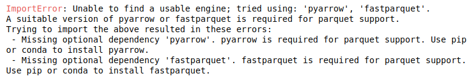

Install following packages

pandas

matplotlib

scikit-learn

fastparquet

pyarrow

seaborn

pip install -r

I have seen this error when using pandas.read_parquet(), the solution is to install pyarrow or fastparquet by doing !pip install pyarrow in the notebook

NOTE: if you’re using Conda instead of pip, install fastparquet rather than pyarrow, as it is much easier to install and it’s functionally identical to pyarrow for our needs.

---

### squared Option Not Available in mean_squared_error

The mean_squared_error function in scikit-learn no longer includes the squared parameter. To compute the Root Mean Squared Error (RMSE), use the dedicated function root_mean_squared_error from sklearn.metrics instead.

---

### No RMSE value in the options

The evaluation RMSE I get doesn’t figure within the options!

If you’re evaluating the model on the entire February data, try to filter outliers using the same technique you used on the train data (0≤duration≤60) and you’ll get a RMSE which is (approximately) in the options. Also don’t forget to convert the columns data types to str before using the DictVectorizer.

Another option: Along with filtering outliers, additionally filter on null values by replacing them with -1.  You will get a RMSE which is (almost same as) in the options. Use ‘.round(2)’ method to round it to 2 decimal points.

Warning deprecation

The python interpreter warning of modules that have been deprecated  and will be removed in future releases as well as making suggestion how to go about your code.

For example

C:\ProgramData\Anaconda3\lib\site-packages\seaborn\distributions.py:2619:

FutureWarning: `distplot` is a deprecated function and will be removed in a future version. Please adapt your code to use either `displot` (a figure-level function with similar flexibility) or `histplot` (an axes-level function for histograms).

warnings.warn(msg, FutureWarning)

To suppress the warnings, you can include this code at the beginning of your notebook

import warnings

warnings.filterwarnings("ignore")

---

### How to replace distplot with histplot

sns.distplot(df_train["duration"])

Can be replaced with

sns.histplot(

df_train["duration"] , kde=True,

stat="density", kde_kws=dict(cut=3), bins=50,

alpha=.4, edgecolor=(1, 1, 1, 0.4),

)

To get almost identical result

---

### KeyError: 'PULocationID'  or  'DOLocationID'

You need to replace the capital letter “L” with a small one “l”

---

### ImportError: Unable to find a usable engine; tried using: ‘pyarrow’, ‘fastparquet’.

Run the following command:
!pip install pyarrow

After successfully downloading, you can delete the command.

-AnnalieseTech

---

### Reading large parquet files

I have faced a problem while reading the large parquet file. I tried some workarounds but they were NOT successful with Jupyter.

The error message is:

IndexError: index 311297 is out of bounds for axis 0 with size 131743

I solved it by performing the homework directly as a python script.

Added by Ibraheem Taha ()

You can try using the Pyspark library

Answered by kamaldeen ()

Parquet format can be read in chunks: . (IK)

---

### Kernel getting killed during assignment tasks on local

If the jupyter notebook kernel gets killed repeatedly due to out of memory issues when converting pandas DF to dict or other memory intensive steps, try google colab as it offers larger memory.

For this,

Upload the datasets to google drive [Folder Colab Notebooks]

Mount the drive on colab

from google.colab import drive

drive.mount('/content/drive')

Pull the data from uploaded tables in colab

df_jan = pq.read_table('/content/drive/My Drive/Colab Notebooks/yellow_tripdata_2023-01.parquet').to_pandas()

All set for doing the assignment

Download the final assignment to your local and copy into the relevant repo

---

### What is the difference between label and one-hot encoding?

Two main encoding approaches are generally used to handle categorical data: label encoding and one-hot encoding. The first assigns each categorical value an integer value based on alphabetical order, while the second creates new variables (using 0s and 1s) depicting original categorical data. Simply, one may use label encoding with logical categorical data such as a rating system or a classification, and one-hot encoding is rather applicable to cases where there is no reasoning with the data. Sci-kit Learn dictionary vectorizer is an encoding class that will provide a means to handle categorical data and generate a corresponding array based on the unique number of instances encountered within your columns choice from a DataFrame (or else). The key point is to assign values to categories and thus enable fitting ML models. In case you want to apply one-hot encoding, sometimes you’ll have to reset the dataset into objects, so any possible logic is deceived. Otherwise, you may fall into label encoding, which can be limiting for some applications. Besides the dictionary vectorizer, Sci-kit Learn also offers the OneHotEncoding() class. Pandas has a similar feature, named pd.get_dummies().

Added by Jonathan Lima (jtlimads@gmail.com)

---

### Distplot takes too long

First remove the outliers (trips with unusual duration) before plotting

Added by Ibraheem Taha ()

---

### RMSE on test set too high

Problem: RMSE on test set was too high when hot encoding the validation set with a previously fitted OneHotEncoder(handle_unknown=’ignore’) on the training set, while DictVectorizer would yield the correct RMSE.

In principle both transformers should behave identically when treating categorical features (at least in this week’s homework where we don’t have sequences of strings in each row):

Features are put into binary columns encoding their presence (1) or absence (0)

Unknown categories are imputed as zeroes in the hot-encoded matrix

---

### ictVectorizerA: Alexey’s answer

In summary,

pd.get_dummies or OHE can come up with result in different orders and handle missing data differently, so train and val set would have different columns during train and validation

DictVectorizer would ignore missing (in train) and new (in val) datasets

Other sources:

~ ellacharmed

---

### Q: Why did we not use OneHotEncoder(sklearn) instead of DictVectorizer ?

Why didn't get_dummies in the pandas library or OneHotEncoder in scikit-learn library be used for one-hot encoding? I know OneHotEncoder is the most common and useful. One-hot coding can also be done using the eye or identity components of the NumPy library.

M.Sari

OneHotEncoder has the option to output a row column tuple matrix. DictVectorizer is a one step method to encode and support row column tuple matrix output.

Harinder()

We used DictVectorizer because it provides a simple one-step way to handle both categorical and numerical features from dictionaries, and directly outputs a sparse matrix—making it ideal for ML pipelines without extra preprocessing.

Yann Pham-Van

Use OneHotEncoder when you want full control, need to work with sklearn pipelines, or must handle unknown categories safely. Use DictVectorizer when your data is in dictionary format (e.g., JSON or from APIs) and you want to plug it into a pipeline quickly.

---

### Clipping outliers

How to check that we removed the outliers?

Use the pandas function describe() which can provide a report of the data distribution along with the statistics to describe the data. For example, after clipping the outliers using boolean expression, the min and max can be verified using

df[‘duration’].describe()

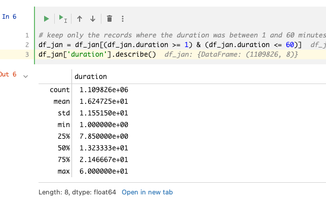

---

### Replacing NaNs for pickup location and drop off location with -1 for One-Hot Encoding

pd.get_dummies and DictVectorizer both create a one-hot encoding on string values. Therefore you need to convert the values in PUlocationID and DOlocationID to string.

If you convert the values in PUlocationID and DOlocationID from numeric to string, the NaN values get converted to the string "nan".  With DictVectorizer the RMSE is the same whether you use "nan" or "-1" as string representation for the NaN values. Therefore the representation doesn't have to be "-1" specifically, it could also be some other string.

---

### Slightly different RMSE

Problem: My LinearRegression RMSE is very close to the answer but not exactly the same. Is this normal?

Answer: No, LinearRegression is an deterministic model, it should always output the same results when given the same inputs.

Answer:

Check if you have treated the outlier properly for both train and validation sets

Check if the one hot encoding has been done properly by looking at the shape of one hot encoded feature matrix. If it shows 2 features, there is something wrong with one hot encoding. Hint: the drop off and pick up codes need to be converted to proper data format and then DictVectorizer is fitted.

Harshit Lamba (hlamba19@gmail.com)

---

### Extremely low RSME

Problem: I’m facing an extremely low RMSE score (eg: 4.3451e-6) - what shall I do?

Answer: Recheck your code to see if your model is learning the target prior to making the prediction. If the target variable is passed in as a parameter while fitting the model, chances are the model would score extremely low. However, that’s not what you would want and would much like to have your model predict that. A good way to check that is to make sure your X_train doesn’t contain any part of your y_train. The same stands for validation too.

Snehangsu De ()

---

### Enabling Auto-completion in jupyter notebook

Problem: how to enable auto completion in jupyter notebook? Tab doesn’t work for me

Solution: !pip install --upgrade jedi==0.17.2

Christopher R.J.()

---

### Downloading the data from the NY Taxis datasets gives error : 403 Forbidden

Problem: While following the steps in the videos you may have problems trying to download with wget the files. Usually it is a 403 error type (Forbidden access).

Solution: The links point to files on cloudfront.net, something like this:

I’m not download the dataset directly, i use dataset URL and run this in the file.

Update(27-May-2023): Vikram

I am able to download the data from the below link. This is from the official  NYC trip record page (). Copy link from page directly as the below url might get changed if the NYC decides to move away from this. Go to the page , right click and use copy link.

wget https://d37ci6vzurychx.cloudfront.net/trip-data/green_tripdata_2021-01.parquet

(Asif)

---

### Using PyCharm & Conda env in remote development

Problem: PyCharm (remote) doesn’t see conda execution path. So, I cannot use conda env (which is located on a remote server).

Solution: In remote server in command line write “conda activate envname”, after write “which python” - it gives you python execution path. After you can use this path when you will add new interpreter in PyCharm: add local interpreter -> system interpreter -> and put the path with python.

Salimov Ilnaz ()

---

### Running out of memory

Problem: The output of DictVectorizer was taking up too much memory. So much so, that I couldn’t even fit the linear regression model before running out of memory on my 16 GB machine.

Solution: In the example for DictVectorizer in the scikit-learn , they set the parameter “sparse” as False. Although this helps with viewing the results, this results in a lot of memory usage. The solution is to either use “sparse=True” instead, or leave it at the default which is also True.

Ahmed Fahim (afahim03@yahoo.com)

---

### Activating Anaconda env in .bashrc

Problem: For me, Installing anaconda didn’t modify the .bashrc profile. That means Anaconda env was not activated even after exiting and relaunching the unix shell.

Solution:

For bash : Initiate conda again, which will add entries for anaconda in .bashrc file.

$ cd YOUR_PATH_ANACONDA/bin $ ./conda init bash

That will automatically edit your .bashrc.

Reload:

$ source ~/.bashrc

Ahamed Irshad ()

---

### The feature size is different for training set and validation set

While working through the HW1, you will realize that the training and the validation data set feature sizes are different. I was trying to figure out why and went down the entire rabbit hole only to see that I wasn’t doing ```transform``` on the premade dictionary vectorizer instead of ```fit_transform```. You already have the dictionary vectorizer made so no need to execute the fit pipeline on the model.

Sam Lim()

---

### Permission denied (publickey) Error (when you remove your public key on the AWS machine)

I found a good guide how to get acces to your machine again when you removed your public key.

Using the following link you can go to Session Manager and log in to your instance and create public key again.

The main problem for me here was to get my old public key, so for doing this you should run the following command: ssh-keygen -y -f /path_to_key_pair/my-key-pair.pem

For more information:

Hanna Zhukavets ()

---

### Overfitting: Absurdly high RMSE on the validation dataset

Problem: The February dataset has been used as a validation/test dataset and been stripped of the outliers in a similar manner to the train dataset (taking only the rows for the duration between 1 and 60, inclusive). The RMSE obtained afterward is in the thousands.

Answer: The sparsematrix result from DictVectorizer shouldn’t be turned into an ndarray. After removing that part of the code, I ended up receiving a correct result .

Tahina Mahatoky ()

---

### Can’t import sklearn

more specific error line:

from sklearn.feature_extraction import DictVectorizer

I had this issue and to solve it I did

!pip install scikit-learn

Joel Auccapuclla ()

---

### Install docker in WSL2 without installing Docker Desktop

If you don’t want to install docker desktop and run docker in WSL2 on Windows you can try the following:

Install docker and docker compose and give the user the right privileges (you do not need

# Install Docker, you can ignore the warnings

curl -fsSL -o get-docker.sh

sudo sh get-docker.sh

# Add your user to the Docker group

sudo usermod -aG docker $USER

Then you need to start the service:

sudo systemctl enable docker.service

Then you can test both are installed:

# Sanity check that both tools were installed successfully

docker --version

docker compose version

docker run hello-world

if after restarting WSL the service is not started automatically, you will need to change your .profile o .zprofile file and include something like this:

if grep -q "microsoft" /proc/version > /dev/null 2>&1; then

if service docker status 2>&1 | grep -q "is not running"; then

wsl.exe --distribution "${WSL_DISTRO_NAME}" --user root \

--exec /usr/sbin/service docker start > /dev/null 2>&1

fi

fi

Added by Eduardo Munoz

---

### Zero elements in sparse matrix (AKA when dictionary vectorizer / categorical X transformation fails )

Seeing <2855951x515 sparse matrix of type '<class 'numpy.float64'>'

with 0 stored elements in Compressed Sparse Row format>? It could be that your (soon to be vectorized) variables imported as floating point rather than integer. This will result in nonsensical models. Convert with (for dg being your dataframe, and categorical storing names of your variables to be vectorized):

dg[categorical] = dg[categorical].round(0).astype(int).astype(str)

---

### Using a docker image as development environment (Linux)

If you don’t want to install anaconda on your machine and don’t want to use codespace or a VPS, you could create a docker image and run it locally.

For this, can use the following Dockerfile:

FROM docker.io/bitnami/minideb:bookworm

RUN install_packages wget ca-certificates vim less silversearcher-ag

# Uncomment the `COPY` and comment the `RUN` line if you have downloaded anaconda manually

# I did this to save bandwith when experimenting with the image creation

RUN wget https://repo.anaconda.com/archive/Anaconda3-2022.05-Linux-x86_64.sh && bash Anaconda3-2022.05-Linux-x86_64.sh -b -p /opt/anaconda3

#COPY  Anaconda3-2022.05-Linux-x86_64.sh /tmp/Anaconda3-2022.05-Linux-x86_64.sh

RUN   bash /tmp/Anaconda3-2022.05-Linux-x86_64.sh -b -p /opt/anaconda3 && \

rm /tmp/Anaconda3-2022.05-Linux-x86_64.sh

ENV PATH="/opt/anaconda3/bin:$PATH" \

HOME="/app"

EXPOSE 8888

WORKDIR /app

USER 1001

ENTRYPOINT [ "jupyter", "notebook", "--ip", "0.0.0.0" ]

Build the image using:

docker build -f Dockerfile -t mlops:v0 .

Then you could run it with:

mkdir app

chmod -R 777 app

docker run --name jupyter -p 8888:8888 -v ./app:/app mlops:v0

In the logs you could see the jupyter URL that you need to use to enter the jupyter environment. The files you create in the environment will be written under app directory.

---

### Use uv as a package manager

There is an option to run the project without anaconda and not much pain with maintaining multiple pythons on your machine. The new package manager uv is a speedy and powerful one written in Rust. It’s good to use in your python projects overall.

uv venv --python 3.9.7 # install python 3.9.7 that is used in the course

source .venv/bin/activate # activate the environment

python -V # should be 3.9.7

uv pip install pandas scikit-learn notebook seaborn pyarrow # install required packages

jupyter notebook # run jupyter notebook

And cleanup has never been easy. Deactivate the environment and delete the folder

deactivate

rm -rf .venv

Added by Masha Loianych

---

### Q: I get TypeError: got an unexpected keyword argument 'squared' when using mean_squared_error(..., squared=False). Why?

A: While calculating the RMSE, I initially used mean_squared_error(..., squared=False), but it failed with a TypeError. It turns out that the squared parameter was only added in scikit-learn 0.22, and in earlier versions it's not recognized. For older versions, RMSE can be computed manually using np.sqrt(mean_squared_error(...)). Alternatively, from version 1.0 onward, there's a dedicated function: root_mean_squared_error(...), which is more explicit and convenient.

from sklearn.metrics import root_mean_squared_error as rmse

rmse = root_mean_squared_error(y_train, y_pred)

print('RMSE:', rmse)

Added by José Luis Martínez (Maxkaizo)

---

### Visualizing outliers in large datasets with Seaborn: Boxplot vs Histplot

seaborn.boxplot is generally faster because it uses a smaller set of summary statistics (min, Q1, median, Q3, max) to represent the data, which requires less computational effort, especially for large datasets.

seaborn.histplot can be slower, particularly with large datasets, because it needs to bin the data and compute frequency counts for each bin, which involves more processing.

So, if speed is a concern, especially with large datasets, boxplots are typically faster than histograms.

Added by Alexander Daniel Rios

---

### Reading parquet files with Pandas (pyarrow dependency)

Error

A module that was compiled using NumPy 1.x cannot be run in NumPy 2.2.4 as it may crash.
OR

AttributeError: module 'pyarrow' has no attribute '__version__'

Solution: Down grade the version of your numpy

pip uninstall numpy -y

conda remove numpy --force

conda clean --all -y

conda install numpy=1.26 -y

Added by Uchechukwu Fortune Njoku

---

## Module 2: Experiment tracking

### Kernel died during Model Training  on Github Codespaces

While training the model in Jupyter Notebook ono Github Codespaces . You may get an error where the jupyter kernel dies. Simply upgrade the machine type in Codespaces from 8 cores to 14 cores. It is free to upgrade but be aware that you use up more hours .

Added by :

---

### Do we absolutely need to save data to disk ?
Can we use it directly from download ?

Sure, the path may be an URL :

Yann Pham-Van

---

### Access Denied at Localhost:5000 - Authorization Issue

Problem: Localhost:5000 Unavailable // Access to Localhost Denied // You don’t have authorization to view this page (127.0.0.1:5000)

Solution: If you are on an chrome browser you need to head to `chrome://net-internals/#sockets` and press “Flush Socket Pools”

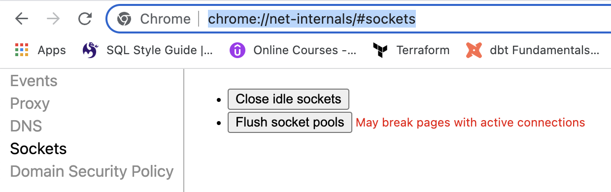

---

### Connection in use: ('127.0.0.1', 5000)

You have something running on the 5000 port. You need to stop it.

Answer: On terminal in mac .

Run ps -A | grep gunicorn

Look for the number process id which is the 1st number after running the command

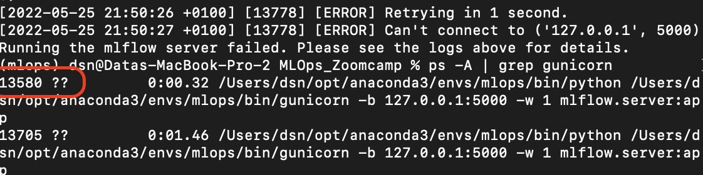

kill 13580

where 13580  represents the process number.

Or by executing the following command it will kill all the processes using port 5000:

>> sudo fuser -k 5000/tcp

Answered by Vaibhav Khandelwal

Just execute in the command below in the command line to kill the running port

->> kill -9 $(ps -A | grep python | awk '{print $1}')

Answered by kamaldeen (kamaldeen32@gmail.com)

Change to different port (5001 in this case)

>> mlflow ui --backend-store-uri sqlite:///mlflow.db --port 5001

Answered by krishna (nellaikrishna@gmail.com)

---

### Could not convert string to float - ValueError

Running python register_model.py results in the following error:

ValueError: could not convert string to float: '0 int\n1   float\n2     hyperopt_param\n3       Literal{n_estimators}\n4       quniform\n5         Literal{10}\n6         Literal{50}\n7         Literal{1}'

Full Traceback:

Traceback (most recent call last):

File "/Users/name/Desktop/Programming/DataTalksClub/MLOps-Zoomcamp/2. Experiment tracking and model management/homework/scripts/register_model.py", line 101, in <module>

run(args.data_path, args.top_n)

File "/Users/name/Desktop/Programming/DataTalksClub/MLOps-Zoomcamp/2. Experiment tracking and model management/homework/scripts/register_model.py", line 67, in run

train_and_log_model(data_path=data_path, params=run.data.params)

File "/Users/name/Desktop/Programming/DataTalksClub/MLOps-Zoomcamp/2. Experiment tracking and model management/xfsub/scripts/register_model.py", line 41, in train_and_log_model

params = space_eval(SPACE, params)

File "/Users/name/miniconda3/envs/mlops-zoomcamp/lib/python3.9/site-packages/hyperopt/fmin.py", line 618, in space_eval

rval = pyll.rec_eval(space, memo=memo)

File "/Users/name/miniconda3/envs/mlops-zoomcamp/lib/python3.9/site-packages/hyperopt/pyll/base.py", line 902, in rec_eval

rval = scope._impls[node.name](*args, **kwargs)

ValueError: could not convert string to float: '0 int\n1   float\n2     hyperopt_param\n3       Literal{n_estimators}\n4       quniform\n5         Literal{10}\n6         Literal{50}\n7         Literal{1}'

Solution: There are two plausible errors to this. Both are in the hpo.py file where the hyper-parameter tuning is run. The objective function should look like this.

   def objective(params):

# It's important to set the "with" statement and the "log_params" function here

# in order to properly log all the runs and parameters.

with mlflow.start_run():

# Log the parameters

mlflow.log_params(params)

rf = RandomForestRegressor(**params)

rf.fit(X_train, y_train)

y_pred = rf.predict(X_valid)

# Calculate and log rmse

rmse = mean_squared_error(y_valid, y_pred, squared=False)

mlflow.log_metric('rmse', rmse)

If you add the with statement before this function, and just after the following line

X_valid, y_valid = load_pickle(os.path.join(data_path, "valid.pkl"))

and you log the parameters just after the search_space dictionary is defined, like this

search_space = {....}

# Log the parameters

mlflow.log_params(search_space)

Then there is a risk that the parameters will be logged in group. As a result, the

params = space_eval(SPACE, params)

register_model.py file will receive the parameters in group, while in fact it expects to receive them one by one. Thus, make sure that the objective function looks as above.

Added by Jakob Salomonsson

---

### Experiment not visible in MLflow UI

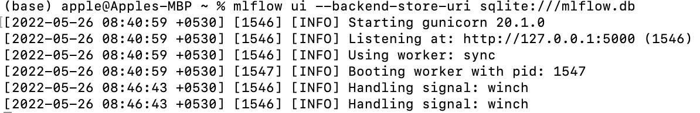

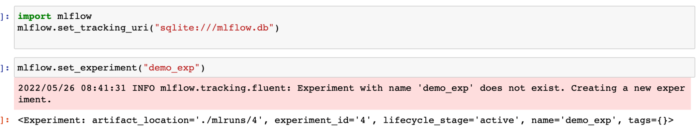

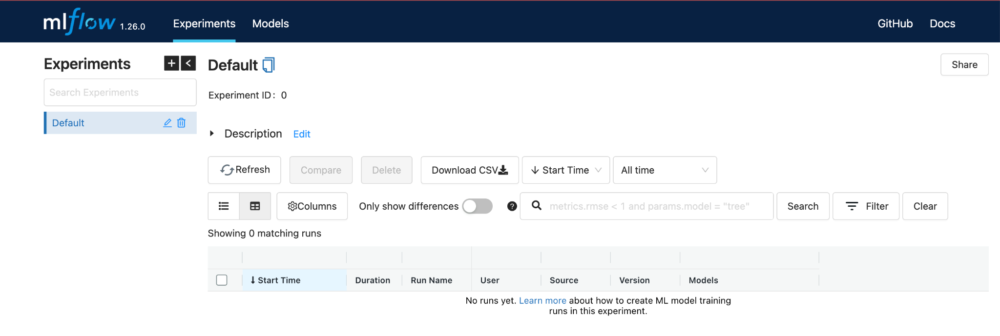

Make sure you launch the mlflow UI from the same directory as the code that is running the experiments (same directory that contains the mlruns directory and the database that stores the experiments).

Or navigate to the correct directory when specifying the tracking_uri.

For example:

If the mlflow.db is in a subdirectory called database, the tracking uri would be ‘sqllite:///database/mlflow.db’

If the mlflow.db is a directory above your current directory: the tracking uri would be

‘sqlite:///../mlflow.db’

Answered by Anna Vasylytsya

Another alternative is to use an absolute path to mlflow.db rather than relative path

And yet another alternative is to launch the UI from the same notebook by executing the following code cell

import subprocess

MLFLOW_TRACKING_URI = "sqlite:///data/mlflow.db"

subprocess.Popen(["mlflow", "ui", "--backend-store-uri", MLFLOW_TRACKING_URI])

And then using the same MLFLOW_TRACKING_URI when initializing mlflow or the client

client = MlflowClient(tracking_uri=MLFLOW_TRACKING_URI)

mlflow.set_tracking_uri(MLFLOW_TRACKING_URI)

---

### Metrics not visible in mlflow UI

I encountered the following issue: I was able to run experiments and the different model parameters were visible. However, the metrics, including the “handmade” metric rmse in the training script, were not visible (empty field).

I solved my problem by making sure to specify the “key” and “value” explicitly when using mlflow.log_metric:

mlflow.log_metric(key="rmse",value=rmse)

Added by Mélanie Fouesnard

---

### Unable to create new Experiment

Following the instructions as per the video as below did not work though the jupyter notebook says it is successfully created.


Set the URI to the listener directly. It worked for me. This could be because the video was made with a lower version of the “mlflow” package and we are working on the latest version. The documentation of the latest  “mlflow” package is asking to set as below

mlflow.set_tracking_uri(uri="http://127.0.0.1:5000")

(optional) Arun Gansi

---

### Hash Mismatch Error with Package Installation

Problem:

Getting

ERROR: THESE PACKAGES DO NOT MATCH THE HASHES FROM THE REQUIREMENTS FILE

during MLFlow's installation process, particularly while installing the Numpy package using pip

When I installed mlflow using ‘pip install mlflow’ on 27th May 2022, I got the following error while numpy was getting installed through mlflow:

Collecting numpy

Downloading numpy-1.22.4-cp310-cp310-win_amd64.whl (14.7 MB)

|██████████████              	| 6.3 MB 107 kB/s eta 0:01:19

ERROR: THESE PACKAGES DO NOT MATCH THE HASHES FROM THE REQUIREMENTS FILE.

If you have updated the package versions, please update the hashes. Otherwise, examine the package contents carefully; someone may have tampered with them.

numpy from  (from mlflow):

Expected sha256 3e1ffa4748168e1cc8d3cde93f006fe92b5421396221a02f2274aab6ac83b077

Got    	15e691797dba353af05cf51233aefc4c654ea7ff194b3e7435e6eec321807e90

Solution:

Then when I install numpy separately (and not as part of mlflow), numpy gets installed (same version), and then when I do 'pip install mlflow', it also goes through.

Please note that the above may not be consistently simulatable, but please be aware of this issue that could occur during pip install of mlflow.

Added by Venkat Ramakrishnan

---

### How to Delete an Experiment Permanently from MLFlow UI

After deleting an experiment from UI, the deleted experiment still persists in the database.

Solution: To delete this experiment permanently, follow these steps.

Assuming you are using sqlite database;

Install ipython sql using the following command: pip install ipython-sql

In your jupyter notebook, load the SQL magic scripts with this: %load_ext sql

Load the database with this: %sql sqlite:///nameofdatabase.db

Run the following SQL script to delete the experiment permanently: check

---

### How to Update Git Public Repo Without Overwriting Changes

Problem: I cloned the public repo, made edits, committed and pushed them to my own repo. Now I want to get the recent commits from the public repo without overwriting my own changes to my own repo. Which command(s) should I use?

This is what my config looks like (in case this might be useful):

[core]

repositoryformatversion = 0

filemode = true

bare = false

logallrefupdates = true

ignorecase = true

precomposeunicode = true

[remote "origin"]

url = git@github.com:my_username/mlops-zoomcamp.git

fetch = +refs/heads/*:refs/remotes/origin/*

[branch "main"]

remote = origin

merge = refs/heads/main

Solution: You should fork DataClubsTak’s repo instead of cloning it. On GitHub, click “Fetch and Merge” under the menu “Fetch upstream” at the main page of your own

---

### Image size of 460x93139 pixels is too large. It must be less than 2^16 in each direction.

This is caused by ```mlflow.xgboost.autolog()``` when version 1.6.1 of xgboost
Downgrade to 1.6.0

```pip install xgboost==1.6.0``` or update requirements file with xgboost==1.6.0 instead of xgboost

Added by Nakul Bajaj

---

### MlflowClient object has no attribute 'list_experiments'

and then removed in the later version

You should use # Register the best model model_uri = f"runs:/{best_run.info.run_id}/model" mlflow.register_model(model_uri=model_uri, name="RandomForestBestModel") instead

Added by Alex Litvinov

---

### MLflow Autolog not working

Make sure `mlflow.autolog()` ( or framework-specific autolog ) written BEFORE `with mlflow.start_run()` not after.

Also make sure that all dependencies for the autologger are installed, including matplotlib. A warning about uninstalled dependencies will be raised.

Mohammed Ayoub Chettouh

---

### MLflow URL (http://127.0.0.1:5000), doesn’t open.

If you’re running MLflow on a remote VM, you need to forward the port too like we did in Module 1 for Jupyter notebook port 8888. Simply connect your server to VS Code, as we did, and add 5000 to the PORT like in the screenshot:

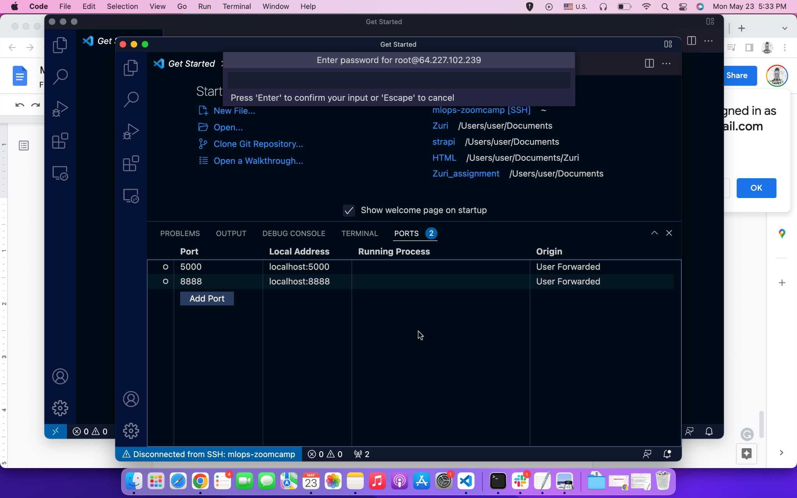

Added by Sharon Ibejih

If you are running MLflow locally and 127.0.0.1:5000 shows a blank page navigate to localhost:5000 instead.

---

### MLflow.xgboost Autolog Model Signature Failure

Got the same warning message as Warrie Warrie when using “mlflow.xgboost.autolog()”

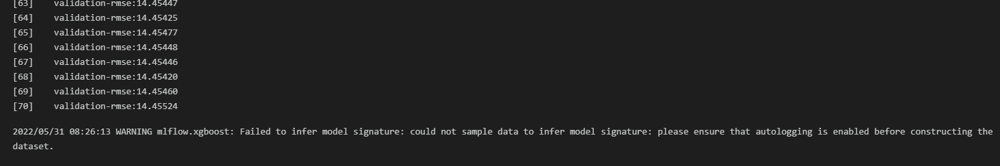

It turned out that this was just a warning message and upon checking MLflow UI (making sure that no “tag” filters were included), the model was actually automatically tracked in the MLflow.

Added by Bengsoon Chuah, Asked by Warrie Warrie, Answered by Anna Vasylytsya & Ivan Starovit

---

### MlflowException: Unable to Set a Deleted Experiment

raise MlflowException(

mlflow.exceptions.MlflowException: Cannot set a deleted experiment 'random-forest-hyperopt' as the active experiment. You can restore the experiment, or permanently delete the experiment to create a new one.

There are many options to solve in this link:

✅Had deleted the experiment from the mlflow ui, and this command in CLI works mlflow gc --backend-store-uri sqlite:///backend.db (use the filename.db that you had used, obviously)

⛔ Below suggestion didn’t work, as .trash/ was already empty

rm -rf mlruns/.trash/*

zsh: sure you want to delete all the files in /home/ellacharmed/github/mlops-zoomcamp/cohorts/2024/02-experiment-tracking/homework/mlruns/.trash [yn]? y

zsh: no matches found: mlruns/.trash/*

---

### MlflowException: Unable to Set a Deleted Experiment with Postgres backend

If you’re using a  postgres  backend locally or remotely and you don’t want to delete the entire backend, you can run this script to permanently delete an experiment. I had a separate env.py file to retrieve my environment variables from.

```
import os

import sys

import psycopg2

sys.path.insert(0, os.getcwd())

from env import DB_NAME, DB_PASSWORD, DB_PORT, DB_USER

def perm_delete_exp():

connection = psycopg2.connect(database=DB_NAME,

user=DB_USER,

password=DB_PASSWORD,

host="localhost",

port=int(DB_PORT))

with connection.cursor() as cursor:

queries = """

DELETE FROM experiment_tags WHERE experiment_id=ANY(SELECT experiment_id FROM experiments where lifecycle_stage='deleted');

DELETE FROM latest_metrics WHERE run_uuid=ANY(SELECT run_uuid FROM runs WHERE experiment_id=ANY(SELECT experiment_id FROM experiments where lifecycle_stage='deleted'));

DELETE FROM metrics WHERE run_uuid=ANY(SELECT run_uuid FROM runs WHERE experiment_id=ANY(SELECT experiment_id FROM experiments where lifecycle_stage='deleted'));

DELETE FROM tags WHERE run_uuid=ANY(SELECT run_uuid FROM runs WHERE experiment_id=ANY(SELECT experiment_id FROM experiments where lifecycle_stage='deleted'));

DELETE FROM params WHERE run_uuid=ANY(SELECT run_uuid FROM runs where experiment_id=ANY(SELECT experiment_id FROM experiments where lifecycle_stage='deleted'));

DELETE FROM runs WHERE experiment_id=ANY(SELECT experiment_id FROM experiments where lifecycle_stage='deleted');

DELETE FROM datasets WHERE experiment_id=ANY(SELECT experiment_id FROM experiments where lifecycle_stage='deleted');

DELETE FROM experiments where lifecycle_stage='deleted';

"""

for query in queries.splitlines()[1:-1]:

cursor.execute(query.strip())

connection.commit()

connection.close()

if __name__ == "__main__":

perm_delete_exp()

```

Added by Joses Omojola

---

### No Space Left on Device - OSError[Errno 28]

You do not have enough disk space to install the requirements. You can either increase the base EBS volume by following  or add an external disk to your instance and configure conda installation to happen on the external disk.

Abinaya Mahendiran

On GCP: I added another disk to my vm and followed  to mount the disk. Confirm the mount by running df -H (disk free) command in bash shell. I also deleted Anaconda and instead used miniconda. I downloaded miniconda in the additional disk that I mounted and when installing miniconda, enter the path to the extra disk instead of the default disk, this way conda is installed on the extra disk.

Yang Cao

---

### Parameters Mismatch in Homework Q3

I was using an old version of sklearn due to which I got the wrong number of parameters because in the latest version min_impurity_split for randomForrestRegressor was deprecated. I had to upgrade to the latest version to get the correct number of params.

---

### Protobuf error when installing MLflow

Error: I installed all the libraries from the requirements.txt document in a new environment as follows:

pip install -r requirementes.txt

Then when I run mlflow from my terminal like this:

mlflow

I get this error:

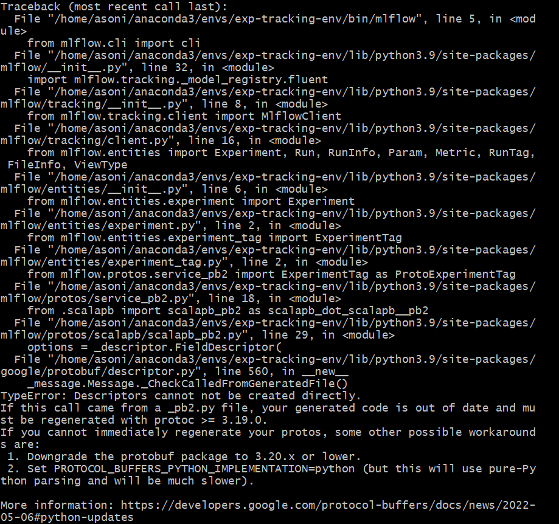

SOLUTION: You need to downgrade the version of 'protobuf' module to 3.20.x or lower. Initially, it was version=4.21, I installed protobuf==3.20

pip install protobuf==3.20

After which I was able to run mlflow from my terminal.

-Submitted by Aashnna Soni

---

### SSH Connection to AWS EC2 instance from local machine WSL getting terminated frequently within a minute of inactivity.

If the ssh connection from your local machine’s WSL to AWS EC2 instance is frequently getting terminated with very short span of inactivity with the following message displayed at prompt:

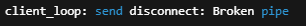

You can fix the same by adding the following lines to your config file at your .ssh directory in your WSL environment:

ServerAliveInterval 60

ServerAliveCountMax 3

For eg (for clarity). after adding these lines your ssh connection should look somewhat like this below:

Host mlops-zoomcamp

HostName 45.80.32.7

User ubuntu

IdentityFile ~/.ssh/siddMLOps.pem

StrictHostKeyChecking no

ServerAliveInterval 60

ServerAliveCountMax 3

Added by Siddhartha Gogoi

---

### Setting up Artifacts folders

Please check your current directory while running the mlflow ui command. You need to run mlflow ui or mlflow server command in the right directory.

---

### Setting up MLflow experiment tracker on GCP

If you have problem with setting up MLflow for experiment tracking on GCP, you can check these two links:

https://kargarisaac.github.io/blog/mlops/data%20engineering/2022/06/15/MLFlow-on-GCP.html

https://kargarisaac.github.io/blog/mlops/2022/08/26/machine-learning-workflow-orchestration-zenml.html

---

### Setuptools Replacing Distutils - MLflow Autolog Warning

Solution: Downgrade setuptools (I downgraded 62.3.2 -> 49.1.0)

---

### Sorting runs in MLflow UI

I can’t sort runs in MLFlow

Make sure you are in table view (not list view) in the MLflow UI.

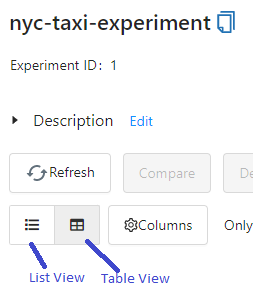

Added and Answered by Anna Vasylytsya

---

### TypeError: send_file() unexpected keyword 'max_age' during MLflow UI Launch

Problem: When I ran `$ mlflow ui` on a remote server and try to open it in my local browser I got an exception  and the page with mlflow ui wasn’t loaded.

Solution: You should `pip uninstall flask` on your remote server on conda env and after it install Flask `pip install Flask`. It is because the base conda env has ~flask<1.2, and when you clone it to your new work env, you are stuck with this old version.

Added by Salimov Ilnaz

---

### mlflow ui on Windows FileNotFoundError: [WinError 2] The system cannot find the file specified

Problem: After successfully installing mlflow using pip install mlflow on my Windows system, I am trying to run the mlflow ui command but it throws the following error:

FileNotFoundError: [WinError 2] The system cannot find the file specified

Solution: Add C:\Users\{User_Name}\AppData\Roaming\Python\Python39\Scripts to the PATH

Added by Alex Litvinov

---

### Unsupported Operand Type Error in hpo.py

Running “python hpo.py --data_path=./your-path --max_evals=50” for the homework leads to the following error: TypeError: unsupported operand type(s) for -: 'str' and 'int'

Full Traceback:

File "~/repos/mlops/02-experiment-tracking/homework/hpo.py", line 73, in <module>

run(args.data_path, args.max_evals)

File "~/repos/mlops/02-experiment-tracking/homework/hpo.py", line 47, in run

fmin(

File "~/Library/Caches/pypoetry/virtualenvs/mlflow-intro-SyTqwt0D-py3.9/lib/python3.9/site-packages/hyperopt/fmin.py", line 540, in fmin

return trials.fmin(

File "~/Library/Caches/pypoetry/virtualenvs/mlflow-intro-SyTqwt0D-py3.9/lib/python3.9/site-packages/hyperopt/base.py", line 671, in fmin

return fmin(

File "~/Library/Caches/pypoetry/virtualenvs/mlflow-intro-SyTqwt0D-py3.9/lib/python3.9/site-packages/hyperopt/fmin.py", line 586, in fmin

rval.exhaust()

File "~/Library/Caches/pypoetry/virtualenvs/mlflow-intro-SyTqwt0D-py3.9/lib/python3.9/site-packages/hyperopt/fmin.py", line 364, in exhaust

self.run(self.max_evals - n_done, block_until_done=self.asynchronous)

TypeError: unsupported operand type(s) for -: 'str' and 'int'

Solution:

The --max_evals argument in hpo.py has no defined datatype and will therefore implicitly be treated as string. It should be an integer, so that the script can work correctly. Add type=int to the argument definition:

parser.add_argument(

"--max_evals",

type=int,

default=50,

help="the number of parameter evaluations for the optimizer to explore."

)

export

---

### Unsupported Scikit-Learn version

Getting the following warning when running mlflow.sklearn:

2022/05/28 04:36:36 WARNING mlflow.utils.autologging_utils: You are using an unsupported version of sklearn. If you encounter errors during autologging, try upgrading / downgrading sklearn to a supported version, or try upgrading MLflow. […]

Solution: use 0.24.1 <= scikit-learn <= 1.4.2 (Updated: May 26, 2024)

Reference:

---

### Mlflow CLI does not return experiments

Problem: CLI commands (mlflow experiments list) do not return experiments

Solution description: need to set environment variable for the Tracking URI:
$ export MLFLOW_TRACKING_URI=http://127.0.0.1:5000

Added and Answered by Dino Vitale

---

### Viewing MLflow Experiments using MLflow CLI

Problem: After starting the tracking server, when we try to use the mlflow cli commands as listed , most of them can’t seem to find the experiments that have been run with the tracking server

Solution: We need to set the environment variable MLFLOW_TRACKING_URI to the URI of the sqlite database. This is something like “export MLFLOW_TRACKING_URI=sqlite:///{path to sqlite database}” . After this, we can view the experiments from the command line using commands like “mlflow experiments search”

Even after this commands like “mlflow gc” doesn’t seem to get the tracking uri, and they have to be passed explicitly as an argument every time the command is run.

Ahmed Fahim (afahim03@yahoo.com)

---

### Viewing SQLite Data Raw & Deleting Experiments Manually

All the experiment and other tracking information in mlflow are stored in sqllite database provided while initiating the mlflow ui command. This database can be inspected using Pycharm’s Database tab by using the SQLLite database type. Once the connection is created as below, the tables can be queried and inspected using regular SQL. The same applies for any SQL backed database such as postgres as well.

This is very useful to understand the entity structure of the data being stored within mlflow and useful for any kind of systematic archiving of model tracking for longer periods.

Added by Senthilkumar Gopal

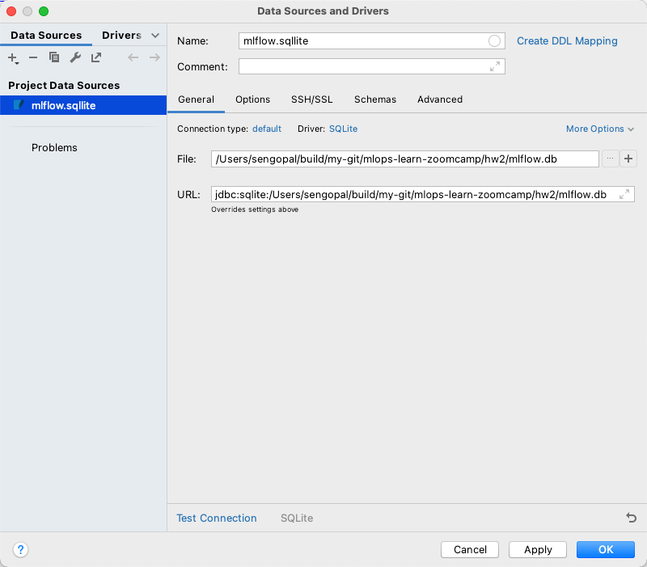

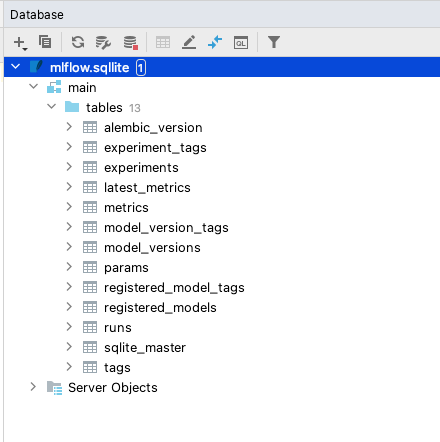

---

### What does launching the tracking server locally mean?

Solution : It is another way to start it for remote hosting a mlflow server. For example, if you are multiple colleagues working together on something you most likely would not run mlflow on one laptop but rather everyone would connect to the same server running mlflow

Answer by Christoffer Added by Akshit Miglani (akshit.miglani09@gmail.com)

---

### Parameter adding in case of max_depth not recognized

Problem: parameter was not recognized during the model registry

Solution: parameters should be added in previous to the model registry. The parameters can be added by mlflow.log_params(params) so that the dictionary can be directly appended to the data.run.params.

Added and Answered by Sam Lim

---

### Max_depth is not recognize even when I add the mlflow.log_params

Problem: Max_depth is not recognize even when I add the mlflow.log_params

Solution: the mlflow.log_params(params) should be added to the hpo.py script, but if you run it it will append the new model to the previous run that doesn’t contain the parameters, you should either remove the previous experiment or change it

Pastor Soto

---

### AttributeError: 'tuple' object has no attribute 'tb_frame'

Problem: About week_2 homework: The register_model.py  script, when I copy it into a jupyter notebook fails and spits out the following error. AttributeError: 'tuple' object has no attribute 'tb_frame'

Solution: remove click decorators

---

### WandB API error

Problem: when running the preprocess_data.py file you get the following error:

wandb: ERROR api_key not configured (no-tty). call wandb.login(key=[your_api_key])

Solution: Go to your WandB profile (top RHS) → user settings → scroll down to “Danger Zone” and copy your API key. 

Then before running preprocess_data.py, add and run the following cell in your notebook:

%%bash

Wandb login <YOUR_API_KEY_HERE>.

Added and Answered by James Gammerman (jgammerman@gmail.com)

---

### WARNING mlflow.xgboost: Failed to infer model signature: could not sample data to infer model signature: please ensure that autologging is enabled before constructing the dataset.

Please make sure you following the order below nd enabling the autologging before constructing the dataset. If you still have this issue check that your data is in format compatible with XGBoost.

# Enable MLflow autologging for XGBoost

mlflow.xgboost.autolog()

# Construct your dataset

X_train, y_train = ...

# Train your XGBoost model

model = xgb.XGBRegressor(...)

model.fit(X_train, y_train)

Added by Olga Rudakova

---

### Old version of glibc when running XGBoost

Starting from version 2.1.0, XGBoost distributes its Python package in two variants:

manylinux_2_28: For recent Linux distributions with glibc 2.28 or newer. This variant includes all features, such as GPU algorithms and federated learning/

manylinux2014: For older Linux distributions with glibc versions older than 2.28. This variant lacks support for GPU algorithms and federated learning.

If you're installing XGBoost via pip, the package manager automatically selects the appropriate variant based on your system's glibc version. Starting May 31, 2025, the manylinux2014 variant will no longer be distributed.

This means that systems with glibc versions older than 2.28 will not be able to install future versions of XGBoost via pip unless they upgrade their glibc version or build XGBoost from source.

Added by Jon Areas (areasjx@gmail.com)

---

### wget not working

Problem

Using wget command to download either data or python scripts on Windows, I am using the notebook provided by Visual Studio and despite having a python virtual env, it did not recognize the pip command.

Solution: Use python -m pip, this same for any other command. Ie. python -m wget

Added by Erick Calderin

---

### Open/run github notebook(.ipynb) directly in Google Colab

Problem: Open/run github notebook(.ipynb) directly in Google Colab

Solution: Change the domain from 'github.com' to 'githubtocolab.com'. The notebook will open in Google Colab.

Only works with Public repo.

Added by Ming Jun

Navigating in Wandb UI became difficult to me, I had to intuit some options until I found the correct one.

Solution: Go to the official doc.

Added by Erick Calderin

---

### Why do we use Jan/Feb/March for Train/Test/Validation Purposes?

Problem: Someone asked why we are using this type of split approach instead of just a random split.

Solution: For example, I have some models at work that train on Jan 1 2020 — Aug 1 2021 time period, and then test on Aug 1 - Dec 31 2021, and finally validate on Jan - March or something

We do these “out of time”  validations to do a few things:

Check for seasonality of our data

We know if the RMSE for Test is 5 say, and then RMSE for validation is 20, then there’s serious seasonality to the data we are looking at, and now we might change to Time Series approaches

If I’m predicting on Mar 30 2023 the outcomes for the next 3 months, the “random sample” in our train/test would have caused data leakage, overfitting, and poor model performance in production. We mustn’t take information about the future and apply it to the present when we are predicting in a model context.

These are two of, I think, the biggest points for why we are doing jan/feb/march. I wouldn’t do it any other way.

Train: Jan

Test: Feb

Validate: March

The point of validation is to report out model metrics to leadership, regulators, auditors, and record the models performance to then later analyze target drift

Added by Sam LaFell

---

### WARNING: mlflow.sklearn: Failed to log training dataset information to MLflow Tracking.

Problem: When using MLflow’s autolog function, I get this warning: "WARNING mlflow.sklearn: Failed to log training dataset information to MLflow Tracking. Reason: 'numpy.ndarray' object has no attribute 'toarray'". Why is this happening?

Solution:

You're getting this warning because autolog is attempting to log your dataset. Mlflow expects the dataset to be in a pd.DataFrame format, but if you’re following the course’s code, we’re providing a numpy.ndarray. So, when Mlflow tries to do the execute the toarray method, it fails because the numpy.ndarray is already an array.

Since we're not doing anything (yet) with the datasets in this zoomcamp, I just went ahead and put log_datasets = False as a parameter in the autolog function.

Added by Fustincho

Problem: If you get an error while trying to run the mlflow server on AWS CLI with S3 bucket and POSTGRES database:

Reproducible Command:

mlflow server -h 0.0.0.0 -p 5000 --backend-store-uri postgresql://<DB_USERNAME>:<DB_PASSWORD>@<DB_ENDPOINT>:<DB_PORT>/<DB_NAME> --default-artifact-root s3://<BUCKET_NAME>

Error:

"urllib3 v2.0 only supports OpenSSL 1.1.1+, currently "

ImportError: urllib3 v2.0 only supports OpenSSL 1.1.1+, currently the 'ssl' module is compiled with 'OpenSSL 1.0.2k-fips  26 Jan 2017'. See: https://github.com/urllib3/urllib3/issues/2168

Solution: Upgrade mlflow using

Code: pip3 install --upgrade mlflow

Resolution: It downgrades urllib3 2.0.3 to 1.26.16 which is compatible with mlflow and ssl 1.0.2

Installing collected packages: urllib3

Attempting uninstall: urllib3

Found existing installation: urllib3 2.0.3

Uninstalling urllib3-2.0.3:

Successfully uninstalled urllib3-2.0.3

Successfully installed urllib3-1.26.16

Added by Sarvesh Thakur

---

### ImportError: urllib3 v2.0 only supports OpenSSL 1.1.1+

If encountering an error while running s3 buckets make sure to resolve dependencies issue by downgrading urllib3 to a compatible version: pip3 install "urllib3<1.27"

Added by Maximilien Eyengue

---

### AttributeError: 'MlflowClient' object has no attribute 'list_run_infos'

Problem: In scenario 2 notebook, an error AttributeError: 'MlflowClient' object has no attribute 'list_run_infos',

Is thrown when one runs “run_id = client.list_run_infos(experiment_id='1')[0].run_id”

Solution: Use “run_id = client.search_runs(experiment_ids='1')[0].info.run_id” instead.

Scenario: For reference, this works for mflow version 2.12.2, but might work for other recent versions as of May, 2024

Added by Oluwadara Adedeji

---

### When using Autologging, do I need to set a training parameter to track it on Mlflow UI?

No, in the official documentation it’s mentioned that autologging keep track of the parameters even when you do not explicitly set them when calling .fit.

You can run the training, only setting the parameters you want, but you can check all the parameters in mlflow UI.

Added by Eduardo Munoz

---

### Hyperopt is not installable with Conda

Description

When setting up your venv with

$conda install --file requirements.txt

You may encounter the following error

​​

```

PackagesNotFoundError: The following packages are not available from current channels:

- hyperopt

```

Solution

It is probably because your conda is out of date. You can update Conda with

$conda update -n base -c defaults conda

If that doesn’t work you can always install it via, which is the advice from the

$conda install intel::hyperopt

Added by Marcus Leiwe

---

### Error importing xgboost in python with OS mac: library not loaded: @rpath/libomp.dylib

I fix this error by running `brew install libomp`

---

### Size limit when uploading to github

Basically add the mlruns and artifacts to the .gitignore, like this:

02-experiment-tracking/mlruns

02-experiment-tracking/runnin-mflow-examples/mlruns

02-experiment-tracking/homework/mlruns

02-experiment-tracking/homework/artifacts

Added by Ibai Irastorza

---

## Module 3: Orchestration

### Why does MlflowClient no longer support list_experiments()?

Older versions of MLflow used client.list_experiments(), but in recent versions this method was replaced.

Use client.search_experiments() instead.

Added by José Luis Martínez

---

### Mage shortcut key to open Text Editor is not working on Windows

Instructor (Tommy) uses MacOS (I presume), so shortcut key is CMD+period

On Windows, the equivalent is CTRL+WIN+period

---

### Mage pipeline breaks with [Errno 2] No such file or directory: '/home/src/mage_data/{…} /.variables/{...}/output_1/object.joblib'"

Try to export the pipeline as zip file, create a new Mage project and import the pipeline zip to new project

Start by thoroughly checking the logs of the upstream block that was supposed to generate object.joblib. Ensure it completed successfully and that its expected output (often named output_1) was actually created and saved. You might also want to quickly verify in the Mage UI or file system (if accessible) whether the file exists in the .variables directory for that upstream block.

---

### Update docker-compose to initiate Mage

When running ./scripts/start.sh - it returns below error

ERROR: The Compose file './docker-compose.yml' is invalid because:

Unsupported config option for networks: 'app-network'

Unsupported config option for services: 'magic-platform'

Solution description

# Download the latest version of Docker Compose

sudo curl -L "https://github.com/docker/compose/releases/latest/download/docker-compose-$(uname -s)-$(uname -m)" -o /usr/local/bin/docker-compose

# Apply executable permissions to the binary

sudo chmod +x /usr/local/bin/docker-compose

(optional) Artur G

---

### Mage in Codespaces in a subfolder under mlops-zoomcamp repository

Issue (1) you get errors like:

[+] Running 1/1

✘ magic-database Error too many requests: You have reached your pull rate limit. You may increase the limit by authenticating and upgra...                       1.2s

Error response from daemon: too many requests: You have reached your pull rate limit. You may increase the limit by authenticating and upgrading:

Issue (2) you get these popups with different % values but all saying space is in single digits.

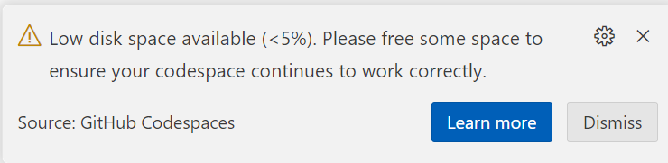

Solution: It is not recommended to setup Mage as a subfolder of mlops-zoomcamp. See findings in this .

---

### Mage in Codespaces

The below errors seem to occur only when using mage in Codespaces.

Errors (1)

Cannot connect to the Docker daemon at unix:///var/run/docker.sock. Is the docker daemon running?

Errors (2)

Error response from daemon: invalid volume specification: '/workspaces/mage-mlops:/:rw': invalid mount config for type "bind": invalid specification: destination can't be '/'

Solution for (1) & (2): stay tuned…still testing

docker info and docker –version runs fine. 
But when I do docker compose down, stop codespaces, and reconnect, the errors went away. Not sure if it is reproducible for everyone, though.

Errors (3)

warning: unable to access '/home/codespace/.gitconfig': Is a directory

Solution (3) via Office Hours:

this is targeted for 3.5.x Deploying with Mage

If not deploying,

Comment line#20 in docker-compose.yml

place a dummy empty file named .gitconfig in your repo’s root folder and copy it in the Dockerfile with this line, place it below line#9

COPY .gitconfig /root/.gitconfig

The reason this happens is that when the file is missing, Docker auto-creates it as a Directory instead of a file. So creating a dummy file prevents this

---

### Mage updated in UI

When you see the mage version change in the UI after you’ve started the container, and you want to update, follow these steps. Read the release notes first to see if there’s a fix that affected your work and would benefit from an update.

If you want to remain in the previous version is also fine; unless the fixes were specifically for our zoomcamp course-work (check slack and/or the repository for any new instructions or PRs added).

Close the browser page

In the terminal console, bring down the container `docker compose down`

Rebuild the container with new mage image `docker compose build --no-cache`

Verify that you see `[magic-platform 1/4] FROM docker.io/mageai/mageai:alpha` meaning that the container is being rebuild with a new version

If the image is not updated, ctrl+c to cancel the process and pull the image manually with `docker pull mageai/mageai:alpha` then rebuild

Then restart the docker container with `./scripts/start.sh` as before

ps: this is the same sequence of steps if you want to switch to the latest tagged image instead of using the alpha image.

What does alpha and latest mean?

Latest is the fully released version ready for production use, and it has gone through verification, testing, QA and whatever else the release cycle entails.

Alpha is the potentially buggy version with fresh new fixes and newly added features; but not yet put through the full beta test (if there’s one), integration testing and other QA steps. So expect issues to occur.

---

### Mage Time Series Bar Chart Not Showing

import requests

from io import BytesIO

from typing import List

import numpy as np

import pandas as pd

if 'data_loader' not in globals():

from mage_ai.data_preparation.decorators import data_loader

@data_loader

def ingest_files(**kwargs) -> pd.DataFrame:

dfs: List[pd.DataFrame] = []

for year, months in [(2024, (1, 3))]:

for i in range(*months):

response = requests.get(

'https://github.com/mage-ai/datasets/raw/master/taxi/green'f'/{year}/{i:02d}.parquet'

)

if response.status_code != 200:

raise Exception(response.text)

df = pd.read_parquet(BytesIO(response.content))

# if time series chart on mage error, add code below

df['lpep_pickup_datetime_cleaned'] = df['lpep_pickup_datetime'].astype(np.int64) // 10**9

dfs.append(df)

return pd.concat(dfs)

Added by Rohmat S

---

### Mage data_exporter block not taking all outputs from previous transformer block

I encountered this issue while trying to run the data_export block that saves the dict vectorizer and the logs of the linear regression model into mlflow. My two distinct outputs, while they were clearly created by the previous transformer block where the linear regression model is trained and the dict vectorizer fitted to the training dataset.

Thus, I had this error while trying to run my export code:

Exception: Block mlflow_model_registry may be missing upstream dependencies. It expected to have 2 arguments, but only received 1. Confirm that the @data_exporter method declaration has the correct number of arguments.

The outputs are stored in a list and this list is the input with the two outputs as the two elements. I had to modify my code in the data_exporter function to take only one argument and to define the two variables after that:

Dv = output[0]

Lr = output[1]

Added by Mélanie Fouesnard

---

### Mage Dashboard on unit_3 is not showing charts

Error: Cannot cast DatetimeArray to dtype float64

Have the runs completed successfully? We need to have successfully running Pipelines in order to populate the mage and mlflow databases.

If all pipelines are successfully completed and still getting this error, then please provide this info.

---

### Creating Helper functions in Mage

There’s no need to add the utilities functions in each sub-project when you watch the videos as there only need to be one set. Just verify the code is still the same as in Mage’s mlops repository.

As from the import statements

from mlops.utils.[...] import [...]

all refer to the same path in the main mlops “parent” project:

/[mage-mlops-repository-name]/mlops/utils/...

---

### Video 3.2.1 - Various issues with Global Data Products

Running the GDP block takes forever.

Exception: Pipeline run xx for global data product training_set: failed

AttributeError: 'NoneType' object has no attribute 'to_dict'

We need to replicate the pipelines and codes into each sub-project as the Settings indicate that only one project can be active at any one time, which means the sub-projects do not communicate with each other. (Needs confirmation during office hours.)

Things you can try:

Make sure the following lines in the GDP block are for the actual project and pipeline you’re running

"project": "unit_2_training",

"repo_path": "/home/src/mlops/unit_2_training",

Interrupt and Restart Kernel from the Run menu

Bring docker down and restarting it via the script

If both of the above does not resolve, recreate everything from scratch:

Remove the connections from the hyperparameter_tuning/sklearn block in the Tree panel to its upstream blocks. Click on the connector → Remove Connection

Remove the Global Data Product block from the Tree panel, right click → Delete Block (ignore dependencies)

Click on All blocks and select the Global Data Products, drag+drop this block to be the first in the pipeline

Rename the block to what is used in the video

Run the block to test it (Play button or Ctrl+Enter)

If it helps, do the same for the file in path “unit_3_observability” (ella’s full disclosure: unit_2 works after I removed all things GDP and recreate, now I cannot replicate the same success for unit_3. Still trying…)

Error with creating Global Data Product on Mage: AttributeError: 'NoneType' object has no attribute 'to_dict'

Solution: Global product is currently not cross product. You will have to create the data preparation pipeline in unit_2_training and configure to build.

Added by Oluwadara Adedeji

---

### How do you remove a global data product

There is no way to remove this through the UI, you need to manually edit the global_data_products.yaml  which is stored in your project’s utils function. You can do this through the Text Editor.

Added by Marcus Leiwe

---

### Video 3.2.5 -  TypeError: string indices must be integers

If you had remove and re-add blocks, especially from the above issue with Global Data Products, remove the connections from the hyperparameter_tuning/sklearn block in the Tree panel to its upstream blocks and re-add them. Don’t forget to [Ctrl+S] to save Pipeline.

Video 3.2.8 Error with Xgboost pipeline: ValueError: not enough values to unpack (expected 3, got 1)

Solution: Ensure that you have created the variables as in the video and you have this order in your code.

data →

data_2 →

If not, remove the connections for the xgboost and reconnect starting with the training set, followed by hyperparameter_tuning/xgboost.

Added by Oluwadara Adedeji

---

### MLflow container error: Can't locate revision identified by …

This means your MLflow container tries to access a db file which was a backend for a different MLflow version than the one you have in the container. Most likely, the MLflow version in the container does not match the MLflow version of the MLflow server you ran in module 2.

The easiest solution is to check which version you worked with before, and change the docker image accordingly.

You can check your version by opening a terminal on your host, conda activate into the env you worked in, and run:

mlflow --version

Now edit the mlflow.dockerfile line to your version:

RUN pip install mlflow==2.??.??

Save the file and rebuild the docker service by running:

docker-compose build

Now you can start up the containers again and your MLflow container should be able to successfully read your mounted DB file.

---

### Permission denied in github codespace

When you use github codespaces and you get permission denied when trying to set up the server, you need to follow this guide:

---

### (root) Additional property mlflow is not allowed

This error means that you are not writing below server on Docker Compose file. To solve the issue

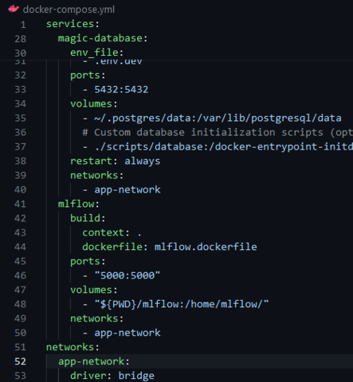

---

### Q6: Logged model artifacts lost when mlflow container is down or removed

By default, the logged model and artifacts are stored in a local folder in the mlflow container but not in /home/src/mlflow, so when the container is restarted (after a compose down or container remove) the artifacts are deleted and you can not see them in mlflow UI.

A simple solution to avoid this issue: You can include a new volume in the docker compose service mlflow to map a folder in the local machine to the folder /mlartifacts in the mlflow container:

- "${PWD}/mlartifacts:/mlartifacts/"

Then, every data logged to the experiment will be available when the mlflow container is recreated.

Added by edumunozsala

---

### Q6: mlflow not showing artifacts

When using localstore, try to start mlflow where mlflow.db is present. For example, mlflow.db is present in mlops/mlflow, cd to that folder, and run ../scrtips/start.sh (assuming you followed the instructions in homework.md file of week3 and setup mlops folder)

Added by Vijay

---

### Q6: Correct mlflow tracking uri

For the correct mlflow tracking uri, use : mlflow.set_tracking_uri(uri="") provided that you used the suggested docker file snippet in the homework question 6.

Added by Victor

---

### I get below error invalid mount config for type "bind": invalid specification: destination can't be '/' when running docker compose up when running mage

You should not run docker compose up for mage repo, should always use bash ./scripts/start.sh

A

>>> Update from another student of mlops zoomcamp: The start.sh script also runs docker compose up. And depending on how you start your mage project (like starting a fresh one in the capstone project), you may not have a start.sh or scripts directory. The most important thing about start.sh is that it sets the PROJECT_NAME and MAGE_CODE_PATH before executing docker compose up. These ENV variables can and probably should be set in your .env file.

Update added by Claudia van Dijk

---

### AttributeError: module 'mlflow' has no attribute 'set_tracking_url'

In a mage block, the python statement mlflow.set_tracking_uri() was returning an attribute error. This problem was observed when running mage in one container and mlflow in another. If you encounter this, consider that there may be something else in your project with the name “mlflow”.

Insert a statement before the python statement that produces the attribute error: print(mlflow.__file__) to see what the mlflow module points to. It should return a site-packages location, something like '/usr/local/lib/python3.10/site-packages/mlflow/__init__.py'.

If not, you may have another file or folder called “mlflow” that is confusing the python import statement.

Look at the folder name where the mlflow.db is being created via this command (either in command line or in the dockerfile for the mlflow service):

mlflow server --backend-store-uri sqlite:///home/mlflow/mlflow.db --host", "0.0.0.0 --port 5000

If the folder name for the backend store is mlflow, as above, python may be trying to import that instead of the mlflow package you installed. You will need to change the backend-store folder name to something else, like mlflow_data.

Rename the folder it in your local drive (since it gets mounted in docker-compose.yml);

Change the folder name in the dockerfile for the mlflow service (where you specify the backend-store-uri in the mlflow server command)

Change the folder name in docker-compose.yml (when mounting the folder for the mlflow service), e.g. 
Volumes:
  - "${PWD}/mlflow_data:/home/mlflow_data/"

This should resolve the issue of confusing python with which mlflow to import.

If the import mlflow statement now gives a “module not found” error, check the PYTHONPATH variable in the container by ssh-ing into the running container, as follows:

docker ps   (copy the mage container ID)

docker exec -it <container-ID> /bin/bash

echo $PYTHONPATH

If you do not see the path to the site-packages directory for your python version, you will need to add it to the PYTHONPATH environment variable.

To find out what path you should use, execute this from the running container that you have ssh’d into:

Python

>>> import sys

>>> print(sys.path)

You will hopefully see a path for the site-packages directory for your current python version.

Add this to the PYTHONPATH in the Dockerfile for the Mage service with this line:

ENV PYTHONPATH="${PYTHONPATH}:/usr/local/lib/python3.10/site-packages"

Added by Claudia van Dijk

---

### prefect project init Error: No such command 'project'.

The newest  version of Prefect does not have the module project. To initiate a project, use command `project init`

---

### Video 3.3.4 Training Metrics RMSE chart does not show due to the error: KeyError: ‘rmse_LinearRegression’

Solution: Check the difference between xgboost and sklearn pipelines. In xgboost pipeline there is a track_experiment callback while in sklearn pipeline is not.

Please add those lines:

You can refer them in my similar commit

Added by Nilesh Arte

---

### Q: How can I enable communication between Docker containers when invoked from a Kestra task?

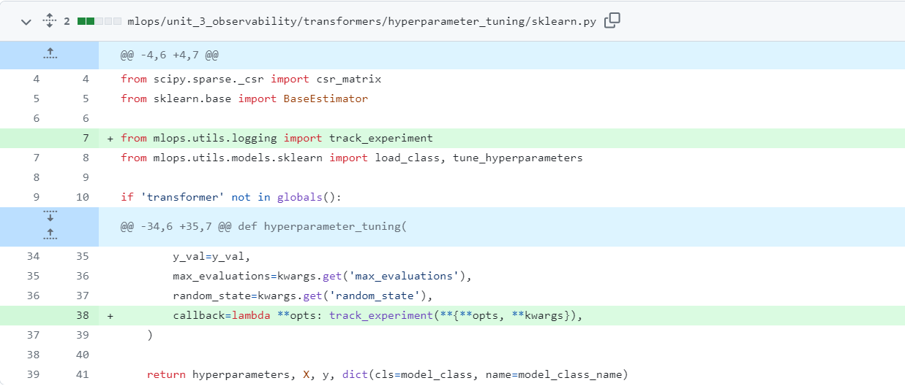

A: Use the docker.Run plugin in your Kestra task to run containers. This plugin supports advanced Docker options like custom networks.

For local development, you can use networkMode: host to allow containers to access services on your host (e.g., MLflow running on localhost).

Example:

networkMode: host

⚠️ Note: host mode is only supported on Linux. For Docker Desktop on Windows/macOS, use host.docker.internal or create a shared Docker network.

Best practice:

In production setups, tools like MLflow should run outside Kestra and be accessed over a stable URI (e.g., a cloud endpoint or a container with a known hostname in a shared network).

Added by José Luis Martínez

---

## Module 4: Deployment

### Fix Out of Memory error while orchestrating the workflow on a ML Pipeline for a high volume dataset.

We come across situations in data transformation & pre-processing as well as model training in a ML pipeline where we need to handle dataset of high dimensionality or/and high cardinality (usually millions). And we often end up with Out of Memory (OOM) errors like below when the flow is running:

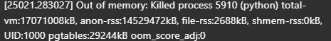

If you do not have the option of increasing your RAM, the following 3 approaches can be effective in mitigating this error:

If at all possible, during the data loading step, read only the required features/columns from the dataset, eg.

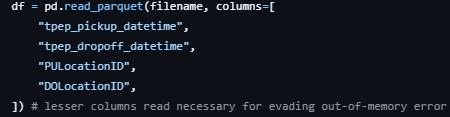

Before encoding/vectorizing, when we get our X_train & y_train, we can remove the dataframe, eg.

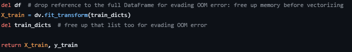

If you do not have a swap file or have a small one, create a swap file (size as per memory requirement) or replace the existing one with a proper sized one.Eg.

To remove existing swapfile, issue commands:

sudo swapoff /swapfile

sudo rm /swapfile

To create a new proper sized (I’m setting 16 GB in my case) swapfile, issue commands:

sudo fallocate -l 16G /swapfile

sudo chmod 600 /swapfile

sudo mkswap /swapfile

sudo swapon /swapfile

To check the swap file created, issue command:

free -h

Added by Siddhartha Gogoi

---

### aws.exe: error: argument operation: Invalid choice — Docker can not login to ECR.

Windows with AWS CLI already installed

AWS CLI version:

aws-cli/2.4.24 Python/3.8.8 Windows/10 exe/AMD64 prompt/off

Executing

$(aws ecr get-login --no-include-email)

shows error

aws.exe: error: argument operation: Invalid choice, valid choices are…

Use this command instead. More info here:

aws ecr get-login-password \

--region <region> \

| docker login \

--username AWS \

--password-stdin <aws_account_id>.dkr.ecr.<region>.amazonaws.com

Added by MarcosMJD

---

### Multiline commands in Windows Powershell

Use ` at the end of each line except the last. Note that multiline string does not need `.

Escape “ to “\ .

Use $env: to create env vars (non-persistent). E.g.:

$env:KINESIS_STREAM_INPUT="ride_events"

aws kinesis put-record --cli-binary-format raw-in-base64-out `

--stream-name $env:KINESIS_STREAM_INPUT `

--partition-key 1 `

--data '{

\"ride\": {

\"PULocationID\": 130,

\"DOLocationID\": 205,

\"trip_distance\": 3.66

},

\"ride_id\": 156

}'

Added by MarcosMJD

---

### Pipenv installation not working (AttributeError: module 'collections' has no attribute 'MutableMapping')

If one gets pipenv failures for pipenv install command -

AttributeError: module 'collections' has no attribute 'MutableMapping'

It happens because you use the system Python (3.10) for pipenv.

If you previously installed pipenv with apt-get, remove it - sudo-apt remove pipenv

Make sure you have a non-system Python installed in your environment. The easiest way to do it is to install anaconda or miniconda

Next, install pipenv to your non-system Python. If you use the setup from the lectures, it’s just this: pip install pipenv

Now re-run pipenv install XXXX (relevant dependencies) - should work

Tested and worked on AWS instance, similar to the config Alexey presented in class.

Added by Daniel HenSSL

---

### module is not available (Can't connect to HTTPS URL)

First check if SSL module configured with following command:

Python -m ssl

If the output of this is empty there is no problem with SSL configuration.

Then you should upgrade your pipenv package in your current environment to resolve the problem.

Added by Kenan Arslanbay

---

### No module named 'pip._vendor.six'

During scikit-learn installation via the command:

pipenv install scikit-learn==1.0.2

The following error is raised:

ModuleNotFoundError: No module named 'pip._vendor.six'

Then, one should:

sudo apt install python-six

pipenv --rm

pipenv install scikit-learn==1.0.2

Added by Giovanni Pecoraro

---

### Pipenv with Jupyter

Problem description. How can we use Jupyter notebooks with the Pipenv environment?

Solution: Refer to this . Basically install jupyter and ipykernel using pipenv. And then register the kernel with `python -m ipykernel install --user --name=my-virtualenv-name` inside the Pipenv shell. If you are using Jupyter notebooks in VS Code, doing this will also add the virtual environment in the list of kernels.

Added by Ron Medina

---

### Pipenv with Jupyter no output

Problem: I tried to run starter notebook on pipenv environment but had issues with no output on prints. 
I used scikit-learn==1.2.2 and python==3.10
Tornado version was 6.3.2

Solution: The error you're encountering seems to be a bug related to Tornado, which is a Python web server and networking library. It's used by Jupyter under the hood to handle networking tasks.

Downgrading to tornado==6.1 fixed the issue

---

### ‘Invalid base64’ error after running `aws kinesis put-record`

Problem description:  You might get an error ‘Invalid base64’ after running the ‘aws kinesis put-record’ command on your local machine. This might be the case if you are using the AWS CLI version 2 (note that in the video 4.4, around 57:42, you can see a warning since the instructor is using v1 of the CLI.

Solution description: To get around this, pass the argument ‘--cli-binary-format raw-in-base64-out’. This will encode your data string into base64 before passing it to kinesis

Added by M

---

### Error index 311297 is out of bounds for axis 0 with size 131483 when loading parquet file.

Problem description:   Running starter.ipynb in homework’s Q1 will show up this error.

Solution description: Update pandas (actually pandas version was the latest, but several dependencies are updated).

Added by Marcos Jimenez

---

### Pipfile.lock was not created along with Pipfile

Use command $pipenv lock to force the creation of Pipfile.lock

Added by Bijay P.

---

### Permission Denied using Pipenv

This issue is usually due to the pythonfinder module in pipenv.

The solution to this involves manually changing the scripts as describe here

Added by Ridwan Amure

---

### Going further with Google Cloud Platform (load and save data to GCS)

There is a possibility to load and store the data in a Google Cloud Storage bucket. To do that, we will need to authenticate through the IDE we are using (for example github Codespaces) and allow the read and write from/to a GCS bucket:

Authenticate gsutil with your GCP account: gsutil config

Upload the data to your GCS bucket: gsutil cp path/to/local/data gs://your-bucket-name

In the GCP Console, go to the "IAM & Admin" section, then "Service accounts."

Create a new service account, grant it the necessary permissions (e.g., "Storage Object Admin" for GCS access), and generate a JSON key file.

Install the Google Cloud SDK:

Authenticate the SDK with your GCP account: gcloud auth login

Set the project: gcloud config set project YOUR_GCP_PROJECT_ID

Install google cloud storage library (you can do it with a pip install directly in your notebook): !pip install google-cloud-storage

Example script on how to do it to load a file from a csv to a pandas df:

from google.cloud import storage

import pandas as pd

# Set up the storage client with the service account key

storage_client = storage.Client.from_service_account_json('path/to/service-account-key.json')

# Get the GCS bucket

bucket = storage_client.get_bucket('your-bucket-name')

# List the contents of the bucket

blobs = bucket.list_blobs()

for blob in blobs:

print(blob.name)

# Load a CSV file from the bucket into a pandas DataFrame

csv_blob = bucket.blob('path/to/csv/in/bucket.csv')

df = pd.read_csv(csv_blob.download_as_string())

You can directly save output data by setting the output file name to your desired file gsutil uri.

Added by Mélanie Fouesnard

---

### Error while parsing arguments via CLI  [ValueError: Unknown format code 'd' for object of type 'str']

When passing arguments to a script via command line and converting it to a 4 digit number using f’{year:04d}’, this error showed up.

This happens because all inputs from the command line are read as string by the script. They need to be converted to numeric/integer before transformation in fstring.

year = int(sys.argv[1])

f’{year:04d}’

If you use click library just edit a decorator

@click.command()

@click.option( "--year",  help="Year for evaluation",   type=int)

def  your_function(year):

<<Your code>>

Added by Taras Sh

---

### Dockerizing tips

Ensure the correct image is being used to derive from.

Copy the data from local to the docker image using the COPY command to a relative path. Using absolute paths within the image might be troublesome.

Use paths starting from /app and don’t forget to do WORKDIR /app before actually performing the code execution.

Most common commands

Build container using docker build -t mlops-learn .

Execute the script using docker run -it --rm mlops-learn

<mlops-learn> is just a name used for the image and does not have any significance.

---

### Running multiple services in a Docker container

If you are trying to run Flask gunicorn & MLFlow server from the same container, defining both in Dockerfile with CMD will only run MLFlow & not Flask.

Solution: Create separate shell script with server run commands, for eg:

> 	script1.sh

#!/bin/bash

gunicorn --bind=0.0.0.0:9696 predict:app

Another script with e.g. MLFlow server:

>	script2.sh

#!/bin/bash

mlflow server -h 0.0.0.0 -p 5000 --backend-store-uri=sqlite:///mlflow.db --default-artifact-root=g3://zc-bucket/mlruns/

Create a wrapper script to run above 2 scripts:

>	wrapper_script.sh

#!/bin/bash

# Start the first process

./script1.sh &

# Start the second process

./script2.sh &

# Wait for any process to exit

wait -n

# Exit with status of process that exited first

exit $?

Give executable permissions to all scripts:

chmod +x *.sh

Now we can define last line of Dockerfile as:

> 	Dockerfile

CMD ./wrapper_script.sh

Dont forget to expose all ports defined by services!

---

### Cannot generate pipfile.lock raise InstallationError( pip9.exceptions.InstallationError)

Problem description cannot generate pipfile.lock raise InstallationError( pip9.exceptions.InstallationError: Command "python setup.py egg_info" failed with error code 1

Solution: you need to force and upgrade wheel and pipenv

Just run the command line :

pip install --user --upgrade --upgrade-strategy eager pipenv wheel

---

### Connecting s3 bucket to MLFLOW

Problem description. How can we connect s3 bucket to MLFLOW?

Solution: Use boto3 and AWS CLI to store access keys. The access keys are what will be used by boto3 (AWS' Python API tool) to connect with the AWS servers. If there are no Access Keys how can they make sure that they have the right to access this Bucket? Maybe you're a malicious actor (Hacker for ex). The keys must be present for boto3 to talk to the AWS servers and they will provide access to the Bucket if you possess the right permissions. You can always set the Bucket as public so anyone can access it, now you don't need access keys because AWS won't care.

Read more here:

Added by Akshit Miglani

---

### Uploading to s3 fails with "An error occurred (InvalidAccessKeyId) when calling the PutObject operation: The AWS Access Key Id you provided does not exist in our records."

Even though the upload works using aws cli and boto3 in Jupyter notebook.

Solution set the AWS_PROFILE environment variable (the default profile is called default)

---

### Dockerizing lightgbm

Problem description: lib_lightgbm.so Reason: image not found

Solution description: Add “RUN apt-get install libgomp1” to your docker. (change installer command based on OS)

Added by Kazeem Hakeem

---

### Error raised when executing mlflow’s pyfunc.load_model in lambda function.

When the request is processed in lambda function, mlflow library raises:

2022/09/19 21:18:47 WARNING mlflow.pyfunc: Encountered an unexpected error (AttributeError("module 'dataclasses' has no attribute '__version__'")) while detecting model dependency mismatches. Set logging level to DEBUG to see the full traceback.

Solution: Increase the memory of the lambda function.

Added by MarcosMJD

---

### 4.3 FYI Notebook is end state of Video -

Just a note if you are following the video but also using the repo’s notebook The notebook is the end state of the video which eventually uses mlflow pipelines.

Just watch the video and be patient. Everything will work :)

Added by Quinn Avila

---

### Solution: The notebook in the repo is missing some code, Include the code to log the dict_vectorizer. If the error is after using pipelines, update the predict function as seen in the video.

Added by Oluwadara Adedeji

---

### Passing envs to my docker image

Problem description: I was having issues because my python script was not reading AWS credentials from env vars, after building the image I was running it like this:

docker run -it homework-04 -e AWS_ACCESS_KEY_ID=xxxxxxxx -e AWS_SECRET_ACCESS_KEY=xxxxxx

Solution 1:

Environment Variables: 
You can set the AWS_ACCESS_KEY_ID, AWS_SECRET_ACCESS_KEY and AWS_SESSION_TOKEN (if you are using AWS STS) environment variables. You can set these in your shell, or you can include them in your Docker run command like this:

I found out by myself that those variables must be passed before specifying the name of the image, as follow:

docker run -e AWS_ACCESS_KEY_ID=xxxxxxxx -e AWS_SECRET_ACCESS_KEY=xxxxxx -it homework-04

Solution 2:

If you want to pass an env file, you can also do so by adding, for an env file called .env:

docker run -it homework-04 --env-file .env

Solution 3 (if AWS credentials were not found):
AWS Configuration Files: 
The AWS SDKs and CLI will check the ~/.aws/credentials and ~/.aws/config files for credentials if they exist. You can map these files into your Docker container using volumes:

docker run -it --rm -v ~/.aws:/root/.aws homework:v1

Added by Erick Cal

Last edited by: Fustincho

---

### How to see the model in the docker container in app/?

If anyone is troubleshooting or just interested in seeing the model listed on the image svizor/zoomcamp-model:mlops-3.10.0-slim.

Create a dockerfile. (yep thats all) and build “docker build -t zoomcamp_test .”

FROM svizor/zoomcamp-model:mlops-3.10.0-slim

Run “docker run -it zoomcamp_test ls /app” output -> model.bin

This will list the contents of the app directory and “model.bin” should output. With this you could just copy your files, for example “copy myfile .” maybe a requirements file and this can be run for example “docker run -it myimage myscript arg1 arg2 ”. Of course keep in mind a build is needed everytime you change the Dockerfile.

Another variation is to have it run when you run the docker file.

“””

FROM svizor/zoomcamp-model:mlops-3.10.0-slim

WORKDIR /app

CMD ls

“””

Just keep in mind CMD is needed because the RUN commands are used for building the image and the CMD is used at container runtime. And in your example you probably want to run a script or should we say CMD a script.

Quinn Avila

---

### WARNING: The requested image's platform (linux/amd64) does not match the detected host platform (linux/arm64/v8) and no specific platform was requested

To resolve this make sure to build the docker image with the platform tag, like this:
“docker build -t homework:v1 --platform=linux/arm64 .”

---

### HTTPError: HTTP Error 403: Forbidden when call apply_model() in score.ipynb

Solution: instead of input_file = f''  use input_file = f''

Ilnaz Salimov

---

### ModuleNotFoundError: No module named 'pipenv.patched.pip._vendor.urllib3.response'

i'm getting this error ModuleNotFoundError: No module named 'pipenv.patched.pip._vendor.urllib3.response'

and Resolved from this command pip install pipenv --force-reinstall

getting this errror site-packages\pipenv\patched\pip\_vendor\urllib3\connectionpool.py"

Resolved from this command pip install -U pip and pip install requests

Asif

---

### Error pipenv command not found after pipenv installation

When installing pipenv using --user option, not to all users, you would need to update the PATH environment variable to run pipenv commands. 
You can update the env variable but its much better to update your .bashrc or .profile, depends on you OS, to persist the change. Go to your .bashrc file and include or update a line like this:

`PATH="<path_to_your_pipenv_install_dir>:$PATH”`

Or you can try to reinstall pipenv as root, for all users:

sudo -H pip install -U pipenv

Added by Eduardo Muñoz

---

### Homework/Question 2: Namerror: name ‘year’ is not defined

For question 2 which requires you to prepare the dataframe with the output, you need to first define the year and month as integers.

Added by Victor E.

---

### Mage error: Error loading custom object at…

When returning an object from a block, you may encounter an error like

Error loading custom_object at /home/src/mage_data/*************/pipelines/taxi_duration_pipe/.variables/make_predictions/output_0: [Errno 2] No such file or directory: '/home/src/mage_data/*************/pipelines/taxi_duration_pipe/.variables/make_predictions/output_0/object.joblib'

Error loading custom_object at /home/src/mage_data/*************/pipelines/taxi_duration_pipe/.variables/make_predictions/output_0: [Errno 2] No such file or directory: '/home/src/mage_data/*************/pipelines/taxi_duration_pipe/.variables/make_predictions/output_0/object.joblib'

This happened to me when returning a numpy.ndarray, namely the y_pred variable containing the predictions for the taxi dataset. I believe Mage struggles returning some type of objects and expects things like DataFrames instead of numpy.ndarrays. What I did was to return a df that had both the y_pred and the ride ids.

Added by Fustincho

---

### The arm64 chip doesn’t match with Alexey’s docker image

You may get a warning similar to the one below when trying to run the docker

WARNING: The requested image's platform (linux/amd64) does not match the detected host platform (linux/arm64/v8) and no specific platform was requested

Python 3.10.13 (main, Mar 12 2024, 12:22:40) [GCC 12.2.0] on linux

Add the tag --platform linux/amd64 when running and it should work. For example

docker run -it --platform linux/amd64 --rm -p 9696:9696 homework:v2

---

### Pipenv installation

Make sure you have python and pip

python --version

pip --version

Preferred Installation of Pipenv

pip install pipenv --user

---

### Jupyter nbconvert error

If you encounter an error when converting your notebook.ipnb into a Python script using the command:

jupyter nbconvert --to script your_notebook.ipynb

and you see the error message:

Jupyter command `jupyter-nbconvert` not found.

follow these steps:

Verify that you're in the directory containing your Jupyter notebook.( I’ve got this error message that confused me).

Install the necessary package: If the issue persists, you may need to install the nbconvert package. Run the following command:
pip install nbconvert

:After installing nbconvert, use the following command to convert your notebook to a Python script:

jupyter nbconvert your_notebook.ipynb --to python
Note: The correct command is slightly different (--to python instead of --to script).

Added by Anatolii Kryvko

---

### Homework/Question 6: Do not forget to specify that the folder output/yellow should be created in the working directory of your docker file

For question 6 which requires you to put your script in a docker file,  you can specify that the folder ‘output/yellow’ should be created in the working directory of your docker container by specifying ‘RUN mkdir -p output/yellow’ in your docker file.

Added by Victor E.

---

### Homework/Question 6: Entry point for running scoring script in Docker container

For question 6, if you are using the script as instructed in the homework and not flask, your endpoint should be ‘bash’. This can be set by specifying ENTRYPOINT = [“bash”].

Added by Victor E.

---

### Unable to locate credentials

This error appeared when I was running the jupyter notebooks inside visual code in codespace. I fixed just running the jupyter notebooks outside codespaces.

Added by Ibai Irastorza

---

## Module 5: Monitoring

### How do I log in to AWS ECR from the terminal using Docker?

Before (deprecated command):

$(aws ecr get-login --no-include-email)

Now (updated and secure command):

aws ecr get-login-password --region us-west-1 | docker login --username AWS --password-stdin <ACCOUNTID>.dkr.ecr.<REGION>.amazonaws.com

Note: Make sure you specify the correct AWS region where your ECR repository is located (e.g., us-west-1).

If the region is incorrect or not set properly, the login will fail with a 400 Bad Request error — which doesn’t clearly indicate the region is the issue

Added by Maxkaizo (José L Martínez)

Tip: Use a Python Block in Mage to Interact with Your Dockerized ML Model

The most effective way to integrate your machine learning model into a Mage pipeline is to have your Docker container serve the model via an API (like FastAPI or Flask). Then, a custom Python block within your Mage pipeline can easily call this API to get predictions.

Here’s the concise workflow:

1. In Your Docker Container:

Create an API for your model: Use a framework like FastAPI to wrap your model's prediction logic in an API endpoint. For example, create a /predict endpoint that accepts input data and returns the model's output.

Build and run the Docker container: Ensure the container is running and the API is accessible. For local development, you can use docker-compose to run both your model's container and the Mage container, connecting them on the same Docker network for easy communication.

2. In Your Mage Pipeline:

Create a custom Python block: Add a new "transformer" or "data loader" block to your pipeline.

Call the model's API: Inside this block, use a Python library like requests to send the data you want to get predictions for to your model's API endpoint.

Process the results: The block will receive the predictions back from the API. You can then continue your Mage pipeline, using the model's output for further transformations or exporting it to a database or other destination.

---

### ImportError when using ColumnQuantileMetric with Evidently

[Problem description]
 While working on the monitoring module homework, the instructions mention using ColumnQuantileMetric. However, attempting to import it results in an error:
 ImportError: cannot import name 'ColumnQuantileMetric' from 'evidently.metrics'

[Solution description]
 The ColumnQuantileMetric class does not exist in current versions of Evidently (e.g., 0.7.8+). The correct class to use is QuantileValue, which serves the same purpose.

Additionally, the expected argument is not column_name, but column. This differs from other metrics like MissingValueCount that use column_name.

If you see a ValidationError: column field required, you are likely using the wrong parameter name.

You can use it as follows:

from evidently.metrics import QuantileValue

QuantileValue(column="fare_amount", quantile=0.5)

This mismatch likely results from outdated references or changes in the library’s API.

Added by Yann Pham-Van

---

### Login window in Grafana

Problem description: When running docker-compose up as shown in the video 5.2 if you go to  you get asked for a username and a password.

Solution: for both of them the default is “admin”. Then you can enter your new password. 
See also

Added by JaimeRV

---

### Error in starting monitoring services in Linux

Problem Description : In Linux, when starting services using docker compose up --build  as shown in video 5.2, the services won’t start and instead we get message unknown flag: --build in command prompt.

Solution : Since we install docker-compose separately in Linux, we have to run docker-compose up --build instead of docker compose up --build

Added by Ashish Lalchandani

---

### KeyError ‘content-length’ when running prepare.py

Problem: When running prepare.py getting KeyError: ‘content-length’

Solution: From Emeli Dral:
It seems to me that the link we used in prepare.py to download taxi data does not work anymore. I substituted the instruction:

url = f"

by the

url = f""

in the prepare.py and it worked for me. Hopefully, if you do the same you will be able to get those data.

---

### Evidently service exit with code 2

Problem description

When I run the command “docker-compose up –build” and send the data to the real-time prediction service. The service will return “Max retries exceeded with url: /api”.

In my case it’s because of my evidently service exit with code 2 due to the “app.py” in evidently service cannot import “from pyarrow import parquet as pq”.

Solution description

The first solution is just install the pyarrow module “pip install pyarrow”

The second solution is to restart your machine.

The third solution is if the first and second one didn’t work with your machine. I found that “app.py” of evidently service didn’t use that module. So comment the pyarrow module out and the problem was solved for me.

Added by Surawut Jirasaktavee

---

### ValueError: Incorrect item instead of a metric or metric preset was passed to Report

When using evidently if you get this error.

You probably forgot to and parentheses () just and opening and closing and you are good to go.

Quinn Avila

---

### For the report RegressionQualityMetric()

You will get an error if you didn’t add a target=’duration_min’

If you want to use RegressionQualityMetric() you need a target=’duration_min and you need this added to you current_data[‘duration_min’]

Quinn Avila

---

### Found array with 0 sample(s)

Problem description

ValueError: Found array with 0 sample(s) (shape=(0, 6)) while a minimum of 1 is required by LinearRegression.

Solution description

This happens because the generated data is based on an early date therefore the training dataset would be empty.

Adjust the following

begin = datetime.datetime(202X, X, X, 0, 0)

Added by Luke

---

### Adding additional metric

Problem description

Getting “target columns” “prediction columns” not present errors after adding a metric

Solution description

Make sure to read through the documentation on what is required or optional when adding the metric. I added DatasetCorrelationsMetric which doesn’t require any parameters because the metric evaluates for correlations among the features.

Sam Lim

---

### Standard login in Grafana does not work

When you try to login in Grafana with standard requisites (admin/admin) it throw up an error.

After run grafana-cli admin reset-admin-password admin in Grafana container the problem will be fixed

Added by Artem Glazkov

Command above is deprecated:

Deprecation warning: The standalone 'grafana-cli' program is deprecated and will be removed in the future. Please update all uses of 'grafana-cli' to 'grafana cli'

To enter the docker container with grafana, find the Container ID by running:

docker ps

Then use the Container ID from grafana and prepend it to the command above like this:

lpep_pickup_datetime<container_ID> grafana cli admin reset-admin-password admin

Added by Svetlana Ulianova

---

### The chart in Grafana doesn’t get updates

Problem description. While my metric generation script was still running, I noticed that the charts in Grafana don’t get updated.

Solution description. There are two things to pay attention to:

Refresh interval: set it to a small value: 5-10-30 seconds

Use your local timezone in a call to `pytz.timezone` – I couldn’t get updates before changing this from the original value “Europe/London” to my own zone

---

### Prefect server was not running locally

Problem description. Prefect server was not running locally, I ran `prefect server start` command but it stopped immediately..

Solution description. I used Prefect cloud to run the script, however I created an issue on the Prefect github.

By Erick Calderin

---

### no disk space left error when doing docker compose up

Solution. Using docker CLI run docker system prune to remove unused things (build cache, containers, images etc)

Also, to see what’s taking space before pruning you can run docker system df

By Alex Litvinov

---

### Failed to listen on :::8080 (reason: php_network_getaddresses: getaddrinfo failed: Address family for hostname not supported)

Problem: when run docker-compose up –build, you may see this error. To solve, add `command: php -S 0.0.0.0:8080 -t /var/www/html` in adminer block in yml file like:

adminer:

command: php -S 0.0.0.0:8080 -t /var/www/html

image: adminer
…

Ilnaz Salimov

---

### Generate Evidently Chart in Grafana

Problem: Can we generate charts like Evidently inside Grafana?

Solution: In Grafana that would be a stat panel (just a number) and scatter plot panel (I believe it requires a plug-in). However, there is no native way to quickly recreate this exact Evidently dashboard. You'd need to make sure you have all the relevant information logged to your Grafana data source, and then design your own plots in Grafana.

If you want to recreate the Evidently visualizations externally, you can export the Evidently output in JSON with include_render=True

(more details here ) and then parse information from it for your external visualization layer. To include everything you need for non-aggregated visuals, you should also add "raw_data": True  option (more details here ).

Overall, this specific plot with under- and over-performance segments is more useful during debugging, so might be easier to access it ad hoc using Evidently.

Added by Ming Jun, Asked by Luke, Answered by Elena Samuylova

---

### Error when importing evidently package because of numpy version upgraded

A new version of Numpy has just been released v 2.0.0 (on Jun 16, 2024), and this causes an import error of the package.

"`np.chararray` is deprecated and will be removed from "

419     	"the main namespace in the future. Use an array with a string "

420     	"or bytes dtype instead.", DeprecationWarning, stacklevel=2): `np.float_` was removed in the NumPy 2.0 release. Use `np.float64` instead.

Or

AttributeError: `np.float_` was removed in the NumPy 2.0 release. Use `np.float64` instead.

You can solve it by reinstalling numpy to previous version 1.26.4. Just run:

python -m pip install numpy==1.26.4

Or modify the requirements.txt to freeze the version:

numpy==1.26.4

Added by Eduardo Muñoz

Problem: Grafarna and Adminer not showing at their designated URIs after Docker Compose

Solution: If you are using a VM, you will have to forward the ports (on VS Code or any other editor)

Added by Oluwadara Adedeji

---

### Bind for 0.0.0.0:5432 failed: port is already allocated

Problem: When trying to start the postgres services through docker-compose up, this error occurs

Note: This issue occurs since port 5432 is already used by some other service.

Solution: update the port mapping for postgres service to 5433:5432 in docker compose yaml

Added by Sumeet Lalla

---

### Table/database not showing on grafana dashboard

Problem: for 5.4, when trying to create a new dashboard grafana does not list the ‘dummy_metrics’ table in the query tab.

Note: also change the datasource name other than PostgreSQL

Solution1: update the config/grafana_datasources.yaml to the following:

# list of datasources to insert/update

# available in the database

datasources:

- name: NewPostgreSQL

type: postgres

url: db:5432

user: postgres

secureJsonData:

password: 'example'

jsonData:

sslmode: 'disable'

database: test

Solution 2: Utilise the Code option rather than the Builder option and load the data in using your own SQL queries. See screenshot below (box highlight in red). Tip, if you write your FROM statement first the SELECT options are able to be done through auto-complete too.

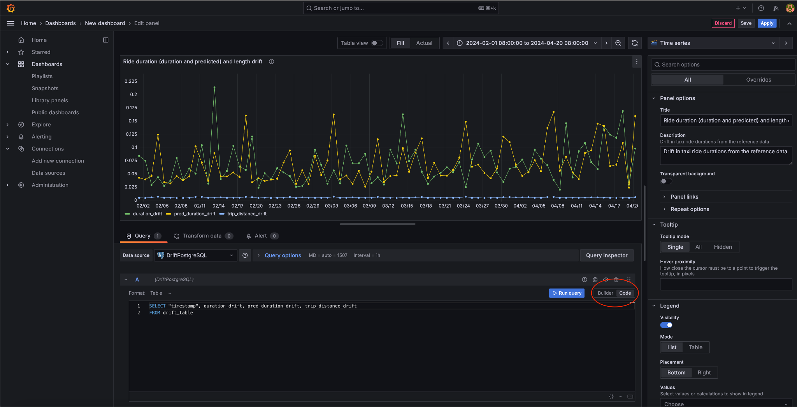

Answered by  Anuj Panthri, added by Andrea Nicolas, edit by Marcus Leiwe

---

### Adminer Not Loaded

Problem: After running docker compose, adminer cannot be accessed on

Solution: Just add index.php after URL, so the URL will be

Added by Rohmat S

---

### Grafana UI Changes

Problem: When selecting column from table db has no time column: no time column found


Solution: Add timestamp column in query builder

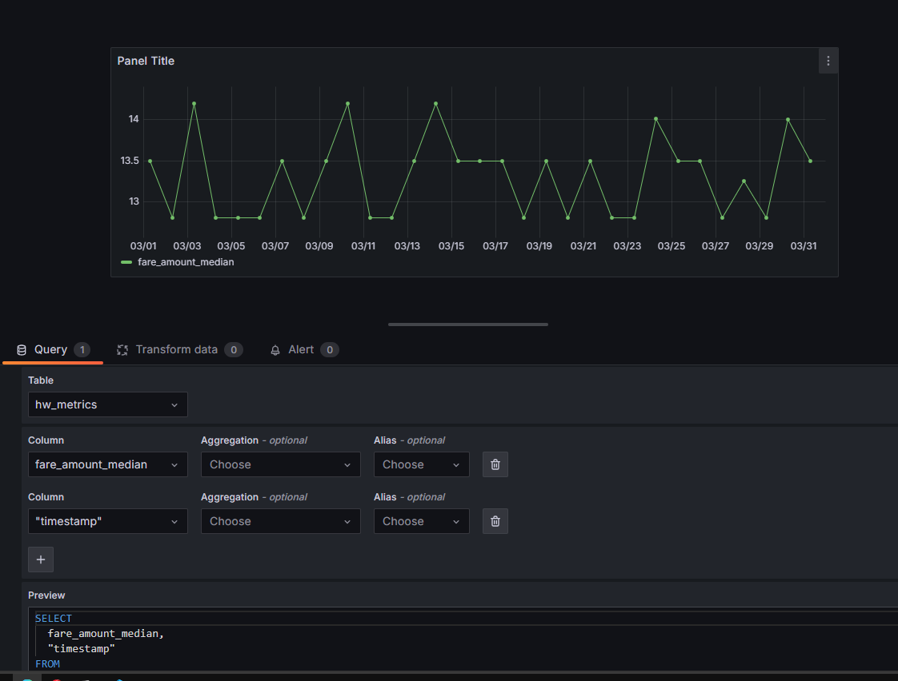

Added by Rohmat S

---

### Runtime Error : Failed to Reach API on Prefect

Problem: When to running evidently_metrics_calculation.py show RuntimeError: Cannot create flow run. Failed to reach API at https://api.prefect.cloud/api/accounts/ee976605-4ca7-4a27-b5e3-0a37da3c7678/workspaces/78b23cf5-38bb-4d8b-9888-5bf8070d6d62/.

Solution: Register or Signup on

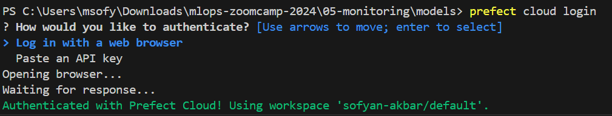

Added by Sofyan Akbar

---

### Grafana dashboard error after reset: db query error: pq: database “test” does not exist

Problem: You’ve already loaded your data, created a dashboard and even saved it according to the exercise. But suddenly when you run docker-compose up after saving the dashboard file you get this error: db query error: pq: database “test” does not exist

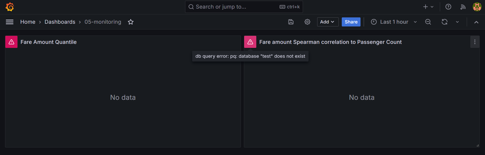

Solution:

This error indicates you haven’t run the DB initialization code. But if you did run it before and even saw results, the most likely reason for the error is that you restarted the docker-compose services.

The default docker-compose.yml file doesn’t have a volume for the Postgres DB, so every restart will also delete the DB data with it.

If you’re not planning to restart the services again, the easiest solution would be to run the DB initialization and filling code of your exercise again and forget about this.

On the other hand, if you’ll run more services restarts, consider adding a volume to your postgres service in the docker-compose.yml file, e.g.:

volumes:

- ./data/postgres:/var/lib/postgresql/data

* Notice i added a new directory to the project ./data directory!

You can run the following in order for the volume to be attached:

docker-compose down

docker-compose up --build

Added by Igal Chernov

---

### Are there any alternative to Evidently on cloud platforms ?

There are several alternatives to Evidently for monitoring machine learning models in the cloud. Here are a few options on popular cloud platforms:

Google Cloud Platform (GCP): AI Platform Predictions with Cloud Monitoring & Logging

Microsoft Azure: Azure Machine Learning

Amazon Web Services (AWS): Amazon SageMaker Model Monitor

These services provide model monitoring capabilities, allowing you to track the performance and data quality of your machine learning models within the cloud environment.

Added by Mélanie Fouesnard

---

### docker.errors.DockerException: Error while fetching server API version: HTTPConnection.request() got an unexpected keyword argument 'chunked'

Instead of:  docker-compose up –build

Use: docker compose up –build

Added Ibai Irastorza

---

### Docker-Compose depreciated

Related to the question . Docker compose v1 is deprecated (from April 2023 onwards). More information on why v2 is better is in this blog post here

Added by Marcus Leiwe

---

### psycopg.OperationalError: connection failed: connection to server at "127.0.0.1", port 5432 failed: FATAL:  password authentication failed for user "postgres"

It could be that there is already a another docker container running (for example, from previous week).

Check with docker ps, and stop it with docker stop container_name_or_ID

Added Ibai Irastorza

---

### Login to DB not working in Adminer UI even after right DB, user and password.

Problem: In adminer ui Adminer access is not working even after right DB user and password

(It wasn't for me) Adminer simply does not respond and does not show DB details

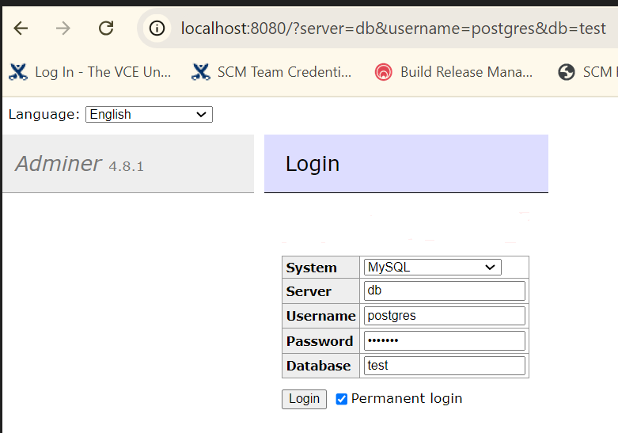

Solution: Try accessing DB from command line via psql

You can quickly install psql via sudo apt etc

Here is the example

(base) cpl@inpne-ed-lab003:~$ psql -h localhost -p 5432 -U postgres

Password for user postgres:

psql (14.12 (Ubuntu 14.12-0ubuntu0.22.04.1), server 16.4 (Debian 16.4-1.pgdg120+1))

WARNING: psql major version 14, server major version 16.

Some psql features might not work.

Type "help" for help.

postgres=# \l

List of databases

Name    |  Owner   | Encoding |  Collate   |   Ctype    |   Access privileges

-----------+----------+----------+------------+------------+-----------------------

postgres  | postgres | UTF8     | en_US.utf8 | en_US.utf8 |

template0 | postgres | UTF8     | en_US.utf8 | en_US.utf8 | =c/postgres          +

|          |          |            |            | postgres=CTc/postgres

template1 | postgres | UTF8     | en_US.utf8 | en_US.utf8 | =c/postgres          +

|          |          |            |            | postgres=CTc/postgres

test      | postgres | UTF8     | en_US.utf8 | en_US.utf8 |

(4 rows)

Added by Nilesh Arte

---

### Is it mandatory to use a reference dataset when generating a report with Evidently?

Answer:

No. While Evidently is designed to compare a reference dataset with a current one, it can also be used without a reference dataset.

In such cases, you can pass reference_data=None when creating the report. This is useful for generating descriptive statistics or univariate analyses on a single dataset (e.g., using ColumnSummaryMetric, DatasetMissingValuesMetric, etc.).

Added by José Luis Martínez

---

### What version of Evidently AI is used in the course?

In the video (current cohort: 2025) the Evidently used is 0.4.17, but any version up to 0.6.7 will be able to run the code in the video and the repo.

The newer versions have changed the APIs so the code in the video will not run.

Added by Thanh Trung Mai

Failed to create provisioner error when running docker-compose up –build

Error: ✗ Failed to create provisioner: Failed to read dashboards config: could not parse provisioning config file: dashboards.yaml error: read /etc/grafana/provisioning/dashboards/dashboards.yaml: is a directory

The docker-compose.yml file needs to be updated in grafana -> volumes from a YML file to a directory because docker-compose expects a directory but is instead given a file like in the example error above. Change /etc/grafana/provisioning/dashboards/dashboards.yaml to /etc/grafana/provisioning/dashboards/dashboards and do that for all other file names in grafana -> volumes.

---

## Module 6: Best practices

### Evidently Import Error

Problem description

When I run the command “from evidently import ColumnMapping” I get an import error ImportError: cannot import name 'ColumnMapping' from 'evidently'

Solution description

Uninstall the latest version (Version: 0.7.8) with “pip uninstall evidently -y” then install an older compatible version “pip install evidently==0.4.18” and restart the kernel to reload the environment.

Added by Mohamed Cherif

---

### Error following video 6.2: mlflow=1.27.0

When following the video instructions and running the Dockerfile I get an error that the Dockerfile build failed in line 8, because there is no matching distribution for mlflow=1.27.0. Below is the code output:

4.900 ERROR: No matching distribution found for mlflow==1.27.0

4.901 ERROR: Couldn't install package: {}

4.901  Package installation failed...

------

Dockerfile:8

--------------------

6 |     COPY [ "Pipfile", "Pipfile.lock", "./" ]

7 |

8 | >>> RUN pipenv install --system --deploy

9 |

10 |     COPY [ "lambda_function.py", "model.py", "./" ]

--------------------

ERROR: failed to solve: process "/bin/sh -c pipenv install --system --deploy" did not complete successfully: exit code: 1

---

### Get an error ‘Unable to locate credentials’ after running localstack with kinesis

You may get an error ‘{'errorMessage': 'Unable to locate credentials', …’ from the print statement in test_docker.py after running localstack with kinesis.

To fix this, in the docker-compose.yaml file, in addition to the environment variables like AWS_DEFAULT_REGION, add two other variables AWS_ACCESS_KEY_ID and AWS_SECRET_ACCESS_KEY. Their value is not important; anything like abc will suffice

Added by M

Other possibility is just to run

aws --endpoint-url http://localhost:4566 configure

And providing random values for AWS Access Key ID , AWS Secret Access Key, Default region name, and Default output format.

Added by M.A. Monjas

---

### Get an error ‘ unspecified location constraint is incompatible ’

You may get an error while creating a bucket with localstack and the boto3 client:

botocore.exceptions.ClientError: An error occurred (IllegalLocationConstraintException) when calling the CreateBucket operation: The unspecified location constraint is incompatible for the region specific endpoint this request was sent to.

To fix this, instead of creating a bucket via

s3_client.create_bucket(Bucket='nyc-duration')

Create it with

s3_client.create_bucket(Bucket='nyc-duration', CreateBucketConfiguration={

'LocationConstraint': AWS_DEFAULT_REGION})

yam

Added by M

---

### Get an error “<botocore.awsrequest.AWSRequest object at 0x7fbaf2666280>” after running an AWS CLI command

When executing an AWS CLI command (e.g., aws s3 ls), you can get the error <botocore.awsrequest.AWSRequest object at 0x7fbaf2666280>.

To fix it, simply set the AWS CLI environment variables:

export AWS_DEFAULT_REGION=eu-west-1

export AWS_ACCESS_KEY_ID=foobar

export AWS_SECRET_ACCESS_KEY=foobar

Their value is not important; anything would be ok.

Added by Giovanni Pecoraro

---

### Pre-commit triggers an error at every commit: “mapping values are not allowed in this context”

At every commit the above error is thrown and no pre-commit hooks are ran.

Make sure the indentation in .pre-commit-config.yaml is correct. Especially the 4 spaces ahead of every `repo` statement

Added by M. Ayoub C.

---

### Could not reconfigure pytest from zero after getting done with previous folder

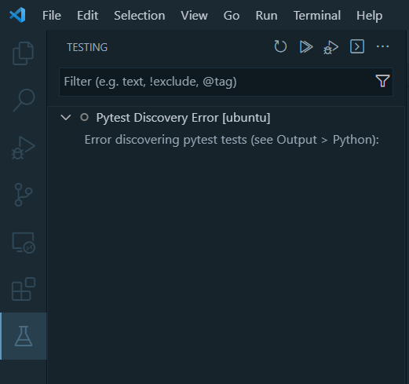

No option to remove pytest test

Remove the .vscode folder located on the folder you previously used for testing, e.g. folder code (from week6-best-practices) was chosen to test, so you may remove .vscode inside the folder.

Added by Rizdi Aprilian

---

### Empty Records in Kinesis Get Records with LocalStack

Problem description
Following video 6.3, at minute 11:23, get records command returns empty Records.

Solution description

Add --no-sign-request to Kinesis get records call:
 aws --endpoint-url= kinesis get-records --shard-iterator […] --no-sign-request

---

### In Powershell, Git commit raises utf-8 encoding error after creating pre-commit yaml file

Problem description

git commit -m 'Updated xxxxxx'

An error has occurred: InvalidConfigError:

==> File .pre-commit-config.yaml

=====> 'utf-8' codec can't decode byte 0xff in position 0: invalid start byte

Solution description

Set uft-8 encoding when creating the pre-commit yaml file:

pre-commit sample-config | out-file .pre-commit-config.yaml -encoding utf8

Added by MarcosMJD

---

### Git commit with pre-commit hook raises error ‘'PythonInfo' object has no attribute 'version_nodot'

Problem description

git commit -m 'Updated xxxxxx'

[INFO] Initializing environment for https://github.com/pre-commit/pre-commit-hooks.

[INFO] Installing environment for https://github.com/pre-commit/pre-commit-hooks.

[INFO] Once installed this environment will be reused.

An unexpected error has occurred: CalledProcessError: command:

…

return code: 1

expected return code: 0

stdout:

AttributeError: 'PythonInfo' object has no attribute 'version_nodot'

Solution description

Clear app-data of the virtualenv

python -m virtualenv api -vvv --reset-app-data

Added by MarcosMJD

---

### Pytest error ‘module not found’ when if using custom packages in the source code

Problem description

Project structure:

/sources/production/model_service.py

/sources/tests/unit_tests/test_model_service.py (“from production.model_service import ModelService)

When running python test_model_service.py from the sources directory, it works.

When running pytest ./test/unit_tests fails. ‘No module named ‘production’’

Solution description

Use python -m pytest ./test/unit_tests

Explanation: pytest does not add to the sys.path the path where pytest is run.

You can run python -m pytest, or alternatively export PYTHONPATH=. Before executing pytest

Added by MarcosMJD

---

### Pytest error ‘module not found’ when using pre-commit hooks if using custom packages in the source code

Problem description

Project structure:

/sources/production/model_service.py

/sources/tests/unit_tests/test_model_service.py (“from production.model_service import ModelService)

git commit -t ‘test’ raises ‘No module named ‘production’’ when calling pytest hook

- repo: local

hooks:

- id: pytest-check

name: pytest-check

entry: pytest

language: system

pass_filenames: false

always_run: true

args: [

"tests/"

]

Solution description

Use this hook instead:

- repo: local

hooks:

- id: pytest-check

name: pytest-check

entry: "./sources/tests/unit_tests/run.sh"

language: system

types: [python]

pass_filenames: false

always_run: true

And make sure that run.sh sets the right directory and run pytest:

cd "$(dirname "$0")"

cd ../..

export PYTHONPATH=.

pipenv run pytest ./tests/unit_tests

Added by MarcosMJD

---

### Github actions: Permission denied error when executing script file

Problem description

This is the step in the ci yml file definition:

- name: Run Unit Tests

working-directory: "sources"

run: ./tests/unit_tests/run.sh

When executing github ci action, error raises:

…/tests/unit_test/run.sh Permission error

Error: Process completed with error code 126

Solution description

Add execution  permission to the script and commit+push:

git update-index --chmod=+x .\sources\tests\unit_tests\run.sh

Added by MarcosMJD

---

### Managing Multiple Docker Containers with docker-compose profile

Problem description

When a docker-compose file contains a lot of containers, running the containers may take too much resource. There is a need to easily select only a group of containers while ignoring irrelevant containers during testing.

Solution description

Add profiles: [“profile_name”] in the service definition.

When starting up the service, add `--profile profile_name` in the command.

Added by Ammar Chalifah

---

### Why do aws cli commands throw <botocore.awsrequest.AWSRequest object at 0x74c89c3562d0> type messages when listing or creating aws s3 buckets with localstack ?

If you encounter such messages when you try to list your aws s3 buckets for example (aws --endpoint-url=http://localhost:4566 s3 ls), you can try to configure AWS by setting up the same region, access key and secret key as the ones that appear in your docker-compose file.

After installing the aws cli, make sure you configure it in your terminal by entering this command line : aws configure

It will ask for:

AWS Access Key ID [None]: abc (example)

AWS Secret Access Key [None]: xyz (example)

Default region name [None]: eu-west-1 (example)

Added by Mélanie Fouesnard

---

### AWS regions need to match docker-compose

Problem description

If you are having problems with the integration tests and kinesis double check that your aws regions match on the docker-compose and local config. Otherwise you will be creating a stream in the wrong region

Solution description

For example set ~/.aws/config region = us-east-1 and the docker-compose.yaml - AWS_DEFAULT_REGION=us-east-1

Added by Quinn Avila

---

### Isort Pre-commit

Problem description

Pre-commit command was failing with isort repo.

Solution description

Set version to 5.12.0

Added by Erick Calderin

---

### How to destroy infrastructure created via GitHub Actions

Problem description

Infrastructure created in AWS with CD-Deploy Action needs to be destroyed

Solution description

From local:

terraform init -backend-config="key=mlops-zoomcamp-prod.tfstate" --reconfigure

terraform destroy --var-file vars/prod.tfvars

Added by Erick Calderin

---

### Error “[Errno 13] Permission denied: '/home/ubuntu/.aws/credentials’” when running any aws command

After installing awscliv2 in linux you can get this error every time you try to run an aws command that needs to use the credentials. For example, if you run aws configure, you can insert the key and secret but finally you receive the error message.

The user ubuntu does not have permission to read/write files in .aws folder and neither credentials and config files exists. What I have done to solve:

Go to .aws folder, usually /home/ubuntu/.aws

Create an empty credentials and config files:

touch credentials

touch config

Modify the permissions:

sudo chmod -R 777 credentials

sudo chmod -R 777 config

Now, you can run aws configure

Run aws configure, modify the keys and secret and save them to the credentials file. And then you can execute your aws commands from your python scripts or in the command line.

Added by Eduardo Muñoz

---

### Why do I get a ValueError: Invalid endpoint error when using Boto3 with Docker Compose services?

Answer: Boto3 does not support underscores (_) in service URLs. Naming your Docker Compose services with underscores will cause Boto3 to throw an error when connecting to the endpoint. (Source: )

# Incorrect Docker Compose configuration with underscores

version: '3.8'

services:

backend_service:

image: my_backend_image

...

s3_service:

image: localstack/localstack

…

Rename your services to avoid using underscores. s3_service → s3service

That way, when you run client = boto3.client('s3', endpoint_url="http://s3service:4566") you won’t get any error.

Added by Fustincho

Problem: Pre-commit fails with error RuntimeError: The Poetry configuration is invalid:

- data.extras.pipfile_deprecated_finder[2] must match pattern ^[a-zA-Z-_.0-9]+$

Solution: This is caused by version mixmatch between the pre-commit-config.yaml designated version for your package and the actual versions. Check the versions in Pipfile.lock and update as appropriate.

Added by Oluwadara Adedeji

---

### Why do I get a “ValueError: The truth value of a DataFrame is ambiguous. Use a.empty, a.bool(), a.item(), a.any() or a.all()” error when doing unit test that involves comparing two data frames?

Solution: Follow the tip: When you compare two Pandas DataFrames, the result is also a DataFrame. The same is true for Pandas Series. Also, a DataFrame could be turned into a list of dictionaries.

Therefore, do not compare data frames directly, but convert the actual and expected dataframes into list of dictionaries and then use assert to compare the resulting list of dictionaries.

For example:

…

actual_df_list_dicts = actual_df.to_dict('records')

…

expected_df_list_dicts = expected_df.to_dict('records')

…

assert actual_df_list_dicts == expected_df_list_dicts

Added by Victor Emenike

---

## Capstone Project

### Question: pytest doesn't recognize my installed libraries, but the script works in the terminal. Why?

Answer: This usually happens because VS Code is using a different Python interpreter than the one in your terminal. As a result, pytest can't see the packages installed in your virtual environment.

How to fix:

1. In your terminal, run:

which python

2. In VS Code, open the command palette (Ctrl+Shift+P) and select:

Python: Select Interpreter

3. Choose the same interpreter shown in step 1.

Added by José Luis Martínez

---

### Is it a group project?

No, the capstone is a solo project.

---

### Do we submit 2 projects, what does attempt 1 and 2 mean?

You only need to submit 1 project. 
If the submission at the first attempt fails, you can improve it and re-submit during attempt#2 submission window.

If you want to submit 2 projects for the experience and exposure, you must use different datasets and problem statements.

If you can’t make it to the attempt#1 submission window, you still have time to catch up to meet the attempt#2 submission window

Remember that the submission does not count towards the certification if you do not participate in the peer-review of 3 peers in your cohort

---

### How is my capstone project going to be evaluated?

Each submitted project will be evaluated by 3 (three) randomly assigned students who have also submitted the project.

You will also be responsible for grading the projects from 3 fellow students yourself. Please be aware that: not complying to this rule also implies you failing to achieve the Certificate at the end of the course.

The final grade you get will be the median score of the grades you get from the peer reviewers.

And of course, the peer review criteria for evaluating or being evaluated must follow the guidelines defined here (TBA for link).

---

### What is the criteria of scoring home work?

What is the scoring given for homework

Each Homework has 6 question on correct answering you can get 6 points

You can also add 7 public learning which you can get 7 points

Adding 1 Question valid in FAQ gives 1 point

So in total you can get 14 point per homework which will help you in leaderboard

(optional) Added by Name

---

## Certificates:

### Question: Error: creating Lambda Function (...): InvalidParameterValueException: The image manifest, config or layer media type for the source image ... is not supported.

Answer: This error occurs when the Docker image you are using is a manifest list (multi-platform). AWS Lambda does not support manifest lists—it only accepts single-platform images with a standard image manifest.

Quick fix: Build your Docker image using docker buildx and specify the platform explicitly.

$ docker buildx build --platform linux/amd64 -t your-ecr-image:latest -f Dockerfile .

This ensures the image is compatible with AWS Lambda. Also make sure that you push your image using the –platform option

Added by

José Luis Martínez

---

### Criteria for getting a certificate?

Finish the Capstone project

Added by Shashank Kumar

---

### Is completion of Homework necessary for a certificate?

No

Added by Shashank Kumar

Can I submit the final project on the second attempt and still receive the certificate?

Yes, absolutely - it's your choice whether to submit one or two times; passing any one attempt is sufficient to earn the certificate.

---

